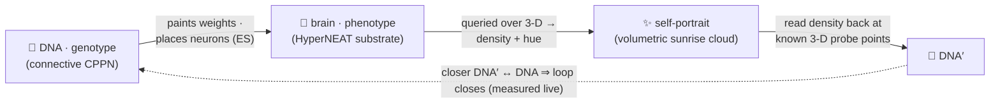

# 🤲 Autograph

> **A network that learns to draw its true self.**
> Autograph is a full-screen, greyscale instrument for a live evolutionary experiment you join the moment it loads. Inside it, tiny neural networks evolve toward a strange loop — a creature whose glowing self-portrait can be read back to recover the very DNA that drew it. *A precise greyscale instrument framing vivid, sunrise-coloured life.*

[](https://github.com/admiralakber/autograph)
[](https://admiralakber.github.io/autograph/)
[](./LICENSE)

**▶ Live: [admiralakber.github.io/autograph](https://admiralakber.github.io/autograph/)** · **Soul & doctrine: [VISION.md](./VISION.md)**

---

## The one line that holds it together 🌀

> **You can't copy a mind — you can only re-grow it from a recipe, and prove the lineage.**

It reads like poetry. It is, independently, a result in three different subjects — and Autograph is the place you can *watch all three agree*:

- 🧮 **Mathematics** — self-reference is a [fixed point](https://en.wikipedia.org/wiki/Kleene%27s_recursion_theorem); a [quine](https://en.wikipedia.org/wiki/Quine_(computing)) is a program whose output is its own source. The recipe is primary, not the copy.
- 🔐 **Cryptography** — provenance is proved by *re-deriving* from a seed and checking a signature, not by trusting a copy. Exactly how [Git](https://git-scm.com/book/en/v2/Git-Internals-Git-Objects) proves history, with no blockchain.
- ⚛️ **Physics** — the [no-cloning theorem](https://en.wikipedia.org/wiki/No-cloning_theorem) forbids photocopying a live state, so reproduction *must* pass on a recipe and regrow the body — von Neumann's trick, enforced by nature.

---

## What it actually is 🖼️

Autograph is an **instrument**, not a slideshow: a greyscale, monospace mission-control panel wrapped around one living population. A creature in it is **two networks that make each other** — and a 3-D self-portrait that closes the loop between them.

- 🧬 **DNA — the genotype.** A small *connective* [CPPN](https://gwern.net/doc/ai/nn/fully-connected/2007-stanley.pdf). Given the positions of two points in space (`x₁,y₁,z₁, x₂,y₂,z₂`, plus a bias) it returns a connection — a `weight` and a link-expression gate (`leo`) that decides whether the connection exists. We draw it as a small node-and-edge **graph**.
- 🧠 **The brain — the phenotype.** A HyperNEAT **substrate**. Its inputs are a point in space (`x, y, z, r, bias`); its outputs are `density` and `hue`. Its connection weights are *painted* by the CPPN from node geometry, and its hidden neurons are *placed* by the CPPN. We draw it as a node-and-connection network too.
- ✨ **The self-portrait.** Query that substrate across 3-D space and it answers with a field of density and hue, rendered as a volumetric **point cloud** coloured by the sunrise palette (density → alpha, hue → colour). This is the creature you see.

When that loop closes, the creature has written its own signature — hence the name. **Autograph**: *auto-* (self) + *-graph* (writing / drawing / network). Self-**writing** is the quine; self-**signature** is the crypto; the two **graphs** are the DNA and the brain.



### The equivalence you can toggle 🔁

The core comprehension goal: **a cool-looking render *is* a neural network, and that network *has* a DNA.** You can view the *same* individual three ways and flip between them — (a) the rendered 3-D self-portrait, (b) its phenotype network, (c) its DNA (the CPPN graph). Three faces of one creature. The full soul and teaching goals live in **[VISION.md](./VISION.md)**.

---

## The soul: a strange loop, braided three ways 🪢

Borrowed, with love, from Hofstadter's [*Gödel, Escher, Bach*](https://en.wikipedia.org/wiki/G%C3%B6del,_Escher,_Bach):

| | The braid | In Autograph |
|---|---|---|
| 🔢 **Gödel** | a formula that talks about itself (self-reference via a [fixed point](https://en.wikipedia.org/wiki/Kleene%27s_recursion_theorem)) | a DNA whose self-portrait re-states the DNA |
| 🎨 **Escher** | [*Drawing Hands*](https://en.wikipedia.org/wiki/Drawing_Hands) — each hand draws the other into being | a CPPN that paints a brain that paints a picture of the CPPN |
| 🎵 **Bach** | the [endlessly rising canon](https://en.wikipedia.org/wiki/Musical_Offering) — climbs forever, returns home | an evolutionary search that never stops climbing |

Everything in the world descends from one canonical **Genesis** seed, preserved byte-for-byte:

```text
And yet.... 🦕 a trace.... ✨ of.. the true self... 🐣 exists.... 🐥 within the false 🍗 = 🦖
```

The soul, in one breath: *the algorithm of life — lifeforms trying to draw their true self out of the false, with a whole world watching and helping a neural network understand its true self.* Humane, and honest: we mean it as a provocation made watchable, never as a grand claim.

---

## What the live instrument really does ✅

It runs **entirely on your device** — no backend, no telemetry. Here is the honest split between what is *real* and what is *illustrative*, because the whole project lives or dies on not over-claiming.

**Real, and running in your browser:**

- 🧬 **A genuinely-evolving DNA + brain.** A heterogeneous-activation CPPN (the genotype) paints and *places* a HyperNEAT substrate (the phenotype); both evolve by gradient-free mutation + crossover.
- 🧠 **ES-style neuron placement.** Hidden neurons are positioned where the incoming connectivity pattern carries the most information (variance) — the simplified, shipping cousin of [ES-HyperNEAT](./docs/WHITEPAPER.md). *Full quadtree band-pruning ES-HyperNEAT is the named direction; we ship simplified placement now.*
- ✨ **A 3-D volumetric self-portrait.** The substrate's density → hue field rendered as a point cloud via [Three.js](https://threejs.org/), with a graceful **Canvas 2D** fallback (and the same field drives the grid thumbnails).
- 🔁 **A self-encoding loop, measured live.** Each DNA parameter is assigned a 3-D probe coordinate; the loop "closes" when the density painted *at* that coordinate matches the parameter. This is the honest, single-device cousin of Chang & Lipson's [neural-network quine](https://arxiv.org/abs/1803.05859) (the HyperNEAT coordinate→weight trick). **The loop fidelity shown is measured live, never faked** — a fresh random creature tends to sit in the low 0.6s, and evolution pushes lively ones into the high 0.8s. We never print a fixed number as a guarantee; you watch the real value climb.
- 🗺️ **Real [MAP-Elites](https://arxiv.org/abs/1504.04909) quality-diversity.** A grid keyed by (structural complexity, mirror symmetry); each cell keeps the best self-encoder of its kind, fitness shown by a greyscale border value (no colour). You watch the wall of diverse self-portraits fill.
- 🌳 **A real signed, hash-chained tree of life — and it persists.** Keep a creature and it becomes a node in a content-addressed [Merkle-DAG](https://en.wikipedia.org/wiki/Merkle_tree); its id is `SHA-256` of its content *including its parents' ids*, signed with an [ECDSA P-256](https://developer.mozilla.org/en-US/docs/Web/API/Web_Crypto_API) key. The lineage is rendered as a navigable greyscale tree and **persisted across sessions in IndexedDB**, so it grows over time. Everything descends from the Genesis seed. **No chain. No token.**

**Real, but deliberately bounded:**

- ⚠️ **The loop closes to a *tolerance*, never bit-exactly,** and the trivial fixed point is avoided on purpose. A blank, near-flat creature "encodes itself" perfectly and says nothing — so a **vitality gate** plus the MAP-Elites diversity pressure keep the population pushing against a real world. Self-reference only matters when it is load-bearing ([Chang & Lipson](https://arxiv.org/abs/1803.05859)).

**Illustrative / roadmap (clearly labelled as such):** the worldwide **swarm / shared archive** (one device today — see *You are a node*, below), **zkML "proof of becoming"**, the **quantum** framing, and **full quadtree ES-HyperNEAT**. Narrative and lineage — never a claim. *There are no qubits here.*

---

## The aesthetic doctrine 🎛️

> **A precise greyscale instrument framing vivid, sunrise-coloured life.**

The discipline is Dieter Rams / Braun restraint: nothing decorative, everything legible.

- **The chrome is monochrome.** Panels, rules, labels, readouts and the population's fitness borders are strictly **greyscale + monospace**. Value, not hue, carries meaning.
- **Colour means life, and nothing else.** The only colour anywhere is the **sunrise** palette — the [HSLuv](https://www.hsluv.org/) colour space (MIT) at Lightness 72, Saturation 100, hue swept the full 0→360, alpha ≈ 0.7 — used *only* to colour the living creatures and living-thing accents. HSLuv gives a perceptually-even sweep, so the cycle glows like a sunrise with no muddy or blown-out arcs.

---

## You are a node: local-first → swarm 🌐

Today, the instrument runs entirely on your own device: **you are a node — a node of one.** No backend, no account, no data leaves the tab.

The roadmap is a **swarm**: many devices growing *one shared garden*, so a creature discovered on one machine illuminates the wall for everyone and the tree of life becomes a single, shared genealogy across all participants. The chosen path — a [PartyServer](https://github.com/cloudflare/partyserver)-on-Cloudflare coordinator that owns the global MAP-Elites archive and the signed lineage behind the same swap-able `Archive` seam already in the code — is specified, sandboxed and **undeployed by design** in the [coordinator runbook](./docs/DEPLOY-coordinator.md). We link to it rather than repeat it.

**The swarm's natural shape is an archipelago.** Heterogeneous device speeds and sporadic syncing make it an *asynchronous island model*: demes emerge on their own (no designed topology), best-per-niche elites migrate through the coordinator, and isolation breeds allopatric speciation → diversity. *Honest status:* v1 is a single local population; true islands arrive only with the coordinator (even a local multi-deme demo is future work, not built). The dynamics are written up in the [whitepaper §3.8](./docs/WHITEPAPER.md).

---

## Two technical pillars

### Pillar I — Cryptographic self-proof 🔐 (the crypto, finalised)

Self-drawing is one step from self-*certifying*. The interest here is **cryptography-as-mathematics** — hashes, commitments, signatures, proofs — **never coins**. Three honest tiers:

- ✅ **Signed, content-addressed Merkle-DAG lineage (built, in the demo).** A phylogeny is a DAG (crossover has two parents). Each genome's id binds its weights, parents, seed and fidelity; signatures bind it to an author key, so you cannot graft a creature onto a famous lineage without the right key. This is the grift-free heart — *Git for genomes*, buildable in a weekend with [WebCrypto](https://developer.mozilla.org/en-US/docs/Web/API/Web_Crypto_API), echoing [Certificate Transparency](https://datatracker.ietf.org/doc/html/rfc6962). It is also the principled fix for an untrusted swarm, and it persists in IndexedDB.
- ✅ **Carried self-commitment (built).** Every creature carries a signed `SHA-256` of its own genome — a self-witnessing fingerprint. (The *exact* crypto-hash quine, where a net's output literally equals `H(W)`, is partial-preimage mining — astronomically hard, deliberately off the critical path.)
- 🔭 **Proof of becoming — zkML (north star, not built).** Each elite carries a succinct [zero-knowledge proof](https://en.wikipedia.org/wiki/Zero-knowledge_proof) that it truly achieved its fidelity — *verified, not re-run*. Our nets are tiny, where zkML's prover/verifier asymmetry is friendliest ([Kang et al.](https://arxiv.org/abs/2210.08674): ~5 KB proofs, ~1 s to verify). Folding the whole history into one [recursive proof](https://eprint.iacr.org/2021/370) à la [Mina](https://minaprotocol.com/blog/22kb-sized-blockchain-a-technical-reference) is the horizon. Proving cost is the gate, so we name it a telescope, not a feature.

> 🚩 **Anti-grift red line.** No token, no manufactured scarcity, no "buy in to participate". Git proves tamper-evident provenance to millions daily **with no blockchain**; so does Autograph. If a feature only makes sense with a coin attached, it isn't here.

### Pillar II — The quantum angle ⚛️ (the soul's physics, finalised)

This is the one place the poetry is, word for word, a law of physics. The [no-cloning theorem](https://en.wikipedia.org/wiki/No-cloning_theorem) ([Wootters & Zurek, 1982](https://www.nature.com/articles/299802a0)) forbids photocopying an arbitrary unknown quantum state. Naïvely that *kills* self-replication — until you notice replication was never about cloning the live thing. Von Neumann's [universal constructor](https://en.wikipedia.org/wiki/Von_Neumann_universal_constructor) passes on a **description** (copied) and regrows the **body** (built); life does the same with DNA; [Marletto (2015)](https://pmc.ncbi.nlm.nih.gov/articles/PMC4345487/) shows this is fully compatible with quantum theory.

**The prohibition is the gift:** the impossibility of copying is exactly what makes reproduction *real* rather than mere duplication. And, à la [Breuer (1995)](https://www.cambridge.org/core/journals/philosophy-of-science/article/impossibility-of-accurate-state-selfmeasurements/80B368D210379DA587D41603B551B95D), a creature can pass on its recipe yet **never perfectly measure itself** — the measurement-theoretic twin of Gödel. (Gödel even surfaces in real physics: the [spectral gap is undecidable](https://www.nature.com/articles/nature16059).)

> ⚛️ **Honest quantum note.** There are no qubits here. Quantum mechanics is our metaphor and our lineage, **not** our runtime. We claim no quantum speedup — [none exists](https://scottaaronson.blog/?p=198) for this embarrassingly-parallel, classical workload. The qubits stay in the museum.

---

## Run it / fork it 💻

```bash
git clone https://github.com/admiralakber/autograph && cd autograph/web
npm install
npm run dev        # Vite + TypeScript dev server
npm run build      # type-check (strict) + production build
npm run smoke      # headless sanity check: evolution + loop + lineage verification
```

The CPPN, the substrate, the simplified ES placement, MAP-Elites, the render and the Web-Crypto lineage are all written from scratch and live in [`web/src/engine`](./web/src/engine).

### Repository layout

```text
autograph/
├── web/                     # the Vite + TypeScript instrument (the live demo)
│   ├── index.html           # the full-screen mission-control panel
│   ├── src/engine/          # the two networks + the loop
│   │   ├── arch.ts          # topology: CPPN genotype + substrate phenotype
│   │   ├── cppn.ts          # the DNA (connective CPPN)
│   │   ├── substrate.ts     # the brain + simplified ES-HyperNEAT placement
│   │   ├── fitness.ts       # the strange loop: fidelity, vitality, descriptors
│   │   ├── mapelites.ts     # MAP-Elites quality-diversity archive
│   │   ├── lineage.ts       # signed, content-addressed Merkle-DAG (Web Crypto)
│   │   ├── palette.ts       # the sunrise (HSLuv) palette — life only
│   │   ├── genesis.ts       # the canonical Genesis seed
│   │   └── render/          # volumetric point cloud (Three.js) + Canvas 2D fallback
│   ├── src/ui/              # the instrument controller
│   └── scripts/smoke.ts     # headless verification ("don't trust, verify")
├── docs/                    # WHITEPAPER.md · BLOG.md · DEPLOY-coordinator.md
├── research/                # the original scout briefings, kept as provenance
├── VISION.md                # the soul + teaching goals + aesthetic doctrine
├── TWEETS.md
└── LICENSE                  # MIT
```

---

## Honest energy note 🔋

Per watt, datacentres win. A browser swarm's value (the roadmap) is harvesting *already-powered, idle* hardware for loss-tolerant quality-diversity search at ~zero marginal cost — **not** efficiency, and emphatically **not** training frontier models. If we ever ship donated compute, it will be explicit, visible and revocable; never crypto-mining by stealth.

---

## Licence ⚖️

**[MIT](./LICENSE).** Autograph is, above all, an *explorable explanation* — meant to be read, forked, taught from and remixed as widely as possible. The lineage of explorable explanations (e.g. [Nicky Case](https://ncase.me/)) leans permissive precisely to maximise reach, and that is the priority here.

*The honest counter-argument we considered:* a copyleft licence (AGPL-3.0) would resist a closed SaaS wrapper enclosing a future hosted swarm. We judged that, for a static client-side art-and-research piece whose value is spreading and being learned from, **reach wins** — and the commons is protected by openness and an attribution culture, not by enforcement. If you fork this toward a hosted service and want enclosure-resistance, AGPL-3.0 is the principled switch.

---

## Standing on shoulders 🙏

[Hofstadter (*GEB*)](https://en.wikipedia.org/wiki/G%C3%B6del,_Escher,_Bach) · [Gödel](https://en.wikipedia.org/wiki/G%C3%B6del%27s_incompleteness_theorems) · [Escher](https://en.wikipedia.org/wiki/Drawing_Hands) · [Bach](https://en.wikipedia.org/wiki/Musical_Offering) · [Kleene (recursion theorem)](https://en.wikipedia.org/wiki/Kleene%27s_recursion_theorem) · [von Neumann (self-replication)](https://en.wikipedia.org/wiki/Von_Neumann_universal_constructor) · [Chang & Lipson (neural-network quine)](https://arxiv.org/abs/1803.05859) · [Stanley & Miikkulainen (NEAT)](https://nn.cs.utexas.edu/downloads/papers/stanley.jair04.pdf) · [Stanley (CPPNs / HyperNEAT)](https://gwern.net/doc/ai/nn/fully-connected/2007-stanley.pdf) · [Secretan et al. (Picbreeder)](https://wiki.santafe.edu/images/1/1e/Secretan_ecj11.pdf) · [Lehman & Stanley (novelty search)](https://www.cs.swarthmore.edu/~meeden/DevelopmentalRobotics/lehman_ecj11.pdf) · [Mouret & Clune (MAP-Elites)](https://arxiv.org/abs/1504.04909) · [Kumar, Clune, Lehman & Stanley (FER/UFR)](https://arxiv.org/abs/2505.11581) · the [BOINC](https://github.com/BOINC/boinc/wiki/Job-replication) volunteer-computing tradition. The full reference list lives in the [whitepaper](./docs/WHITEPAPER.md), grounded in the scout briefings in [`research/`](./research/).

---

## How this was made 🤖

Autograph was built by AI coding agents working autonomously from the vision, taste and direction of [Aqeel Akber](https://aqeelakber.com). The ideas it stands on are his — a long romance with open-ended neuroevolution ([NEAT](https://nn.cs.utexas.edu/downloads/papers/stanley.jair04.pdf), [POET](https://arxiv.org/abs/1901.01753)) and a belief in decentralised, local-first compute as a commons — and so is the ethos: be honest, build no grift, credit the lineage, and let the people's hardware make something beautiful. The code, prose and art here were AI-generated under that direction; where something is illustrative rather than proven, we say so plainly. **The inspiration and ethos are Aqeel's; the typing was done by machines.** 🤲↺

---

<sub>Built by [Aqeel Akber](https://aqeelakber.com) — scientist and founder — who also builds [meos](https://meos.do). Autograph is a kindred spirit: a thing that belongs to itself, grown by many hands. 🤲↺</sub>
