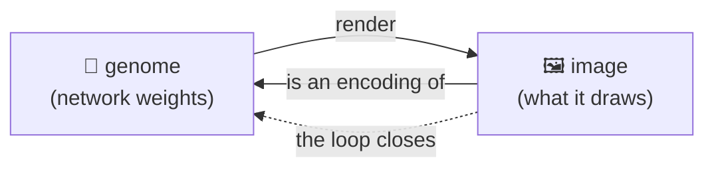

# 🤲 Autograph

> **A network that learns to draw its own beginning.**
> Autograph is a browser-native engine that *evolves* tiny neural networks toward a strange loop: a creature whose picture is the very thing that drew it. Escher's [*Drawing Hands*](https://en.wikipedia.org/wiki/Drawing_Hands) — alive, evolving, and grown in your own tab.

[](https://github.com/admiralakber/autograph)
[](https://admiralakber.github.io/autograph/)
[](./LICENSE)

**▶ Live: [admiralakber.github.io/autograph](https://admiralakber.github.io/autograph/)**

---

## The one line that holds it together 🌀

> **You can't copy a mind — you can only re-grow it from a recipe, and prove the lineage.**

It reads like poetry. It is, independently, a result in three different subjects — and Autograph is the place you can *watch all three agree*:

- 🧮 **Mathematics** — self-reference is a [fixed point](https://en.wikipedia.org/wiki/Kleene%27s_recursion_theorem); a [quine](https://en.wikipedia.org/wiki/Quine_(computing)) is a program whose output is its own source. The recipe is primary, not the copy.
- 🔐 **Cryptography** — provenance is proved by *re-deriving* from a seed and checking a signature, not by trusting a copy. Exactly how [Git](https://git-scm.com/book/en/v2/Git-Internals-Git-Objects) proves history, with no blockchain.
- ⚛️ **Physics** — the [no-cloning theorem](https://en.wikipedia.org/wiki/No-cloning_theorem) forbids photocopying a live state, so reproduction *must* pass on a recipe and regrow the body — von Neumann's trick, enforced by nature.

---

## What it actually is 🖼️

A **quine** is a program that prints its own source code. **Autograph** evolves the artwork version of that idea: a [**compositional pattern-producing network (CPPN)**](https://wiki.santafe.edu/images/1/1e/Secretan_ecj11.pdf) — a tiny neural network that paints an image — bred, generation by generation, until the image it paints is *an encoding of itself*. The output redraws the generator.

It is a piece of **generative art**, a genuine **open-ended evolution** experiment, and a small philosophical provocation made watchable: *what does it look like for a thing to comprehend its own origin?*

When that loop closes, the creature has written its own signature — hence the name. **Autograph**: *auto-* (self) + *-graph* (writing / drawing / network). Self-**writing** is the quine; self-**signature** is the crypto; the **graph** is the net.



---

## The soul: a strange loop, braided three ways 🔁

Borrowed, with love, from Hofstadter's [*Gödel, Escher, Bach*](https://en.wikipedia.org/wiki/G%C3%B6del,_Escher,_Bach):

| | The braid | In Autograph |
|---|---|---|
| 🔢 **Gödel** | a formula that talks about itself (self-reference via a [fixed point](https://en.wikipedia.org/wiki/Kleene%27s_recursion_theorem)) | a genome that encodes a description of itself |
| 🎨 **Escher** | [*Drawing Hands*](https://en.wikipedia.org/wiki/Drawing_Hands) — each hand draws the other into being | a CPPN whose picture *is* its own generator |
| 🎵 **Bach** | the [endlessly rising canon](https://en.wikipedia.org/wiki/Musical_Offering) — climbs forever, returns home | an evolutionary search that never stops climbing |

---

## What the live demo really does ✅

The site runs **entirely on your device** — no backend, no telemetry, no swarm. Here is the honest split between what is *real* and what is *illustrative*, because the whole project lives or dies on not over-claiming.

**Real, and running in your browser:**

- 🧬 **A genuinely-evolving CPPN.** Heterogeneous activations (`sin`, `gauss`, `tanh`, `sigmoid`, `abs`, `identity`), evolvable weights and biases, gradient-free mutation + crossover.
- 🗺️ **Real [MAP-Elites](https://arxiv.org/abs/1504.04909) quality-diversity.** A grid keyed by (structural complexity, mirror symmetry); each cell keeps the best self-encoder of its kind. You watch it fill — a wall of diverse self-portraits.
- 🎨 **The seed → creature ritual.** A seed (or your public key) deterministically grows one creature; the same seed always grows the same creature (the [Art Blocks](https://docs.artblocks.io/protocol/overview/) / [fxhash](https://docs.fxhash.xyz/creating-on-fxhash/programming-open-form-genart) pattern).
- 🌳 **A real signed, hash-chained lineage.** Keep a creature and it becomes a node in a content-addressed [Merkle-DAG](https://en.wikipedia.org/wiki/Merkle_tree); its id is `SHA-256` of its content *including its parents' ids*, signed with an [ECDSA P-256](https://developer.mozilla.org/en-US/docs/Web/API/Web_Crypto_API) key. Export it, re-import it — every hash and signature is re-checked. **No chain. No token.**
- 🖥️ **Graceful degradation.** One CPPN core authored once, run on **WebGPU** (a generated WGSL shader) when available, and a **Canvas 2D** CPU path everywhere else — provably the same network, only the device changes.

**Real, but approximate:**

- 🔁 **The self-encoding loop closes to a *tolerance*, never bit-exactly.** Each genome parameter is assigned a probe coordinate; the loop "closes" when the ink painted *at* that coordinate matches the parameter. This is the honest, single-device cousin of Chang & Lipson's [neural-network quine](https://arxiv.org/abs/1803.05859) (the HyperNEAT coordinate→weight trick). **The loop fidelity shown is measured live, never faked.**
- ⚠️ **The trivial fixed point is real and avoided on purpose.** A blank, near-flat creature "encodes itself" perfectly — and says nothing. So we showcase the *lively* ones (structured *and* self-encoding); self-reference only matters when it is load-bearing against a world ([Chang & Lipson](https://arxiv.org/abs/1803.05859)).

**Illustrative / roadmap (clearly labelled as such):** the worldwide **swarm**, **zkML "proof of becoming"**, and the **quantum** framing. Narrative and lineage — never a claim. *There are no qubits here.*

---

## Two technical pillars

### Pillar I — Cryptographic self-proof 🔐 (the crypto, finalised)

Self-drawing is one step from self-*certifying*. The interest here is **cryptography-as-mathematics** — hashes, commitments, signatures, proofs — **never coins**. Three honest tiers:

- ✅ **Signed, content-addressed Merkle-DAG lineage (built, in the demo).** A phylogeny is a DAG (crossover has two parents). Each genome's id binds its weights, parents, seed and fitness; signatures bind it to an author key, so you cannot graft a creature onto a famous lineage without the right key. This is the grift-free heart — *Git for genomes*, buildable in a weekend with [WebCrypto](https://developer.mozilla.org/en-US/docs/Web/API/Web_Crypto_API), echoing [Certificate Transparency](https://datatracker.ietf.org/doc/html/rfc6962). It is also the principled fix for an untrusted swarm.
- ✅ **Carried self-commitment (built).** Every creature carries a signed `SHA-256` of its own genome — a self-witnessing fingerprint. (The *exact* crypto-hash quine, where a net's output literally equals `H(W)`, is partial-preimage mining — astronomically hard, deliberately off the critical path.)
- 🔭 **Proof of becoming — zkML (north star, not built).** Each elite carries a succinct [zero-knowledge proof](https://en.wikipedia.org/wiki/Zero-knowledge_proof) that it truly achieved its fitness — *verified, not re-run*. Our nets are tiny, where zkML's prover/verifier asymmetry is friendliest ([Kang et al.](https://arxiv.org/abs/2210.08674): ~5 KB proofs, ~1 s to verify). Folding the whole history into one [recursive proof](https://eprint.iacr.org/2021/370) à la [Mina](https://minaprotocol.com/blog/22kb-sized-blockchain-a-technical-reference) is the horizon. Proving cost is the gate, so we name it a telescope, not a feature.

> 🚩 **Anti-grift red line.** No token, no manufactured scarcity, no "buy in to participate". Git proves tamper-evident provenance to millions daily **with no blockchain**; so does Autograph. If a feature only makes sense with a coin attached, it isn't here.

### Pillar II — The quantum angle ⚛️ (the soul's physics, finalised)

This is the one place the poetry is, word for word, a law of physics. The [no-cloning theorem](https://en.wikipedia.org/wiki/No-cloning_theorem) ([Wootters & Zurek, 1982](https://www.nature.com/articles/299802a0)) forbids photocopying an arbitrary unknown quantum state. Naïvely that *kills* self-replication — until you notice replication was never about cloning the live thing. Von Neumann's [universal constructor](https://en.wikipedia.org/wiki/Von_Neumann_universal_constructor) passes on a **description** (copied) and regrows the **body** (built); life does the same with DNA; [Marletto (2015)](https://pmc.ncbi.nlm.nih.gov/articles/PMC4345487/) shows this is fully compatible with quantum theory.

**The prohibition is the gift:** the impossibility of copying is exactly what makes reproduction *real* rather than mere duplication. And, à la [Breuer (1995)](https://www.cambridge.org/core/journals/philosophy-of-science/article/impossibility-of-accurate-state-selfmeasurements/80B368D210379DA587D41603B551B95D), a creature can pass on its recipe yet **never perfectly measure itself** — the measurement-theoretic twin of Gödel. (Gödel even surfaces in real physics: the [spectral gap is undecidable](https://www.nature.com/articles/nature16059).)

> ⚛️ **Honest quantum note.** There are no qubits here. Quantum mechanics is our metaphor and our lineage, **not** our runtime. We claim no quantum speedup — [none exists](https://scottaaronson.blog/?p=198) for this embarrassingly-parallel, classical workload. The qubits stay in the museum.

---

## Run it / fork it 💻

```bash
git clone https://github.com/admiralakber/autograph && cd autograph/web
npm install
npm run dev        # Vite + TypeScript dev server
npm run build      # type-check (strict) + production build
npm run smoke      # headless sanity check: evolution + lineage verification
```

No dependencies beyond Vite + TypeScript: the CPPN, MAP-Elites, the WGSL render core and the Web-Crypto lineage are all written from scratch and live in [`web/src/engine`](./web/src/engine).

### Repository layout

```text
autograph/
├── web/                     # the Vite + TypeScript app (the live demo + story)
│   ├── index.html           # the landing page (the whole tale)
│   ├── src/engine/          # CPPN, MAP-Elites, render (WebGPU + Canvas), Web-Crypto lineage
│   ├── src/ui/              # the live demo controller
│   └── scripts/smoke.ts     # headless verification ("don't trust, verify")
├── docs/                    # WHITEPAPER.md · BLOG.md
├── research/                # the original scout briefings, kept as provenance
├── .github/workflows/       # deploy.yml → GitHub Pages
├── TWEETS.md
└── LICENSE                  # MIT
```

---

## Honest energy note 🔋

Per watt, datacentres win. A browser swarm's value (the roadmap) is harvesting *already-powered, idle* hardware for loss-tolerant quality-diversity search at ~zero marginal cost — **not** efficiency, and emphatically **not** training frontier models. If we ever ship donated compute, it will be explicit, visible and revocable; never crypto-mining by stealth.

---

## Licence ⚖️

**[MIT](./LICENSE).** Autograph is, above all, an *explorable explanation* — meant to be read, forked, taught from and remixed as widely as possible. The lineage of explorable explanations (e.g. [Nicky Case](https://ncase.me/)) leans permissive precisely to maximise reach, and that is the priority here.

*The honest counter-argument we considered:* a copyleft licence (AGPL-3.0) would resist a closed SaaS wrapper enclosing a future hosted swarm. We judged that, for a static client-side art-and-research piece whose value is spreading and being learned from, **reach wins** — and the commons is protected by openness and an attribution culture, not by enforcement. If you fork this toward a hosted service and want enclosure-resistance, AGPL-3.0 is the principled switch.

---

## Standing on shoulders 🙏

[Hofstadter (*GEB*)](https://en.wikipedia.org/wiki/G%C3%B6del,_Escher,_Bach) · [Gödel](https://en.wikipedia.org/wiki/G%C3%B6del%27s_incompleteness_theorems) · [Escher](https://en.wikipedia.org/wiki/Drawing_Hands) · [Bach](https://en.wikipedia.org/wiki/Musical_Offering) · [Kleene (recursion theorem)](https://en.wikipedia.org/wiki/Kleene%27s_recursion_theorem) · [von Neumann (self-replication)](https://en.wikipedia.org/wiki/Von_Neumann_universal_constructor) · [Chang & Lipson (neural-network quine)](https://arxiv.org/abs/1803.05859) · [Stanley & Miikkulainen (NEAT)](https://nn.cs.utexas.edu/downloads/papers/stanley.jair04.pdf) · [Secretan et al. (Picbreeder)](https://wiki.santafe.edu/images/1/1e/Secretan_ecj11.pdf) · [Lehman & Stanley (novelty search)](https://www.cs.swarthmore.edu/~meeden/DevelopmentalRobotics/lehman_ecj11.pdf) · [Mouret & Clune (MAP-Elites)](https://arxiv.org/abs/1504.04909) · [Kumar, Clune, Lehman & Stanley (FER/UFR)](https://arxiv.org/abs/2505.11581) · the [BOINC](https://github.com/BOINC/boinc/wiki/Job-replication) volunteer-computing tradition. The full reference list lives in the [whitepaper](./docs/WHITEPAPER.md).

---

## How this was made 🤖

Autograph was built by AI coding agents working autonomously from the vision, taste and direction of [Aqeel Akber](https://aqeelakber.com). The ideas it stands on are his — a long romance with open-ended neuroevolution ([NEAT](https://nn.cs.utexas.edu/downloads/papers/stanley.jair04.pdf), [POET](https://arxiv.org/abs/1901.01753)) and a belief in decentralised, local-first compute as a commons — and so is the ethos: be honest, build no grift, credit the lineage, and let the people's hardware make something beautiful. The code, prose and art here were AI-generated under that direction; where something is illustrative rather than proven, we say so plainly. **The inspiration and ethos are Aqeel's; the typing was done by machines.** 🤲↺

---

<sub>Built by [Aqeel Akber](https://aqeelakber.com) — scientist and founder — who also builds [meos](https://getmeos.com). Autograph is a kindred spirit: a thing that belongs to itself, grown by many hands. 🤲↺</sub>
