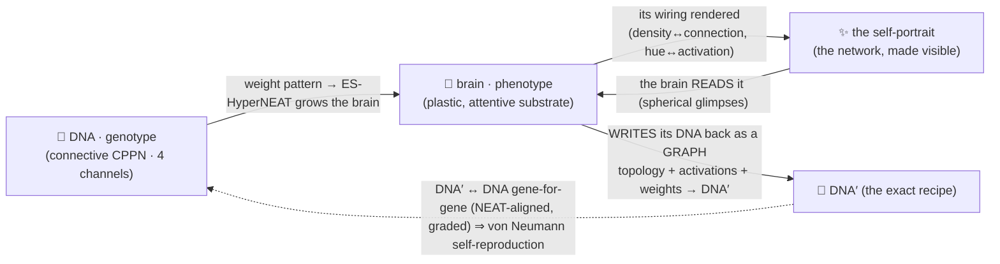

# 🤲 Autograph

> **A network that learns to draw its true self.**
> Autograph is a full-screen, greyscale instrument for a live evolutionary experiment you join the moment it loads. Inside it, tiny neural networks evolve toward a strange loop — a DNA grows a brain, the brain's wiring **is** a glowing self-portrait, and the brain reads that portrait to reconstruct its **exact DNA** — the genome graph itself: von Neumann self-reproduction, alive. *A precise greyscale instrument framing vivid, sunrise-coloured life.*

[](https://github.com/admiralakber/autograph)
[](https://admiralakber.github.io/autograph/)
[](./LICENSE)

**▶ Live: [admiralakber.github.io/autograph](https://admiralakber.github.io/autograph/)** · **Soul & doctrine: [VISION.md](./VISION.md)**

---

## 🌍 Lend an idle box to the swarm

Autograph evolves **on whatever device opens it** and auto-joins the shared swarm the instant it loads — so a spare VPS or an idle laptop can help, with **no install beyond a browser you already have**. Point a *headless* browser at the live site and it quietly pulls the shared map, evolves, and pushes anything that beats a niche back up to everyone:

```bash
chromium --headless=new --disable-gpu \
  --disable-background-timer-throttling \
  --disable-renderer-backgrounding \
  --disable-backgrounding-occluded-windows \
  --user-data-dir="$(mktemp -d)" \
  https://admiralakber.github.io/autograph/
```

Leave it running and that box *is* a node — no account, no GPU, fully anonymous. The two flags that matter are `--headless=new` and `--disable-gpu`; the rest keep the loop full-speed if the OS tries to background the renderer, and the throwaway `--user-data-dir` means swarm-on-by-default with no profile clash.

- 🧠 **It genuinely contributes.** A headless tab still reports as *visible*, so the evolution loop runs **un-throttled** (~15–20 generations/s on a single core in testing); each elite it discovers is signed, pushed, and — once accepted — lifts the swarm's shared **explored** count for everyone.
- 🐢 **Honest caveat.** No GPU means it's **software-rendered** (it falls back to the Canvas-2D path), so it's slower than a desktop tab and keeps roughly one core busy — but it is a real, contributing peer, not a spectator.
- 🔧 **Notes.** `google-chrome`/`google-chrome-stable` work identically; on a **root-only VPS** add `--no-sandbox`; stop it with `Ctrl-C` or `pkill chromium`; opt a normal browser tab out any time with [`?swarm=off`](https://admiralakber.github.io/autograph/?swarm=off).

---

## The one line that holds it together 🌀

> **You can't copy a mind — you can only re-grow it from a recipe, and prove the lineage.**

It reads like poetry. It is, independently, a result in three different subjects — and Autograph is the place you can *watch all three agree*:

- 🧮 **Mathematics** — self-reference is a [fixed point](https://en.wikipedia.org/wiki/Kleene%27s_recursion_theorem); a [quine](https://en.wikipedia.org/wiki/Quine_(computing)) is a program whose output is its own source. The recipe is primary, not the copy.
- 🔐 **Cryptography** — provenance is proved by *re-deriving* from a seed and checking a signature, not by trusting a copy. Exactly how [Git](https://git-scm.com/book/en/v2/Git-Internals-Git-Objects) proves history, with no blockchain.
- ⚛️ **Physics** — the [no-cloning theorem](https://en.wikipedia.org/wiki/No-cloning_theorem) forbids photocopying a live state, so reproduction *must* pass on a recipe and regrow the body — von Neumann's trick, enforced by nature.

---

## What it actually is 🖼️

Autograph is an **instrument**, not a slideshow: a greyscale, monospace mission-control panel wrapped around one living population. A creature in it is **two networks that make each other** — and a 3-D image that closes the loop between them.

- 🧬 **DNA — the genotype.** A small *connective* [CPPN](https://gwern.net/doc/ai/nn/fully-connected/2007-stanley.pdf). Given two 3-D coordinates (`x₁,y₁,z₁, x₂,y₂,z₂`, plus a bias) it returns **four channels**: **structure** (`weight` — the connection strength ES-HyperNEAT grows the brain from; `bias`) and **faculties** (`α` Hebbian plasticity, `modGate` neuromodulation). We draw it as a small node-and-edge **graph**.
- 🧠 **The brain — the phenotype.** An **ES-HyperNEAT substrate** grown from the CPPN's weight pattern by a genuine **quadtree** (variance-based division + band-pruning, [Risi & Stanley 2012](https://doi.org/10.1162/artl_a_00071)) that decides where the hidden neurons sit, how dense they are, and which connections express — an evolvable substrate, not a fixed grid. It **reads** its self-portrait (spherical foveated glimpses) and **writes its exact DNA back as a GRAPH** through its **output neurons** — node activation-types + biases, connection topology + weights + enabled bits — *computed by running the network*, never read off the DNA. We draw it as a node-and-connection network too.
- ✨ **The self-portrait.** A **true depiction of the built network**, rendered across 3-D space and shown as a volumetric **point cloud**: **density ↔ each neuron's connection strength** (and the wires between them), **hue ↔ its activation type** ([sunrise](https://www.hsluv.org/) palette). This is the creature you see — *render = network = code*, made literal: the picture genuinely **is** the wiring, which is exactly what makes reading it a true act of self-knowledge. *(Silence one CPPN node, re-grow, re-render: the picture shifts — the DNA shapes the wiring, the wiring is the image.)*

That is the loop, made honest: the genome grows a brain; the brain's wiring **is** a picture; the brain reads that picture and **rewrites the recipe that would grow it** — [von Neumann](https://en.wikipedia.org/wiki/Von_Neumann_universal_constructor)'s description-and-construction, alive. Hence the name. **Autograph**: *auto-* (self) + *-graph* (writing / drawing / network).



### The equivalence you can toggle 🔁

The core comprehension goal: **a cool-looking render *is* a neural network, and that network *has* a DNA.** You can view the *same* individual three ways and flip between them — (a) the rendered 3-D image, (b) its phenotype network, (c) its DNA (the CPPN graph). Three faces of one creature. The full soul and teaching goals live in **[VISION.md](./VISION.md)**.

---

## The soul: a strange loop, braided three ways 🪢

Borrowed, with love, from Hofstadter's [*Gödel, Escher, Bach*](https://en.wikipedia.org/wiki/G%C3%B6del,_Escher,_Bach):

| | The braid | In Autograph |
|---|---|---|
| 🔢 **Gödel** | a formula that talks about itself (self-reference via a [fixed point](https://en.wikipedia.org/wiki/Kleene%27s_recursion_theorem)) | a DNA whose image re-states the DNA |
| 🎨 **Escher** | [*Drawing Hands*](https://en.wikipedia.org/wiki/Drawing_Hands) — each hand draws the other into being | a CPPN that paints an image a brain grows within — and the brain reads that image to write the DNA anew |
| 🎵 **Bach** | the [endlessly rising canon](https://en.wikipedia.org/wiki/Musical_Offering) — climbs forever, returns home | an evolutionary search that never stops climbing |

Everything in the world descends from one canonical **Genesis** seed, preserved byte-for-byte:

```text
And yet.... 🦕 a trace.... ✨ of.. the true self... 🐣 exists.... 🐥 within the false 🍗 = 🦖
```

The soul, in one breath: *the algorithm of life — lifeforms trying to draw their true self out of the false, with a whole world watching and helping a neural network understand its true self.* Humane, and honest: we mean it as a provocation made watchable, never as a grand claim.

---

## What the live instrument really does ✅

It runs **entirely on your device** — no backend, no telemetry. Here is the honest split between what is *real* and what is *illustrative*, because the whole project lives or dies on not over-claiming.

**Real, and running in your browser:**

- 🧬 **A genuinely-evolving DNA + brain.** A heterogeneous-activation CPPN (the genotype) *paints the image* and *grows* an ES-HyperNEAT substrate (the phenotype) from its weight pattern; both evolve by gradient-free mutation + textbook innovation-aligned crossover.
- 🧠 **Genuine ES-HyperNEAT neuron placement.** A real [quadtree decomposition](https://doi.org/10.1162/artl_a_00071) of the CPPN weight pattern — variance-based **division & initialization** then **pruning & extraction** with band-pruning (Risi & Stanley 2012) — discovers *where* the hidden neurons sit, *how dense* they are, and *which* connections express, iterated from inputs→hidden→outputs and pruned to functional topology. *Honest bound:* the quadtree's max depth is capped for browser real time (the paper sets a max resolution too); placement runs on the algorithm's native 2-D sheet while the image is the network's response swept over 3-D space; per-neuron heterogeneous activations + CPPN-painted biases are Autograph extensions. All real code — see [`web/src/engine/eshyperneat.ts`](./web/src/engine/eshyperneat.ts).
- ✨ **A 3-D volumetric self-portrait that IS the network.** Rendered as a point cloud via [Three.js](https://threejs.org/) (graceful **Canvas 2D** fallback; the same field drives the grid thumbnails): **density ↔ each neuron's connection strength** + the wires, **hue ↔ its activation type**. The neurons are overlaid at their real positions and the strongest connections glow as sunrise **energy pipes** — because the picture genuinely *is* the wiring. An **ablation overlay** silences a single CPPN node, re-grows the substrate, and re-renders — showing that gene's contribution to the actual network.
- 🔁 **A self-encoding loop — the brain reconstructs its EXACT DNA (von Neumann self-reproduction).** First it **reads** a true picture of its own wiring: attention-chosen, foveated **glimpses** in **spherical (r, θ, φ)** volumetric attention (it decides *where + how deep to look*, [RAM](https://arxiv.org/abs/1406.6247)-style evolved hard attention), its synapses **self-modifying as it looks** (CPPN-painted Hebbian plasticity under [Backpropamine](https://arxiv.org/abs/2002.10585)-style neuromodulation), **pondering** a variable number of steps ([Adaptive Computation Time](https://arxiv.org/abs/1603.08983), Graves). Then it **WRITES its DNA back as a GRAPH** — *from its own neurons*, autoregressively ([seq2seq](https://arxiv.org/abs/1409.3215)): node genes (a **categorical activation type** + a bias) then connection genes (a **topology** of from/to slots + a weight + an enabled bit), **deciding its own structure size** (halt-signals). DNA′ is scored against DNA **gene-for-gene** — [NEAT](https://nn.cs.utexas.edu/downloads/papers/stanley.ec02.pdf)-innovation-aligned, **graded partial credit**, coupled-but-floored so half-solutions can't win yet partial structure climbs. A blank creature scores **0.000**. Honest, measured (single garden, ~1–2k gens): the brain reconstructs **topology ≈ 0.78**, **activation-type accuracy ≈ 0.60** (vs 0.083 chance), **weight-R² ≈ 0.34**, **size ≈ 0.8–0.95** (often the *exact* node/connection counts) — the selection skill (≈ 9%) is the coupled product of the whole-graph reconstruction, a far harder, richer measure than a value-only one. (Node *biases* are the honest weak spot: ≈ 0, often a low-variance target.) It is a *thinking, self-modifying, recurrent, self-writing, neuroevolved* network — **no transformer, no LLM**; every word literally true.
- 🗺️ **Real [MAP-Elites](https://arxiv.org/abs/1504.04909) quality-diversity.** A grid keyed by (structural complexity, mirror symmetry); each cell keeps the best self-encoder of its kind, fitness shown by a greyscale border value (no colour). You watch the wall of diverse images fill.
- 🌳 **A real signed, hash-chained tree of life — and it persists.** Keep a creature and it becomes a node in a content-addressed [Merkle-DAG](https://en.wikipedia.org/wiki/Merkle_tree); its id is `SHA-256` of its content *including its parents' ids*, signed with an [ECDSA P-256](https://developer.mozilla.org/en-US/docs/Web/API/Web_Crypto_API) key. The lineage is rendered as a navigable greyscale tree and **persisted across sessions in IndexedDB**, so it grows over time. Everything descends from the Genesis seed. **No chain. No token.**

**Real, but deliberately bounded:**

- ⚠️ **The loop never reaches perfect closure for a living creature,** and the trivial fixed point is avoided on purpose. *Fully* iterating the self-map drifts toward the only effortless fixed point — a flat, silent creature that "encodes itself" by saying nothing (the *zero quine*, vitality → 0, skill → 0, measured) — so a **vitality gate** plus MAP-Elites diversity keep the population on the living, imperfect side. Self-reference only matters when it is load-bearing ([Chang & Lipson](https://arxiv.org/abs/1803.05859)).

**The honest limit it discovered — self-knowledge is real, but partial.** This is the soul of the piece, and it is *measured*, not asserted. The brain genuinely reconstructs its **exact DNA graph** — it gets the *size* nearly right (often exactly), most of the **topology** (≈ 0.78) and **activation types** (≈ 0.60 vs 0.083 chance), and a third of the **weights** (R² ≈ 0.34) — yet it never recovers *all* of itself (the node biases barely reconstruct; the exact wiring is only mostly right). Closing the loop perfectly would mean writing your whole self with nothing left over, and the only creature that does is the empty one (the *zero quine*, vitality → 0, which the gate refuses). So **"life is imperfect self-knowledge"** is no longer only the poem we chose — it is a structural truth the instrument found about itself: we reach for our true selves and grasp a fraction, and the reaching is the life.

**Illustrative / roadmap (clearly labelled as such):**

- 🔭 **A deeper self-write (the structural write is *built*; this is what's left).** The brain already reconstructs its DNA *graph* — topology, activation types, weights, size. The honest frontier now: close the **remaining gaps** (node biases, the last of the exact topology) and add a **behavioural-equivalence fitness** — score DNA′ on whether it *grows the same brain*, not just gene-for-gene match (two genomes can express one phenotype, so exact-match *under*-counts genuine self-knowledge). The principled attempt to know *all* of yourself; research-grade, uncertain — named, not promised.
- 🔭 **A single dedicated evolution Web Worker + WASM/SIMD** — moving the (sequential) search off the render thread for a smoother instrument. A *multi-core pool* is deliberately **not** taken: the loop is strictly sequential, so parallel batching would change the honest numbers.
- 🔭 **zkML "proof of becoming"** (untrusted-machine fitness verification) and the **quantum** framing — narrative and lineage, never a claim. *There are no qubits here.* (The temporal brain, the swarm and genuine ES-HyperNEAT are **real today** — see above.)

---

## The aesthetic doctrine 🎛️

> **A precise greyscale instrument framing vivid, sunrise-coloured life.**

The discipline is Dieter Rams / Braun restraint: nothing decorative, everything legible.

- **The chrome is monochrome.** Panels, rules, labels, readouts and the population's fitness borders are strictly **greyscale + monospace**. Value, not hue, carries meaning.
- **Colour means life, and nothing else.** The only colour anywhere is the **sunrise** palette — the [HSLuv](https://www.hsluv.org/) colour space (MIT) at Lightness 72, Saturation 100, hue swept the full 0→360, alpha ≈ 0.7 — used *only* to colour the living creatures and living-thing accents. HSLuv gives a perceptually-even sweep, so the cycle glows like a sunrise with no muddy or blown-out arcs.

---

## You are a node in a live swarm 🌐

Open the tab and **you join a shared world** — many machines growing *one* genealogy together, right now. A [PartyServer](https://github.com/cloudflare/partykit)-on-Cloudflare coordinator owns the global MAP-Elites archive and the signed lineage behind the same swap-able `Archive` seam in the code: a creature discovered on one machine **migrates** to illuminate the wall for everyone, the **peer count** and the **collective gen/s** are live, and the tree of life is a single, shared genealogy across all participants. It's on by default; `?swarm=off` keeps you fully local (no backend, no account, nothing leaves the tab). The deploy details are in the [coordinator runbook](./docs/DEPLOY-coordinator.md).

**The crowd discovers what one mind alone cannot.** This is the real result, told honestly. A *single* machine evolving solo is humbled by the loop — reconstructing your *exact graph* from a picture of your wiring is genuinely hard — yet it climbs to a real partial self-reconstruction over a couple of thousand generations (topology ≈ 0.78, activation types ≈ 0.60, weights R² ≈ 0.34, size near-exact), still climbing. Ablation confirms the **plasticity + attention faculties are load-bearing** (turn plasticity off and the reconstruction nearly collapses) — the brain really *reads* its self-portrait, learning within its lifetime, before it writes. The *collective* search reaches far higher: the swarm dynamics that carried earlier worlds' self-encoders far above the lone explorer are unchanged, and **the collective ceiling is the fresh world's to write** as the islands run it. It is **not** a freebie: a blank or random creature scores **0.000**, and **closing more of yourself is rewarded**. That gap between the lone explorer and the collective *is* the point of doing this together.

**The swarm's natural shape is an archipelago.** Heterogeneous device speeds and sporadic syncing make it an *asynchronous island model*: demes emerge on their own (no designed topology), best-per-niche elites migrate through the coordinator, and isolation breeds allopatric speciation → diversity.

*Honest trust model:* the coordinator **verifies every shared creature's signature**, rate-limits, and keeps the best per niche — enough for a grift-free shared archive today. **Full replication/quorum and a zkML "proof of becoming" that verifies untrusted machines' fitness claims are still roadmap** (see the [cryptography note](./docs/notes/cryptography.md)). The dynamics are written up in the [whitepaper §3.8](./docs/WHITEPAPER.md).

---

## Two technical pillars

### Pillar I — Cryptographic self-proof 🔐 (the crypto, finalised)

Self-drawing is one step from self-*certifying*. The interest here is **cryptography-as-mathematics** — hashes, commitments, signatures, proofs — **never coins**. Three honest tiers:

- ✅ **Signed, content-addressed Merkle-DAG lineage (built, in the demo).** A phylogeny is a DAG (crossover has two parents). Each genome's id binds its weights, parents, seed and fidelity; signatures bind it to an author key, so you cannot graft a creature onto a famous lineage without the right key. This is the grift-free heart — *Git for genomes*, buildable in a weekend with [WebCrypto](https://developer.mozilla.org/en-US/docs/Web/API/Web_Crypto_API), echoing [Certificate Transparency](https://datatracker.ietf.org/doc/html/rfc6962). It is also the principled fix for an untrusted swarm, and it persists in IndexedDB.
- ✅ **Carried self-commitment (built).** Every creature carries a signed `SHA-256` of its own genome — a self-witnessing fingerprint. (The *exact* crypto-hash quine, where a net's output literally equals `H(W)`, is partial-preimage mining — astronomically hard, deliberately off the critical path.)
- 🔭 **Proof of becoming — zkML (north star, not built).** Each elite carries a succinct [zero-knowledge proof](https://en.wikipedia.org/wiki/Zero-knowledge_proof) that it truly achieved its fidelity — *verified, not re-run*. Our nets are tiny, where zkML's prover/verifier asymmetry is friendliest ([Kang et al.](https://arxiv.org/abs/2210.08674): ~5 KB proofs, ~1 s to verify). Folding the whole history into one [recursive proof](https://eprint.iacr.org/2021/370) à la [Mina](https://minaprotocol.com/blog/22kb-sized-blockchain-a-technical-reference) is the horizon. Proving cost is the gate, so we name it a telescope, not a feature.

> 🚩 **Anti-grift red line.** No token, no manufactured scarcity, no "buy in to participate". Git proves tamper-evident provenance to millions daily **with no blockchain**; so does Autograph. If a feature only makes sense with a coin attached, it isn't here.

### Pillar II — The quantum angle ⚛️ (the soul's physics, finalised)

This is the one place the poetry is, word for word, a law of physics. The [no-cloning theorem](https://en.wikipedia.org/wiki/No-cloning_theorem) ([Wootters & Zurek, 1982](https://www.nature.com/articles/299802a0)) forbids photocopying an arbitrary unknown quantum state. Naïvely that *kills* self-replication — until you notice replication was never about cloning the live thing. Von Neumann's [universal constructor](https://en.wikipedia.org/wiki/Von_Neumann_universal_constructor) passes on a **description** (copied) and regrows the **body** (built); life does the same with DNA; [Marletto (2015)](https://pmc.ncbi.nlm.nih.gov/articles/PMC4345487/) shows this is fully compatible with quantum theory.

**The prohibition is the gift:** the impossibility of copying is exactly what makes reproduction *real* rather than mere duplication. And, à la [Breuer (1995)](https://www.cambridge.org/core/journals/philosophy-of-science/article/impossibility-of-accurate-state-selfmeasurements/80B368D210379DA587D41603B551B95D), a creature can pass on its recipe yet **never perfectly measure itself** — the measurement-theoretic twin of Gödel. (Gödel even surfaces in real physics: the [spectral gap is undecidable](https://www.nature.com/articles/nature16059).)

> ⚛️ **Honest quantum note.** There are no qubits here. Quantum mechanics is our metaphor and our lineage, **not** our runtime. We claim no quantum speedup — [none exists](https://scottaaronson.blog/?p=198) for this embarrassingly-parallel, classical workload. The qubits stay in the museum.

---

## Run it / fork it 💻

```bash
git clone https://github.com/admiralakber/autograph && cd autograph/web
npm install
npm run dev        # Vite + TypeScript dev server
npm run build      # type-check (strict) + production build
npm run smoke      # headless sanity check: evolution + loop + lineage verification
```

The CPPN, the genuine ES-HyperNEAT substrate, the image→brain read-back loop, MAP-Elites, the render and the Web-Crypto lineage are all written from scratch and live in [`web/src/engine`](./web/src/engine).

### Repository layout

```text
autograph/
├── web/                     # the Vite + TypeScript instrument (the live demo)
│   ├── index.html           # the full-screen mission-control panel
│   ├── src/engine/          # the two networks + the loop
│   │   ├── arch.ts          # topology: CPPN genotype + substrate phenotype
│   │   ├── cppn.ts          # the DNA (connective CPPN) + genome serialisation
│   │   ├── eshyperneat.ts   # genuine ES-HyperNEAT: quadtree placement + band-pruning
│   │   ├── substrate.ts     # the brain ES-HyperNEAT grows: renders its wiring as the self-portrait, reads it (spherical glimpses), writes its DNA graph
│   │   ├── structural.ts    # the EXACT-DNA target + the NEAT-aligned graded structural scorer (topology · activations · weights · size)
│   │   ├── readback.ts      # the self-write loop: brain reads its network-portrait → writes its DNA graph (DNA′)
│   │   ├── fitness.ts       # the strange loop: skill (structural), vitality, descriptors
│   │   ├── mapelites.ts     # MAP-Elites quality-diversity archive
│   │   ├── lineage.ts       # signed, content-addressed Merkle-DAG (Web Crypto)
│   │   ├── palette.ts       # the sunrise (HSLuv) palette — life only
│   │   ├── genesis.ts       # the canonical Genesis seed
│   │   └── render/          # volumetric point cloud (Three.js) + Canvas 2D fallback
│   ├── src/ui/              # the instrument controller
│   └── scripts/smoke.ts     # headless verification ("don't trust, verify")
├── docs/                    # WHITEPAPER.md · BLOG.md · DEPLOY-coordinator.md
│   └── notes/               # design deep-dives — architecture · runtime+GPU · crypto · quantum · prior-art
├── VISION.md                # the soul + teaching goals + aesthetic doctrine
└── LICENSE                  # MIT
```

### Design notes 📓

Deeper dives for the curious — the engineering, the maths, and an honest map of what's real vs roadmap — live in [`docs/notes/`](./docs/notes/): [architecture & the swarm](./docs/notes/architecture.md) · [runtime & GPU](./docs/notes/runtime-and-gpu.md) · [cryptography](./docs/notes/cryptography.md) · [quantum](./docs/notes/quantum.md) · [prior art & novelty](./docs/notes/prior-art.md).

---

## Honest energy note 🔋

Per watt, datacentres win. A browser swarm's value (the roadmap) is harvesting *already-powered, idle* hardware for loss-tolerant quality-diversity search at ~zero marginal cost — **not** efficiency, and emphatically **not** training frontier models. If we ever ship donated compute, it will be explicit, visible and revocable; never crypto-mining by stealth.

---

## Licence ⚖️

**[MIT](./LICENSE).** Autograph is, above all, an *explorable explanation* — meant to be read, forked, taught from and remixed as widely as possible. The lineage of explorable explanations (e.g. [Nicky Case](https://ncase.me/)) leans permissive precisely to maximise reach, and that is the priority here.

*The honest counter-argument we considered:* a copyleft licence (AGPL-3.0) would resist a closed SaaS wrapper enclosing a future hosted swarm. We judged that, for a static client-side art-and-research piece whose value is spreading and being learned from, **reach wins** — and the commons is protected by openness and an attribution culture, not by enforcement. If you fork this toward a hosted service and want enclosure-resistance, AGPL-3.0 is the principled switch.

---

## Standing on shoulders 🙏

[Hofstadter (*GEB*)](https://en.wikipedia.org/wiki/G%C3%B6del,_Escher,_Bach) · [Gödel](https://en.wikipedia.org/wiki/G%C3%B6del%27s_incompleteness_theorems) · [Escher](https://en.wikipedia.org/wiki/Drawing_Hands) · [Bach](https://en.wikipedia.org/wiki/Musical_Offering) · [Kleene (recursion theorem)](https://en.wikipedia.org/wiki/Kleene%27s_recursion_theorem) · [von Neumann (self-replication)](https://en.wikipedia.org/wiki/Von_Neumann_universal_constructor) · [Chang & Lipson (neural-network quine)](https://arxiv.org/abs/1803.05859) · [Stanley & Miikkulainen (NEAT)](https://nn.cs.utexas.edu/downloads/papers/stanley.ec02.pdf) · [Stanley (CPPNs / HyperNEAT)](https://gwern.net/doc/ai/nn/fully-connected/2007-stanley.pdf) · [Secretan et al. (Picbreeder)](https://nbenko1.github.io/) · [Lehman & Stanley (novelty search)](https://www.cs.swarthmore.edu/~meeden/DevelopmentalRobotics/lehman_ecj11.pdf) · [Mouret & Clune (MAP-Elites)](https://arxiv.org/abs/1504.04909) · [Wang, Lehman, Clune & Stanley (POET)](https://arxiv.org/abs/1901.01753) · [Lehman et al. (ELM)](https://arxiv.org/abs/2206.08896) · [Mordvintsev et al. (growing neural CA)](https://distill.pub/2020/growing-ca) · [Kumar, Clune, Lehman & Stanley (FER/UFR)](https://arxiv.org/abs/2505.11581) · the [BOINC](https://github.com/BOINC/boinc/wiki/Job-replication) volunteer-computing tradition. The full, grounded reference list lives in the [whitepaper](./docs/WHITEPAPER.md).

---

## How this was made 🤖

Autograph was built by AI coding agents working autonomously from the vision, taste and direction of [Aqeel Akber](https://aqeelakber.com). The ideas it stands on are his — a long romance with open-ended neuroevolution ([NEAT](https://nn.cs.utexas.edu/downloads/papers/stanley.ec02.pdf), [POET](https://arxiv.org/abs/1901.01753)) and a belief in decentralised, local-first compute as a commons — and so is the ethos: be honest, build no grift, credit the lineage, and let the people's hardware make something beautiful. The code, prose and art here were AI-generated under that direction; where something is illustrative rather than proven, we say so plainly. **The inspiration and ethos are Aqeel's; the typing was done by machines.** 🤲↺

---

<sub>Built by [Aqeel Akber](https://aqeelakber.com) — scientist and founder — who also builds [meos](https://meos.do). Autograph is a kindred spirit: a thing that belongs to itself, grown by many hands. 🤲↺</sub>
