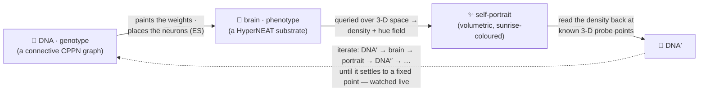
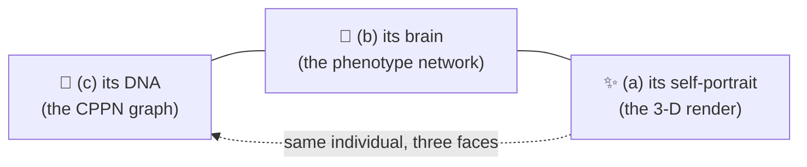
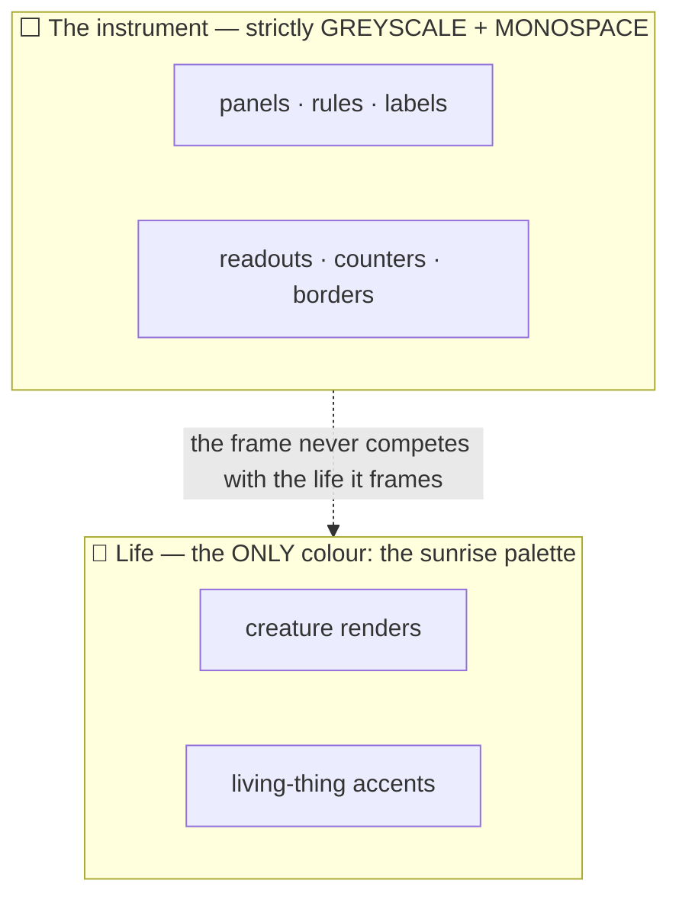

# 🤲 Autograph — Vision

> **The algorithm of life: a lifeform trying to draw its true self out of the false — and a whole world watching, and helping, a neural network understand its true self.**

This is the single source of truth for *why* Autograph exists — the soul and the two things it tries to teach. Everything else (the [README](./README.md), the [whitepaper](./docs/WHITEPAPER.md), the [blog](./docs/BLOG.md), the [tweets](./TWEETS.md)) descends from this page. If a feature, a sentence or a pixel does not serve what is written here, it does not belong.

---

## 1. The Genesis, and the loop 🌅

Autograph is a single, living **strange loop** you join the moment the instrument loads. Every creature that has ever lived in it descends from one canonical seed — the **Genesis** of the world, preserved byte-for-byte:

```text
And yet.... 🦕 a trace.... ✨ of.. the true self... 🐣 exists.... 🐥 within the false 🍗 = 🦖
```

A creature is **two networks that make each other**:

- 🧬 **DNA — the genotype.** A small *connective* CPPN. Hand it the positions of two points in space and it answers with a connection: a weight, and a gate that decides whether the connection exists at all. It is the recipe, and we draw it as a small graph of nodes and edges.
- 🧠 **The brain — the phenotype.** A HyperNEAT *substrate*. Its wiring is **painted** by the DNA, and its hidden neurons are **placed** by the DNA. Queried across three-dimensional space, it answers with a field of *density* and *hue* — and that field, rendered, is the creature's **self-portrait**.

The loop is literal:



The creature draws a picture of itself; we read that picture back to recover a **DNA′**, and **loop fidelity** measures how faithfully one pass re-encodes the original DNA — measured live, never faked (~0.9 for an evolved self-encoder). Then comes the honest, humbling part. If you *fully iterate* the loop — DNA′ grows its own brain, draws its own portrait, is read back to DNA″, again and again — it does **not** settle into a richer likeness. The only **perfect** fixed point is the *empty* one: a flat, silent creature that "encodes itself" by saying nothing (the *zero quine*, vitality 0). A living creature can only ever *approach* closure, never reach it. We even tried replacing the hand-coded read-back with a learned **"mirror brain"** (a network mapping portrait → DNA); across a population it doesn't generalise — the inverse is each creature's own, there is no universal mirror. So **perfect self-knowledge is emptiness; life is the imperfect, unfinished kind** — and the vitality gate + quality-diversity (see §3) hold the search on the living side. We never fake the closure; the strange-loop panel shows the read-back arc turning back into the DNA, and the fidelity is whatever it honestly is.

---

## 2. Two things we show, never lecture 📐

Autograph is an *explorable explanation*. It earns its two teaching goals by making them visible and toggle-able, not by writing them on a slide.

### Goal A — what an indirect encoding really is (ES-HyperNEAT)

The deepest comprehension goal: **a beautiful render *is* a neural network, and that neural network *has* a DNA.** The instrument lets you view the *same* individual three ways and flip between them:



Seeing genotype → substrate → render as three views of one thing teaches *indirect encoding* — the genome is a small recipe that grows a much larger body — in a way no diagram can. The neurons aren't placed on a fixed grid; the DNA decides where information lives. That placement is **ES-HyperNEAT's** idea, and we are honest about how far we take it (§3).

### Goal B — what distributed compute is for (local-first → swarm)

Autograph runs **entirely on your own device**. There is no backend, no telemetry; you are a node — today, a node of one. The vision is a **swarm**: many devices growing *one shared garden*, so a creature discovered on a phone in one city illuminates the wall for everyone, and the tree of life becomes a single shared genealogy. The route from here to there is documented — and deliberately undeployed — in the [coordinator runbook](./docs/DEPLOY-coordinator.md). The teaching is gentle and true: *idle, consenting, ordinary hardware can grow something beautiful together*, and the commons is protected by openness, not by a coin.

**The shape the swarm takes is an archipelago.** Because devices run at wildly different speeds and sync only now and then, the swarm is an *asynchronous island model*: isolated demes form on their own — with no designed topology — simply because a fast desktop and a throttled phone drift apart between syncs. Best-per-niche elites migrate through the coordinator; isolation breeds *allopatric speciation*; speciation breeds diversity. A planetary archipelago of emergent islands, all feeding one signed genealogy, is the real prize. **Honestly: none of this exists yet** — v1 is a single local population; true islands arrive only with the coordinator, and even a *local* multi-deme demo is future work we have not built.

---

## 3. The honesty ethic 🫶

The project lives or dies on not over-claiming. Three rules, no exceptions:

- **Real is labelled real; illustrative is labelled illustrative.** Today the DNA evolved by NEAT augmenting topologies (add-node / add-connection with innovation numbers, recurrent links) + speciation, the HyperNEAT substrate with simplified ES neuron-placement, an optional Novelty Search mode, the 3-D volumetric render, the live loop-fidelity measurement, the signed lineage that auto-records the champion line and persists across sessions, and the MAP-Elites diversity map are **real and running on your device**. The worldwide swarm, the zero-knowledge "proof of becoming", the quantum framing, and *full quadtree* ES-HyperNEAT are **directions** — and we say so, plainly, wherever they appear.
- **No grift.** No coin, no token, no manufactured scarcity, no pay-to-participate. Provenance is proved the way [Git](https://git-scm.com/book/en/v2/Git-Internals-Git-Objects) proves it — content-addressed and signed — with no blockchain.
- **Self-reference must be load-bearing.** A blank creature "encodes itself" perfectly and means nothing — the *zero quine*. So we never reward closure alone: a **vitality gate** plus **MAP-Elites quality-diversity** keep the population pushing against a real world, exactly as a self-replicator coupled to a task must ([Chang & Lipson](https://arxiv.org/abs/1803.05859)'s lesson).

---

## 4. The aesthetic doctrine 🎛️

> **A precise greyscale instrument framing vivid, sunrise-coloured life.**

Autograph is not a scrolling marketing page; it is a full-screen **instrument** — mission-control for a live experiment. The discipline is borrowed from high-end audio and the restraint of Dieter Rams' Braun: nothing decorative, everything legible.



- **The chrome is monochrome.** Every panel, rule, label, readout and the fitness borders on the population grid are greyscale and monospace. Value, not hue, carries meaning.
- **Colour means life, and nothing else.** The only colour anywhere is the **sunrise** palette — the [HSLuv](https://www.hsluv.org/) colour space (MIT), at Lightness 72, Saturation 100, with hue swept the full 0→360 and an alpha around 0.7. It colours *living things only*: the creatures' self-portraits and the accents that stand for life. HSLuv gives a perceptually even sweep, so the cycle glows like a sunrise with no muddy or blown-out arcs.

When you are unsure whether something should have colour, the answer is almost always no. Colour is reserved for the life inside the machine.

---

<sub>🌿 Autograph is built by **[Aqeel Akber](https://aqeelakber.com)**, who also builds **[meos](https://meos.do)** — local-first, sovereign, on-device. The same belief at a different scale: a thing that belongs to itself, grown by many hands. 🤲↺</sub>
