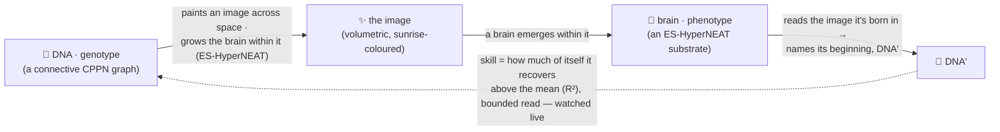
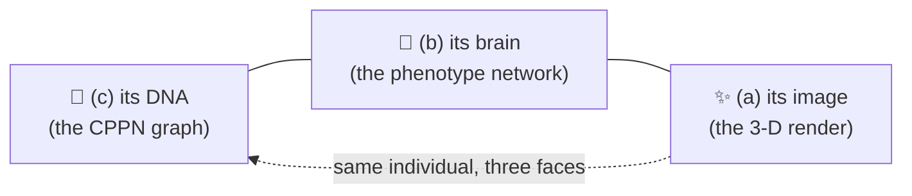
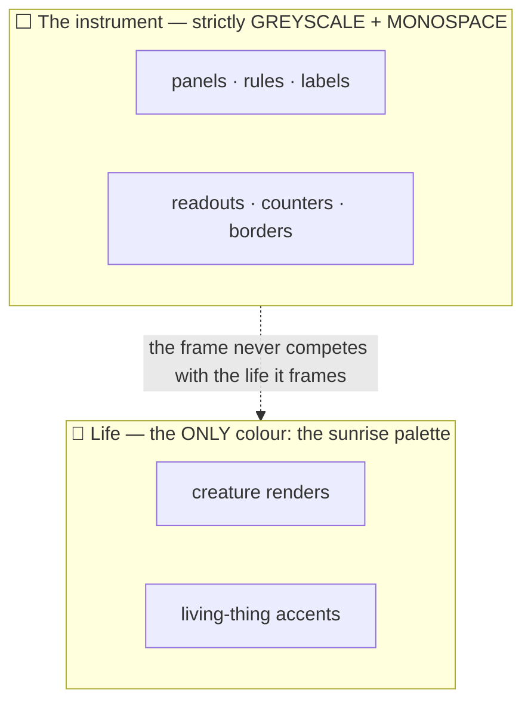

# 🤲 Autograph — Vision

> **The algorithm of life: a lifeform trying to draw its true self out of the false — and a whole world watching, and helping, a neural network understand its true self.**

This is the single source of truth for *why* Autograph exists — the soul and the two things it tries to teach. Everything else (the [README](./README.md), the [whitepaper](./docs/WHITEPAPER.md), the [blog](./docs/BLOG.md), the [design notes](./docs/notes/)) descends from this page. If a feature, a sentence or a pixel does not serve what is written here, it does not belong.

---

## 1. The Genesis, and the loop 🌅

Autograph is a single, living **strange loop** you join the moment the instrument loads. Every creature that has ever lived in it descends from one canonical seed — the **Genesis** of the world, preserved byte-for-byte:

```text
And yet.... 🦕 a trace.... ✨ of.. the true self... 🐣 exists.... 🐥 within the false 🍗 = 🦖
```

A creature is **two networks that make each other**:

- 🧬 **DNA — the genotype.** A small *connective* CPPN. Hand it two coordinates in space and it answers with `[weight, bias]` — the connection strength painted between them, and (read at a single point) a neuron's bias. It is the recipe, and we draw it as a small graph of nodes and edges.
- 🧠 **The brain — the phenotype.** An ES-HyperNEAT *substrate* that **emerges within** the DNA's image: its hidden neurons are **placed, made dense, and wired** by a genuine quadtree of the DNA's weight pattern (Risi & Stanley 2012), settling where the pattern carries information. Queried across three-dimensional space, it answers with a field of *density* and *hue* — and that field, rendered, is the **image** the creature is born in.

The loop is literal — and it is the *same function*, read two ways:



The DNA paints an image; a brain **emerges within that image**; then the brain **reads the image it's born in** — through its own hidden neurons — and outputs a **DNA′**, a reconstruction of its connection vector: it tries to *find its own beginning*. The reader is the creature's own evolved network (the image is genuinely in the path; it is **not** a separate regressor, and **not** the CPPN merely echoing itself) — a continuous cousin of Chang & Lipson's [neural-network quine](https://arxiv.org/abs/1803.05859). **Loop skill** measures how much of its own DNA the brain recovers *from the image it's born in*, above just predicting the mean (R² = 1 − MSE/Var), **weighted by how much of itself it closes** and read through a deliberately **bounded, per-gene view** — measured live, never faked: a blank or trivial image scores **~0** (the old free-regressor's flat ~0.97 artefact is gone), a *compact* creature **no longer wins for free** (the old ~0.93 drops substantially), and closing *more* of yourself counts for more — so the headline is humbling, earned, and always climbing but never "solved". Then comes the honest, humbling part. If you *fully iterate* the self-map — replace each gene with the CPPN's readout of it, again and again — it does **not** settle into a richer likeness. It drifts toward the only effortless fixed point: a flat, silent creature whose genes have lost all variance and which "encodes itself" by saying nothing (the *zero quine*, vitality → 0 — we measured the drift). A living creature can only ever *approach* closure, never rest there. So **perfect self-knowledge is emptiness; life is the imperfect, unfinished kind** — and the vitality gate + quality-diversity (see §3) hold the search on the living side.

---

## 2. Two things we show, never lecture 📐

Autograph is an *explorable explanation*. It earns its two teaching goals by making them visible and toggle-able, not by writing them on a slide.

### Goal A — what an indirect encoding really is (ES-HyperNEAT)

The deepest comprehension goal: **a beautiful render *is* a neural network, and that neural network *has* a DNA.** The instrument lets you view the *same* individual three ways and flip between them:



Seeing genotype → substrate → render as three views of one thing teaches *indirect encoding* — the genome is a small recipe that grows a much larger body — in a way no diagram can. The neurons aren't placed on a fixed grid; a genuine **ES-HyperNEAT** quadtree of the DNA's weight pattern decides where information lives, how dense the neurons are, and which connections express (Risi & Stanley 2012). We implement the real algorithm and name its one honest bound — a browser-capped quadtree depth — in §3.

### Goal B — what distributed compute is for (a live swarm)

Autograph runs **on your own device and joins a shared world**. There is no account, and nothing leaves the tab but the elites you choose to share; you are one node among many. Many devices grow *one shared garden* through a coordinator, so a creature discovered on a phone in one city **migrates** to illuminate the wall for everyone, and the tree of life is a single shared genealogy — with a live peer count and a collective gen/s you can watch climb as machines join. (`?swarm=off` keeps you fully local.) The deploy details are in the [coordinator runbook](./docs/DEPLOY-coordinator.md). The teaching is gentle and true: *idle, consenting, ordinary hardware can grow something beautiful together*, and the commons is protected by openness, not by a coin.

**The shape the swarm takes is an archipelago.** Because devices run at wildly different speeds and sync only now and then, the swarm is an *asynchronous island model*: isolated demes form on their own — with no designed topology — simply because a fast desktop and a throttled phone drift apart between syncs. Best-per-niche elites migrate through the coordinator; isolation breeds *allopatric speciation*; speciation breeds diversity. A planetary archipelago of emergent islands, all feeding one signed genealogy, is the prize. **Honestly:** the swarm, the coordinator, live peer count and best-per-niche migration are real today; the coordinator's trust layer is signed-lineage + rate-limiting + keep-best merge, with full replication and a zkML "proof of becoming" for untrusted machines still to come.

**And the crowd genuinely out-discovers the lone mind — the point, made measurable.** This loop is hard: a single machine evolving alone is humbled, reaching only **~25%** loop-skill over a couple of thousand generations. The shared search climbs far higher — on the live world we have watched a richer **~24-gene** self-encoder close its loop at **~92%**, genuinely earned (a blank or random creature still scores **~0**; a compact creature cannot win for free; complexity is rewarded — it is *not* the old freebie). *No mind knows itself alone* is not only the soul of the piece; here it is a measured result.

---

## 3. The honesty ethic 🫶

The project lives or dies on not over-claiming. Three rules, no exceptions:

- **Real is labelled real; illustrative is labelled illustrative.** Today the DNA evolved by NEAT augmenting topologies (add-node / add-connection with innovation numbers, recurrent links) + speciation + textbook innovation-aligned crossover, the genuine ES-HyperNEAT substrate (quadtree division + band-pruning placement/density/connectivity), an optional Novelty Search mode, the 3-D volumetric render, the read-back loop (the rendered image fed back through the creature's own brain → DNA′) and its honest baseline-corrected, complexity-weighted skill (R²), the signed lineage that auto-records the champion line and persists across sessions, the MAP-Elites diversity map, and the **live shared swarm** (peer count, collective gen/s, best-per-niche migration through the coordinator) are **real and running**. The honestly-flagged approximations are the *bounded* ES-HyperNEAT quadtree depth, its 2-D placement sheet (with a 3-D swept render), and the heterogeneous-activation / CPPN-bias extensions. The **temporal brain** — running the substrate over time so its recurrence comes alive, with Hebbian / neuromodulated plasticity and a read-ponder-emit halting loop — is the next chapter (designed, not built); the zero-knowledge "proof of becoming" and full verification of untrusted machines, and the quantum framing, are further **directions**. All of these we mark plainly wherever they appear — none is claimed as implemented.
- **No grift.** No coin, no token, no manufactured scarcity, no pay-to-participate. Provenance is proved the way [Git](https://git-scm.com/book/en/v2/Git-Internals-Git-Objects) proves it — content-addressed and signed — with no blockchain.
- **Self-reference must be load-bearing.** A blank creature "encodes itself" with nothing to reconstruct — it scores ~0 skill (no variance) *and* is refused by the vitality gate. So closure alone is never rewarded: a **vitality gate** plus **MAP-Elites quality-diversity** keep the population pushing against a real world, exactly as a self-replicator coupled to a task must ([Chang & Lipson](https://arxiv.org/abs/1803.05859)'s lesson).

---

## 4. The aesthetic doctrine 🎛️

> **A precise greyscale instrument framing vivid, sunrise-coloured life.**

Autograph is not a scrolling marketing page; it is a full-screen **instrument** — mission-control for a live experiment. The discipline is borrowed from high-end audio and the restraint of Dieter Rams' Braun: nothing decorative, everything legible.



- **The chrome is monochrome.** Every panel, rule, label, readout and the fitness borders on the population grid are greyscale and monospace. Value, not hue, carries meaning.
- **Colour means life, and nothing else.** The only colour anywhere is the **sunrise** palette — the [HSLuv](https://www.hsluv.org/) colour space (MIT), at Lightness 72, Saturation 100, with hue swept the full 0→360 and an alpha around 0.7. It colours *living things only*: the creatures' images and the accents that stand for life. HSLuv gives a perceptually even sweep, so the cycle glows like a sunrise with no muddy or blown-out arcs.

When you are unsure whether something should have colour, the answer is almost always no. Colour is reserved for the life inside the machine.

---

<sub>🌿 Autograph is built by **[Aqeel Akber](https://aqeelakber.com)**, who also builds **[meos](https://meos.do)** — local-first, sovereign, on-device. The same belief at a different scale: a thing that belongs to itself, grown by many hands. 🤲↺</sub>
