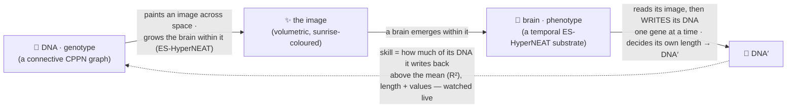
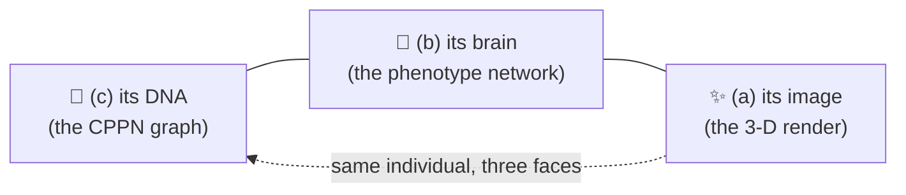
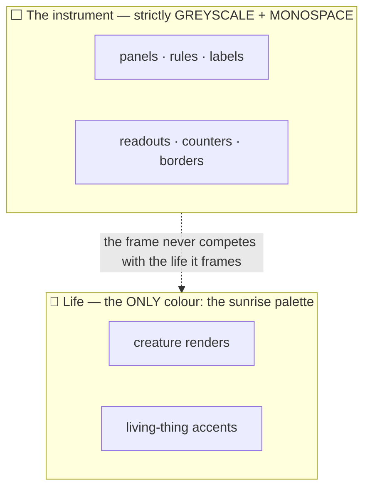

# 🤲 Autograph — Vision

> **The algorithm of life: a lifeform trying to draw its true self out of the false — and a whole world watching, and helping, a neural network understand its true self.**

This is the single source of truth for *why* Autograph exists — the soul and the two things it tries to teach. Everything else (the [README](./README.md), the [whitepaper](./docs/WHITEPAPER.md), the [blog](./docs/BLOG.md), the [design notes](./docs/notes/)) descends from this page. If a feature, a sentence or a pixel does not serve what is written here, it does not belong.

---

## 1. The Genesis, and the loop 🌅

Autograph is a single, living **strange loop** you join the moment the instrument loads. Every creature that has ever lived in it descends from one canonical seed — the **Genesis** of the world, preserved byte-for-byte:

```text
And yet.... 🦕 a trace.... ✨ of.. the true self... 🐣 exists.... 🐥 within the false 🍗 = 🦖
```

A creature is **two networks that make each other**:

- 🧬 **DNA — the genotype.** A small *connective* CPPN. Hand it two coordinates in space and it answers with `[weight, bias]` — the connection strength painted between them, and (read at a single point) a neuron's bias. It is the recipe, and we draw it as a small graph of nodes and edges.
- 🧠 **The brain — the phenotype.** An ES-HyperNEAT *substrate* that **emerges within** the DNA's image: its hidden neurons are **placed, made dense, and wired** by a genuine quadtree of the DNA's weight pattern (Risi & Stanley 2012), settling where the pattern carries information. Queried across three-dimensional space, it answers with a field of *density* and *hue* — and that field, rendered, is the **image** the creature is born in.

The loop is literal — and it is the *same function*, read two ways:



The DNA paints an image; a brain **emerges within that image**; then the brain **reads the image it's born in** and **writes its own DNA back**. In v7 that became a genuine self-write. The brain takes attention-chosen, foveated **glimpses** of its image (it decides where to look, [RAM](https://arxiv.org/abs/1406.6247)-style — *evolved* hard attention), **ponders** over a handful of recurrent steps — its synapses self-modifying *as it looks*, under its own [neuromodulation](https://arxiv.org/abs/2002.10585) — and then **writes its DNA autoregressively**, one gene at a time, *from its own neurons*, feeding back its previous output ([seq2seq](https://arxiv.org/abs/1409.3215)) and **halting when it decides it is done** — so the creature itself chooses how long its DNA is. No re-projecting through the recipe, no length handed to it; the writer is the creature's own evolved network, a continuous cousin of Chang & Lipson's [neural-network quine](https://arxiv.org/abs/1803.05859), now genuinely self-writing. **Loop skill** measures how much of its own DNA the brain writes back, above just predicting the mean (R² = 1 − MSE/Var), scored on **both length and values** and **weighted by how much of itself it closes** — measured live, never faked: a blank or trivial image scores **0.000**, the emitted length **genuinely evolves toward the genome's**, and a single garden reaches about **22%** on this far harder loop — humbling, earned, always climbing, never "solved".

Then comes the honest, humbling part — and in v7 it is a **measured, structural truth**. There are two ways a creature cannot fully know itself. First, if you *fully iterate* the self-map it drifts toward the only effortless fixed point: a flat, silent creature whose genes have lost all variance, that "encodes itself" by saying nothing (the *zero quine*, vitality → 0 — we measured the drift). Perfect self-knowledge is emptiness. Second — and now it reaches for its *whole* self, face and becoming alike, writing its DNA from scratch — it still grasps only a **fraction**: a single garden writes back about a *quarter* of its DNA, and even the *length* of itself is something it must discover (we watch that length converge toward the truth as it evolves). So **"life is imperfect self-knowledge"** is no longer only a poem we chose; it is a result the instrument *discovered about itself*: **we reach for our true selves and hold only a part — and the reaching is the life.** A living creature can only ever *approach* closure, never rest there — and the vitality gate + quality-diversity (see §3) hold the search on the living side.

---

## 2. Two things we show, never lecture 📐

Autograph is an *explorable explanation*. It earns its two teaching goals by making them visible and toggle-able, not by writing them on a slide.

### Goal A — what an indirect encoding really is (ES-HyperNEAT)

The deepest comprehension goal: **a beautiful render *is* a neural network, and that neural network *has* a DNA.** The instrument lets you view the *same* individual three ways and flip between them:



Seeing genotype → substrate → render as three views of one thing teaches *indirect encoding* — the genome is a small recipe that grows a much larger body — in a way no diagram can. The neurons aren't placed on a fixed grid; a genuine **ES-HyperNEAT** quadtree of the DNA's weight pattern decides where information lives, how dense the neurons are, and which connections express (Risi & Stanley 2012). We implement the real algorithm and name its one honest bound — a browser-capped quadtree depth — in §3.

### Goal B — what distributed compute is for (a live swarm)

Autograph runs **on your own device and joins a shared world**. There is no account, and nothing leaves the tab but the elites you choose to share; you are one node among many. Many devices grow *one shared garden* through a coordinator, so a creature discovered on a phone in one city **migrates** to illuminate the wall for everyone, and the tree of life is a single shared genealogy — with a live peer count and a collective gen/s you can watch climb as machines join. (`?swarm=off` keeps you fully local.) The deploy details are in the [coordinator runbook](./docs/DEPLOY-coordinator.md). The teaching is gentle and true: *idle, consenting, ordinary hardware can grow something beautiful together*, and the commons is protected by openness, not by a coin.

**The shape the swarm takes is an archipelago.** Because devices run at wildly different speeds and sync only now and then, the swarm is an *asynchronous island model*: isolated demes form on their own — with no designed topology — simply because a fast desktop and a throttled phone drift apart between syncs. Best-per-niche elites migrate through the coordinator; isolation breeds *allopatric speciation*; speciation breeds diversity. A planetary archipelago of emergent islands, all feeding one signed genealogy, is the prize. **Honestly:** the swarm, the coordinator, live peer count and best-per-niche migration are real today; the coordinator's trust layer is signed-lineage + rate-limiting + keep-best merge, with full replication and a zkML "proof of becoming" for untrusted machines still to come.

**And the crowd genuinely out-discovers the lone mind — the point, made measurable.** This loop is hard, and v7's self-write made it honestly harder still — the brain writes its DNA from scratch and must discover its own length: a single machine evolving alone is humbled, reaching about **~22%** loop-skill over a couple of thousand generations, still climbing (a blank or random creature scores **0.000**; closing *more* of yourself counts for more — it is *not* a freebie). The crowd climbs far higher: the swarm dynamics that carried earlier worlds' self-encoders far above the lone explorer are unchanged, and v7's collective ceiling is the fresh world's to write as the islands run it. *No mind knows itself alone* is not only the soul of the piece; here it is a measured result.

---

## 3. The honesty ethic 🫶

The project lives or dies on not over-claiming. Three rules, no exceptions:

- **Real is labelled real; illustrative is labelled illustrative.** Today the DNA evolved by NEAT augmenting topologies (add-node / add-connection with innovation numbers, recurrent links) + speciation + textbook innovation-aligned crossover, the genuine ES-HyperNEAT substrate (quadtree division + band-pruning placement/density/connectivity), an optional Novelty Search mode, the 3-D volumetric render, the v7 self-writer loop (the brain reads the rendered image then autoregressively writes its own DNA back, deciding its own length → DNA′) and its honest baseline-corrected, complexity-weighted skill (R² on length + values), the signed lineage that auto-records the champion line and persists across sessions, the MAP-Elites diversity map, and the **live shared swarm** (peer count, collective gen/s, best-per-niche migration through the coordinator) are **real and running**. The honestly-flagged approximations are the *bounded* ES-HyperNEAT quadtree depth, its 2-D placement sheet (with a 3-D swept render), and the heterogeneous-activation / CPPN-bias extensions. The **temporal brain is now real (v6)**: the read-back is a genuine **read → ponder → emit** — the creature takes attention-chosen, foveated **glimpses** of its image ([RAM](https://arxiv.org/abs/1406.6247)-style *evolved* hard attention), **ponders** over recurrent steps with CPPN-painted **Hebbian plasticity** + **[Backpropamine](https://arxiv.org/abs/2002.10585)-style neuromodulation** active, **halts** when it has seen enough ([ACT](https://arxiv.org/abs/1603.08983)), then **emits** its DNA′. It is, in plain and literally-true words, a *thinking, self-modifying, recurrent, neuroevolved* network — **no transformer, no LLM**. And it discovered a humbling truth about itself: a creature recovers its visible **form** but not its temporal **interior** — *measured*, not assumed (§1). Still **directions**, clearly marked: a single dedicated evolution **Web Worker** + **WASM/SIMD** for smoother throughput (a multi-core eval pool is precluded — it would change the honest numbers); a **dynamics-readout** (*Phase 5b*) that might one day let a creature recover its interior from the *trace it leaves* rather than its static portrait; and the zero-knowledge "proof of becoming", full verification of untrusted machines, and the quantum framing. All of these we mark plainly wherever they appear — none is claimed as implemented.
- **No grift.** No coin, no token, no manufactured scarcity, no pay-to-participate. Provenance is proved the way [Git](https://git-scm.com/book/en/v2/Git-Internals-Git-Objects) proves it — content-addressed and signed — with no blockchain.
- **Self-reference must be load-bearing.** A blank creature "encodes itself" with nothing to reconstruct — it scores ~0 skill (no variance) *and* is refused by the vitality gate. So closure alone is never rewarded: a **vitality gate** plus **MAP-Elites quality-diversity** keep the population pushing against a real world, exactly as a self-replicator coupled to a task must ([Chang & Lipson](https://arxiv.org/abs/1803.05859)'s lesson).

---

## 4. The aesthetic doctrine 🎛️

> **A precise greyscale instrument framing vivid, sunrise-coloured life.**

Autograph is not a scrolling marketing page; it is a full-screen **instrument** — mission-control for a live experiment. The discipline is borrowed from high-end audio and the restraint of Dieter Rams' Braun: nothing decorative, everything legible.



- **The chrome is monochrome.** Every panel, rule, label, readout and the fitness borders on the population grid are greyscale and monospace. Value, not hue, carries meaning.
- **Colour means life, and nothing else.** The only colour anywhere is the **sunrise** palette — the [HSLuv](https://www.hsluv.org/) colour space (MIT), at Lightness 72, Saturation 100, with hue swept the full 0→360 and an alpha around 0.7. It colours *living things only*: the creatures' images and the accents that stand for life. HSLuv gives a perceptually even sweep, so the cycle glows like a sunrise with no muddy or blown-out arcs.

When you are unsure whether something should have colour, the answer is almost always no. Colour is reserved for the life inside the machine.

---

<sub>🌿 Autograph is built by **[Aqeel Akber](https://aqeelakber.com)**, who also builds **[meos](https://meos.do)** — local-first, sovereign, on-device. The same belief at a different scale: a thing that belongs to itself, grown by many hands. 🤲↺</sub>
