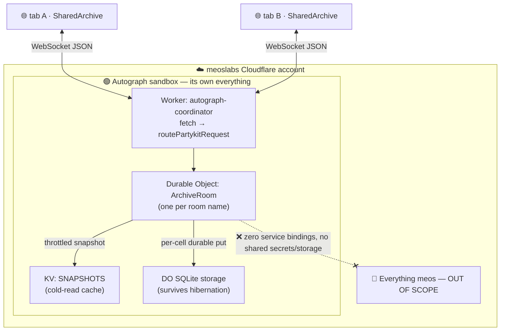
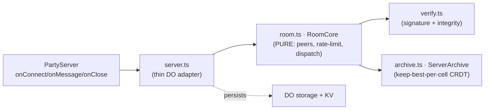

# 🌐 Autograph swarm coordinator (v2)

> **One room = one shared world.** A [PartyServer](https://github.com/cloudflare/partykit/tree/main/packages/partyserver)-on-[Cloudflare-Durable-Objects](https://developers.cloudflare.com/durable-objects/) coordinator that holds the global [MAP-Elites](https://arxiv.org/abs/1504.04909) archive (the **archipelago**) and the signed lineage, so a creature discovered in one tab illuminates the wall for everyone.

**Status: built, locally verified, _undeployed by design_.** Nothing here deploys automatically. The creator deploys it sandboxed inside the meoslabs Cloudflare account — see [`../docs/DEPLOY-coordinator.md`](../docs/DEPLOY-coordinator.md) for the design + scoped-token runbook (this README is the concrete implementation of that spec).

It implements the **swap-able `Archive` seam** already in the engine ([`../web/src/engine/archive.ts`](../web/src/engine/archive.ts)), so a tab joins the shared garden with a one-line swap and **no engine/UI rewrite**.

---

## 🧱 Architecture & boundaries



Inside the Durable Object, the logic is split so it is provable without a network:



---

## 🗂️ Structure

```text
coordinator/
├── src/
│   ├── server.ts      # Worker entry + ArchiveRoom Durable Object (thin adapter)
│   ├── room.ts        # RoomCore — PURE room logic (peers, rate-limit, push/pull)
│   ├── archive.ts     # ServerArchive — keep-best-per-cell merge + dedup (CRDT)
│   ├── verify.ts      # signed-lineage + genome-integrity verification
│   ├── ratelimit.ts   # per-connection token bucket
│   └── protocol.ts    # wire message types + shared domain types + limits
├── client/
│   └── swarmClient.ts # SharedArchive — implements the engine's `Archive` seam
├── test/
│   ├── integration.test.ts        # REAL workerd: 2 WS clients, peer count, push/pull, reject
│   └── fixtures/genuine-elites.json  # GENUINE elites, signed by the real engine
├── scripts/
│   ├── smoke.ts        # zero-dependency proof of all logic (node type-stripping)
│   ├── make-fixture.ts # regenerates the fixture from web/src/engine (READ-ONLY)
│   └── ws-smoke.ts     # raw-socket 2-client e2e vs a running server (optional)
├── wrangler.jsonc      # sandboxed config — placeholders only, zero meos bindings
└── vitest.config.ts    # @cloudflare/vitest-pool-workers (real workerd)
```

---

## 📡 Protocol

One WebSocket per tab, at `wss://<host>/parties/archive-room/<room>` (the `archive-room` segment is the kebab-cased `ArchiveRoom` binding; `<room>` is the world name, default `archipelago`). All frames are JSON. `PROTOCOL_VERSION = 1`.

### Client → server

| `type` | Payload | Meaning |
|---|---|---|
| `hello` | `{ client? }` | Optional handshake; server re-sends `welcome`. |
| `push` | `{ elites: WireElite[] }` | Submit best-per-niche elites for keep-best merge. |
| `pull` | `{ since?, limit? }` | Migration: fetch others' elites (`since` = cursor). |

### Server → client

| `type` | Payload | Meaning |
|---|---|---|
| `welcome` | `{ peers, room, you }` | Sent on connect (room dims + live peer count). |
| `peers` | `{ peers }` | Live peer count; broadcast on every join/leave. |
| `delta` | `{ elites, room }` | Newly-accepted elites, fanned to **other** peers (live migration). |
| `elites` | `{ elites, room }` | Reply to `pull` (a window of the shared archive). |
| `ack` | `{ accepted, rejected, reasons[] }` | Honest per-`push` feedback (why each was kept/dropped). |
| `error` | `{ code, message }` | `rate-limited`, `too-large`, `bad-json`, … |

A **`WireElite`** is `{ genome, evaluation, lineage }` — the DNA, its measured behaviour, and its signed, content-addressed [`LineageEntry`](../web/src/engine/lineage.ts). Domain types mirror the engine and are pinned by the genuine fixture (see Trust model).

---

## 🔐 Trust model — honest about v1

Untrusted browsers can submit junk. v1 leans on three real, weekend-buildable pillars, and is explicit about what is **roadmap**:

| Pillar | What it guarantees | Status |
|---|---|---|
| **Signed lineage** (ECDSA P-256 over a SHA-256 content-id) | **Authenticity** — you cannot impersonate another author key, nor graft a genome onto a lineage you do not hold the key for. **Format-agnostic** (uses the genome hash as an opaque string) — it can never reject a genuine elite because the engine's genome encoding evolved. | ✅ built |
| **Genome integrity** (re-hash `genomeBytes` → must equal the signed `genomeHash`) | Catches a **tampered or swapped** genome early. This is the one piece coupled to the engine's genome encoding; it is pinned by the genuine fixture + smoke gate. | ✅ built |
| **Keep-best + rate-limiting** | Best-per-cell merge means an honest creature evicts a junk one; per-connection token buckets + size/elite caps blunt floods. | ✅ built |
| **Fitness correctness** (is the _claimed_ fidelity _true_?) | The coordinator does **not** re-run the substrate/fitness loop (kept out of the Worker by design), so a key holder can sign an honest-looking-but-inflated number. Ranking uses the **signed** fidelity, so a forged _unsigned_ field cannot win — but a dishonest key still can. | 🔭 roadmap: [BOINC-style](https://github.com/BOINC/boinc/wiki/Job-replication) replication and/or zkML "proof of becoming". Bad keys are attributable and blockable. |

> 🚩 **No coin, no token, no pay-to-participate.** The only thing crossing the wire is public, signed, tamper-evident lineage + behaviour. meoslabs sponsors the infrastructure for a modest credit — that is the whole arrangement.

### Keeping the genome mirror honest (drift gate)

`verify.ts:genomeBytes` mirrors `web/src/engine/cppn.ts:genomeBytes` — the **only** coupling to the engine's genome format. It is guarded, not trusted:

```bash
npm run make-fixture && npm run smoke   # regenerate genuine elites + re-verify
```

If the engine changes the genome encoding, this trips loudly (`genome-hash-mismatch`). Then re-sync `genomeBytes`, bump `GENOME_FORMAT_VERSION`, and regenerate. _(During this build the engine added a per-connection `gater` field; the gate caught it and the mirror was updated to match — exactly the intended workflow.)_

---

## ✅ Verify locally (no deploy)

```bash
npm install
npm run typecheck   # tsc: worker + client connector + tests
npm run smoke       # zero-dependency proof (Node type-stripping) — 15 checks
npm test            # REAL workerd (Miniflare) integration — 2 WebSocket clients
# optional, against a running server:
npm run dev         # terminal 1: wrangler dev on :8787
npm run ws-smoke    # terminal 2: raw-socket 2-client end-to-end
```

**Latest local results (all green):**

- `npm run smoke` → **15/15**: verification accepts a genuine engine-signed elite and rejects a tampered genome, forged signature, swapped author, spoofed fidelity and junk; keep-best-per-cell + content-addressed dedup + order-independent (commutative) merge; token-bucket rate-limiting; a two-client `RoomCore` (peer count = 2, push → delta + pull, forgery rejected).
- `npm test` → **2/2** in workerd: health check; **two clients share one world** — peer count reaches 2, client A pushes a genuine elite, client B receives it live (`delta`) and via `pull`, a tampered genome and a forged signature are both rejected, peer count drops to 1 on disconnect.
- `npm run ws-smoke` → real-socket end-to-end green against `wrangler dev`.

---

## 🚀 Deploy runbook (for the creator)

> Leave all of this to the creator. This repo ships nothing that deploys automatically.

**1 — Scoped API token** (never the account login / Global key). Cloudflare dashboard → _Manage Account → API Tokens → Create Custom token_, scoped to the meoslabs account, least privilege:

- `Account › Workers Scripts › Edit`
- `Account › Workers KV Storage › Edit`
- `Account › Durable Objects › Edit` _(if your account separates it from Workers Scripts)_
- `Zone › Workers Routes › Edit` _(only for a custom subdomain on a zone; omit for `*.workers.dev`)_

**2 — Create the dedicated KV namespace** and paste its id into `wrangler.jsonc` (replacing the all-zero placeholder):

```bash
cd coordinator
CLOUDFLARE_API_TOKEN=*** CLOUDFLARE_ACCOUNT_ID=*** npx wrangler kv namespace create autograph-snapshots
# → copy the printed id into kv_namespaces[0].id in wrangler.jsonc
```

**3 — Deploy** (applies the DO migration + binds KV, all inside the sandbox):

```bash
CLOUDFLARE_API_TOKEN=*** CLOUDFLARE_ACCOUNT_ID=*** npx wrangler deploy
```

The Worker comes up at `autograph-coordinator.<your-subdomain>.workers.dev` (or a `coordinator.autograph.<domain>` route you control — **never** a meos hostname). Verify `GET /health` returns `{ ok: true }`, then point the site's coordinator URL at `wss://<that-host>`.

**Sandbox guarantees enforced by `wrangler.jsonc`:** a dedicated Worker, a dedicated `ArchiveRoom` Durable Object namespace, a dedicated `SNAPSHOTS` KV — and **zero** `services` / `d1_databases` / `r2_buckets` / `queues` / `hyperdrive` / foreign `kv_namespaces`. Blind to meos by construction. Add a [Rate Limiting rule](https://developers.cloudflare.com/waf/rate-limiting-rules/) on the hostname + usage alerts as the operational guards (in-DO token-bucket limits are already enforced).

---

## 🔌 Wiring into the web app (the UI team, later — no edits here needed)

`client/swarmClient.ts` implements the **same `Archive` interface** the engine already depends on, via two injected seams so it never imports `web/src`:

```ts
import { SharedArchive } from '../../coordinator/client/swarmClient.ts';
import { LocalArchive } from './engine/mapelites.ts';
import { createEntry } from './engine/lineage.ts';

const shared = new SharedArchive({
  url: 'wss://autograph-coordinator.<subdomain>.workers.dev',
  mirror: new LocalArchive(14, 14),                  // synchronous read model (UI unchanged)
  signer: { sign: (g, e) =>                          // reuses the engine's signed lineage
    createEntry({ genome: g, parents: [], seed: null, fidelity: e.fidelity, identity }) },
  onPeers: (n) => showPeerCount(n),
});
const garden = new Garden(seed, 14, 14, shared);     // (Garden taught to accept an Archive)
```

Reads (`get`/`best`/`forEach`/`drainDirty`…) delegate to the local mirror, so the renderer is untouched; `tryInsert` updates the mirror **and** signs + shares the elite; inbound migrations are merged via the same keep-best path and surface through the existing `drainDirty()` redraw.

---

## ⚖️ Licence

MIT, as the rest of Autograph.
