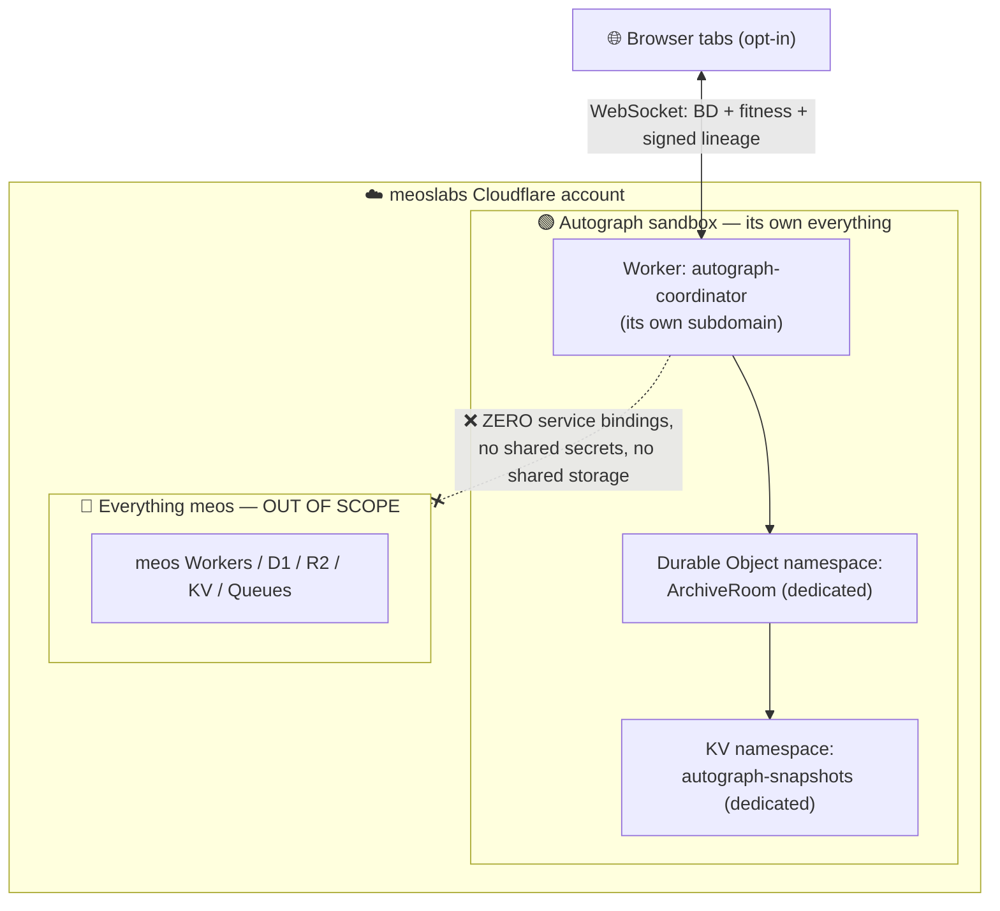

# Autograph v2 — shared-archive coordinator (runbook)

> 🚧 **STATUS: NOT DEPLOYED YET — awaits the creator.** This document specifies the
> planned v2 coordinator. Nothing here is live; v1 (the published site) runs
> entirely on the visitor's own device with **no backend**. Deploy only when you
> (Aqeel) choose to. All identifiers below are **placeholders** — no real account
> IDs, tokens, routes, or any meos internals appear in this repo.

---

## What it is

v1 Autograph evolves a [MAP-Elites](https://arxiv.org/abs/1504.04909) archive **locally**, in one tab. v2 lets many tabs **grow one shared garden**: a small coordinator that holds the global MAP-Elites archive and the signed lineage, so creatures discovered on one device illuminate the wall for everyone.

The chosen path:

- **[PartyServer](https://github.com/cloudflare/partykit)** — PartyKit-style stateful servers — running on **Cloudflare [Workers](https://developers.cloudflare.com/workers/) + [Durable Objects](https://developers.cloudflare.com/durable-objects/)**. One Durable Object instance owns the authoritative archive + lineage for a room and fans out updates over WebSockets; **[Workers KV](https://developers.cloudflare.com/kv/)** holds periodic archive snapshots for cheap cold reads.
- Deployed **sandboxed inside the meoslabs Cloudflare account**, and credited on the site as **“coordinator sponsored by meoslabs.”** meoslabs lends the infrastructure; it gets a small, honest credit — nothing more.

It implements the **`Archive` seam** already in the codebase (see “Wiring” below), so no engine or UI rewrite is needed to switch a tab from the local archive to the shared one.

---

## Isolation: blind by construction 🧱

The coordinator lives in the meoslabs account but must be **unable to see or touch anything meos**, by design — not by policy.



**Hard guarantees to enforce when provisioning:**

| Guarantee | How |
|---|---|
| **Dedicated Worker** | A single Worker `autograph-coordinator`; nothing else routes through it. |
| **Dedicated Durable Object namespace** | One DO class (e.g. `ArchiveRoom`); its storage is private to this Worker. |
| **Dedicated KV namespace** | `autograph-snapshots`, used only for archive snapshots. |
| **ZERO service bindings to meos** | No `services`, no `d1_databases`, no `r2_buckets`, no `queues`, no `kv_namespaces`, no Hyperdrive — pointing at any meos resource. The `wrangler.toml` binds **only** the Autograph DO + KV above. Blind by construction: it has no handle to meos data. |
| **Its own subdomain** | e.g. `autograph-coordinator.<subdomain>.workers.dev` or `coordinator.autograph.<domain>` — never a meos hostname or route. |
| **No shared secrets** | The Worker has no meos API keys/tokens in its environment; only its own (if any). |

**Operational guards:**

- **Rate limits** — a [Rate Limiting rule](https://developers.cloudflare.com/waf/rate-limiting-rules/) on the coordinator hostname (per-IP request and WebSocket-message caps), plus message-size and archive-write caps inside the DO.
- **Usage alerts** — Cloudflare **billing/usage notifications** and Workers analytics alerts on request volume, DO duration, and KV operations, so a runaway tab or abuse is noticed immediately.
- **Abuse containment** — opt-in only; the coordinator accepts public, signed lineage data and behaviour descriptors, never PII (see “What it stores”).

---

## Deploy security: a narrowly-scoped token, never the account login 🔑

**Do not** deploy this with an account-wide `wrangler login` (OAuth) or a Global API Key — those can touch every meos resource. Instead mint a **custom [Cloudflare API token](https://developers.cloudflare.com/fundamentals/api/get-started/create-token/)** scoped to *only* the resources this project needs, and hand it to CI as a secret.

**Minimum permissions for the token (account-scoped, least privilege):**

- `Account › Workers Scripts › Edit`
- `Account › Workers KV Storage › Edit`
- `Account › Durable Objects › Edit` *(Workers Scripts edit covers DO migrations in current Wrangler; keep DO explicit if your account separates it)*
- `Zone › Workers Routes › Edit` *(only if binding a custom subdomain on a zone; omit for `*.workers.dev`)*

Scope the token to the **specific account** (and, where the dashboard allows, the **specific resources**) — **not** “all accounts”, **not** account-wide admin. Set a sensible TTL and rotate it. The token is the only credential CI ever sees.

---

## The 3-step runbook

> Prerequisites: `web/` builds (`npm ci && npm run build`), the coordinator Worker source + a `wrangler.toml` exist (sketch below), and you have access to the meoslabs Cloudflare account.

### 1) Mint the scoped token

Cloudflare dashboard → **Manage Account → API Tokens → Create Token → Custom token**. Add only the permissions listed above, scope to the meoslabs account (and specific resources if offered), set a TTL, and **copy the token once** (it is shown only at creation). You will also need the **Account ID** (dashboard sidebar) — it is an identifier, not a secret, but treat it as config.

### 2) Set the GitHub Actions secret

In the `admiralakber/autograph` repo → **Settings → Secrets and variables → Actions**:

- `CLOUDFLARE_API_TOKEN` → the scoped token from step 1 (**secret**)
- `CLOUDFLARE_ACCOUNT_ID` → the account ID (**secret** or repo **variable**)

CI (or your shell) reads these; the token is never committed. A deploy job would look like:

```yaml
# .github/workflows/deploy-coordinator.yml  (illustrative — add when ready)
name: Deploy coordinator
on: { workflow_dispatch: {} }     # manual only, until the creator opts in
jobs:
  deploy:
    runs-on: ubuntu-latest
    steps:
      - uses: actions/checkout@v4
      - uses: cloudflare/wrangler-action@v3
        with:
          apiToken: ${{ secrets.CLOUDFLARE_API_TOKEN }}
          accountId: ${{ secrets.CLOUDFLARE_ACCOUNT_ID }}
          workingDirectory: coordinator   # the Worker package
```

### 3) `wrangler deploy`

Locally (token in env) or via the manual workflow above:

```bash
cd coordinator
CLOUDFLARE_API_TOKEN=*** CLOUDFLARE_ACCOUNT_ID=*** npx wrangler deploy
```

`wrangler deploy` ([docs](https://developers.cloudflare.com/workers/wrangler/commands/#deploy)) uploads the Worker, applies the Durable Object migration, and binds the KV namespace — all inside the sandbox. Verify the subdomain responds, then point the site's coordinator URL at it.

> Reminder: **leave all three steps for the creator.** This repo ships nothing that deploys automatically; the coordinator workflow above is `workflow_dispatch` (manual) on purpose.

---

## A generic `wrangler.toml` sketch (placeholders only)

```toml
name = "autograph-coordinator"
main = "src/server.ts"
compatibility_date = "2026-01-01"

# Dedicated Durable Object — the authoritative archive room.
[[durable_objects.bindings]]
name = "ARCHIVE_ROOM"
class_name = "ArchiveRoom"

[[migrations]]
tag = "v1"
new_classes = ["ArchiveRoom"]

# Dedicated KV for archive snapshots (replace with the real id at deploy time).
[[kv_namespaces]]
binding = "SNAPSHOTS"
id = "<AUTOGRAPH_KV_NAMESPACE_ID>"

# NOTE: there are deliberately NO [[services]], [[d1_databases]], [[r2_buckets]],
# [[queues]] or [[hyperdrive]] bindings. The coordinator is blind to meos.
```

---

## Wiring it to the `Archive` seam

The engine already exposes the swap-able contract in [`../web/src/engine/archive.ts`](../web/src/engine/archive.ts): every consumer (the `Garden` loop, the live demo) depends on the `Archive` interface, and the local in-memory `LocalArchive` (`MapElites`) implements it today.

A `SharedArchive` would implement the **same** `Archive` interface:

- keep a **local mirror** of the global archive snapshot (so `get`, `best`, `bestLively`, `forEach`, `coverage` stay synchronous and the UI is unchanged);
- on `tryInsert`, update the mirror **and** forward the creature (+ its signed lineage entry) to the coordinator over the WebSocket;
- apply inbound deltas from the coordinator into the mirror and mark cells dirty via the existing `drainDirty()` redraw path.

Then a tab joins the shared garden with a one-line swap — `new Garden(seed, cols, rows, new SharedArchive(coordinatorUrl))` — with **no change** to the evolution loop or the renderer. (If a call site must await the network round-trip, promote `Archive` to an async variant; the interface stays the single source of truth.)

**What it stores:** the global MAP-Elites archive (genomes + behaviour descriptors + fitness) and the **signed, content-addressed lineage** — public, verifiable, no PII. Trust follows the v1 plan: [BOINC-style](https://github.com/BOINC/boinc/wiki/Job-replication) replication/tolerance plus the signed lineage; the coordinator can re-verify signatures server-side.

---

## 🚩 Anti-grift line

The coordinator changes **nothing** about the ethics: **no coin, no token, no token-gating, no pay-to-participate.** Compute is opt-in, visible and revocable; the only thing crossing the wire is public, signed, tamper-evident lineage and behaviour data. meoslabs sponsors the infrastructure and gets a modest credit — that is the whole arrangement.
