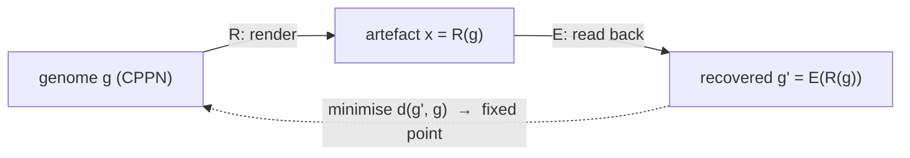

# Autograph: Crowd-Evolved Self-Referential Networks as Generative Art

**A working whitepaper.** *Version 0.1 — weekend draft, open for review.*
**Author:** Aqeel Akber · built on the public groundwork in [`neuroevolution-swarm-stack-2026.md`](../research/neuroevolution-swarm-stack-2026.md).

---

## Abstract

We describe **Autograph**, a browser-native, crowd-powered system that evolves a population of small neural networks toward **self-reference**: a [compositional pattern-producing network (CPPN)](#references) whose rendered output is a decodable encoding of its own genome. This is the artwork analogue of a *quine* — a program that outputs its own source — and a continuous, evolutionary cousin of the [neural network quine](#references) of Chang & Lipson (2018). We frame self-reference, self-replication and (prospectively) cryptographic self-commitment as instances of a single **fixed-point** construction, the same diagonal trick underlying Gödel's incompleteness and Kleene's recursion theorem. The population is illuminated by **MAP-Elites** quality-diversity and rendered as a live generative artwork: a gallery of *kinds* of strange loop. Evaluation runs on a single portable WGSL core spanning phones to headless H100-class GPUs; volunteer results are made trustworthy via replication, tolerance comparison, and — prospectively — self-certifying genomes. We state the system's central claim in falsifiable form, are explicit about where exactness is impossible (cross-device floating-point non-determinism), and we are scrupulous about the maturity of the two technical pillars: a signed Merkle-DAG lineage that is **built and real today**, a zkML "proof of becoming" named honestly as a **research north star**, and a quantum framing kept strictly as **metaphor and lineage, never mechanism**.

---

## 1. Introduction

Most contemporary machine learning optimises a fixed objective on a fixed architecture with gradient descent at industrial scale. An older, stranger tradition asks a different question: *can a process be open-ended* — endlessly generating novel, interesting, learnable artefacts — and *what do the artefacts so produced look like on the inside?* Recent position work argues open-endedness is essential to the next era of capable AI [9], and recent empirical work suggests that artefacts produced by open-ended evolutionary search can possess markedly cleaner internal structure than their gradient-trained counterparts [11].

Autograph takes the most self-contained possible target for such a search — **a network that refers to itself** — and makes the search a public, browser-based, crowd-powered artwork. The contribution is not a new algorithm; it is a *synthesis*: Picbreeder-style crowd-evolved CPPNs [6], the neural-network quine [12], MAP-Elites illumination [5], and a one-runtime volunteer-compute substrate [briefing], arranged so that the scientific object (an approximate fixed point of self-encoding) and the aesthetic object (Escher's *Drawing Hands*, alive) are literally the same thing.

We emphasise honesty throughout. The strange loop is real and computable; several adjacent ideas we find beautiful (notably the quantum angle, §3.7) are **speculative and labelled as such**.

---

## 2. Background and related work

**Self-reference and fixed points.** Gödel's incompleteness theorems [13] construct a sentence asserting its own unprovability via a diagonal/fixed-point lemma. The computational counterpart is Kleene's recursion theorem [14], which guarantees the existence of programs with access to their own description; a [*quine*](#references) is the minimal instance — a fixed point of the execution map, `run(p) = p`. Hofstadter's *Gödel, Escher, Bach* [15] popularised the thesis that such "strange loops" are a deep structural motif across logic, visual art (Escher's *Drawing Hands* [16]) and music (Bach's endlessly rising canon [17]); his later *I Am a Strange Loop* [10] argues the self itself is such a loop.

**Self-replication.** Von Neumann's universal constructor [18] established that machines can build copies of themselves given a description they both *interpret* and *copy*; Langton's loops [19] are a minimal cellular-automaton realisation. Chang & Lipson [12] brought this into deep learning with the **neural network quine** — a network trained (by gradient descent and/or a "regeneration" fixed-point iteration) to output its own weights via coordinate indexing — and observed a trade-off between auxiliary-task performance and replication fidelity, echoing the biological tension between reproduction and other functions.

**Neuroevolution and indirect encodings.** NEAT [1] evolves both weights and topology, complexifying from minimal structure. CPPNs [6] are compositional networks queried over coordinates to produce regular, symmetric patterns (and, in HyperNEAT, the weights of larger substrates). Picbreeder [6] demonstrated crowd-powered, branch-from-each-other CPPN evolution in the browser; Galactic Arms Race used implicit player behaviour as the fitness signal [briefing].

**Open-endedness and quality-diversity.** Novelty search [2] abandons the objective in favour of behavioural novelty and frequently outperforms objective-based search on deceptive tasks. MAP-Elites [5] keeps the best solution per cell of a behaviour-descriptor grid, yielding a *map* of diverse high performers ("illumination"). POET [7] co-evolves problems and solutions; ELM [8] uses learned operators inside MAP-Elites. The position paper of Hughes et al. [9] argues open-endedness is essential for superhuman AI; Kumar, Clune, Lehman & Stanley [11] report that open-endedly evolved CPPNs approach a "unified factored representation" (UFR), whereas conventional SGD tends toward a "fractured entangled representation" (FER) — directly relevant to *why* an evolved self-portrait might be legible.

**Volunteer compute and its perils.** BOINC [20] established the playbook for untrusted distributed computation (replication, quorum, homogeneous redundancy, adaptive replication); JSDoop [21] showed browser-based volunteer neural-network training is feasible. WebGPU reaching Baseline in 2026 [22] makes a single GPU-compute runtime spanning phones to servers practical for the first time. The full engineering case is in the companion briefing [briefing].

---

## 3. The system

### 3.1 Task: self-reference as an (approximate) fixed point

Let $g \in \mathcal{G}$ be a genome (a NEAT-encoded CPPN: topology, weights, per-node activations). Two maps define the loop:

- a **render** map $R:\mathcal{G}\to\mathcal{X}$ producing an artefact $x=R(g)$ (an image over a coordinate grid, optionally a bit-string read-out);
- a **read-back** map $E:\mathcal{X}\to\mathcal{G}$ attempting to recover a genome from an artefact.

The target is a genome $g^\star$ that is a **fixed point of $E\circ R$**:

$$ E(R(g^\star)) \approx g^\star . $$

Equivalently, $R(g^\star)$ is a *self-describing artefact* — the picture encodes the painter. (Chang & Lipson's quine is the special case where $R$ reads parameters at coordinate indices and $E$ is the identity on those values [12].) We do **not** assume exact fixed points are reachable; §3.5 explains why bitwise exactness is impossible across heterogeneous hardware, so the operational target is an $\varepsilon$-approximate fixed point under a stated metric.

**Fitness** combines (i) **self-reconstruction error** $d(E(R(g)), g)$ and (ii) a **quality-diversity** pressure (below). A pure objective collapses the population onto one self-encoder; the QD pressure preserves the *space* of them, which is the point.

### 3.2 Representation

NEAT-encoded CPPNs [1,6]: heterogeneous activations (`sin`, `gauss`, `abs`, `tanh`, `sigmoid`, `identity`), evolved topology with innovation-numbered genes and speciation. CPPNs are an ideal substrate here for two reasons: they are coordinate-queried (so rendering is embarrassingly parallel on a GPU), and open-ended CPPN evolution is empirically prone to *factored* internal structure [11], which a self-encoding task should reward.

### 3.3 Archive: MAP-Elites illumination

The archive is a grid keyed by a behaviour descriptor; each cell retains the best genome found for that cell. Candidate descriptor axes (to be tuned empirically):

| Axis | Meaning |
|---|---|
| reconstruction fidelity | how exactly $E(R(g))$ recovers $g$ |
| structural complexity | node/connection count (NEAT complexification) |
| symmetry / regularity | CPPN pattern statistics |
| loop directness | iterations of $E\circ R$ to converge |
| genome compression | description length vs rendered detail |

The illuminated archive *is* the exhibited artwork: a wall of diverse self-portraits, each the champion of its kind.

### 3.4 One-WGSL runtime, phone → H100

Per the companion briefing [briefing], the evaluation kernels (CPPN render; self-reconstruction scoring; mutation/crossover; atomic MAP-Elites insert) are authored **once in WGSL** and run via WebGPU in browsers and, unchanged, headless via Deno/Dawn on server GPUs. Layered fallback `WebGPU → WebGL2 (transform-feedback / ping-pong textures) → WASM SIMD+threads → scalar JS` keeps the swarm inclusive. Variable-topology NEAT is made GPU-friendly by tensorisation (fixed max-topology + masks, or padded population tensors), following TensorNEAT [3] and QDax [4]. The protocol is invariant across tiers; only batch size, precision and replication policy vary.

### 3.5 Trust, and the determinism caveat

WGSL provides **no bit-exactness guarantee** across GPUs/drivers/WASM (FMA contraction, reassociation, per-built-in accuracy bounds; no `fast-math` flag) [23]. Two consequences:

1. **Self-encoding must be defined up to tolerance $\varepsilon$**, not bitwise — the loop "closes" within a stated metric, and the metric must be numerically stable (prefer fixed-point read-outs and order-independent reductions).
2. **No single self-reported score is trusted.** We adopt BOINC's mechanisms [20]: replication + quorum (default 2×, escalate on disagreement), tolerance comparison, homogeneous redundancy, and authoritative server-side recomputation of archive *elites*. Quality-diversity is noise-tolerant by construction [4], which materially helps a churny volunteer swarm.

### 3.6 Pillar 1: cryptographic self-proof

Self-reference (§3.1) and swarm trust (§3.5) are, at the limit, the *same* mechanism: a genome that can prove itself is its own validator. We separate this pillar into three honest maturity tiers.

**Built and real today.** Each creature carries a signed commitment to itself and sits in a tamper-evident phylogeny. A genome's id is a content hash `SHA-256(weights ‖ parent-ids ‖ seed ‖ fitness)`; because each child commits to its parents' ids, the archive becomes a **signed, content-addressed Merkle DAG** — a verifiable tree of life with tamper-evident ancestry, attribution and anti-fraud. Signatures (ECDSA P-256 via the Web Crypto API) bind each entry to an author key, so a creature cannot be grafted onto a lineage without the right key. This is *Git for genomes* — content-addressing as in [Git](https://git-scm.com/book/en/v2/Git-Internals-Git-Objects); append-only transparency as in [Certificate Transparency (RFC 6962)](https://datatracker.ietf.org/doc/html/rfc6962) — a few hundred lines, no chain, no token. The reference implementation ships in the live demo and is round-trip-verifiable: export the lineage, re-import it, and every hash and signature is re-checked (tampered content and forged signatures are both rejected).

**Research north star.** Replace replication + quorum (§3.5) with succinct verifiable computation: each elite emits a [zero-knowledge proof](https://en.wikipedia.org/wiki/Zero-knowledge_proof) that it evaluated genome $g$ on seeded task $s$ and obtained fitness $\varphi$ and descriptor $bd$ — the coordinator *verifies* rather than re-runs. The prover/verifier asymmetry that makes [zkML](https://github.com/zkonduit/ezkl) punishing for large models is a *gift* for our tiny nets: [Kang et al. (2022)](https://arxiv.org/abs/2210.08674) verify ImageNet-scale inference with a ~5 KB proof in ~1 s. A zk circuit also pins a canonical fixed-point arithmetic, dissolving §3.5's cross-device non-determinism. The horizon is recursive proof composition ([Nova](https://eprint.iacr.org/2021/370); IVC/PCD; [Mina](https://minaprotocol.com/blog/22kb-sized-blockchain-a-technical-reference) folds an entire chain into ~22 KB), so the archive root could one day be a single recursive proof of the population's whole becoming. **The gate is proving cost:** we would prove *selectively* (elites, on opt-in / beast nodes) and verify everywhere. We therefore name this a telescope, not a feature.

**Deliberately off the critical path.** An *exact* crypto-hash quine — a network whose output literally equals `H(W)` — is a partial-preimage search, essentially proof-of-work mining. Beautiful to state; we ship the carried/soft commitment instead.

> 🚩 **Anti-grift red line.** Cryptography-as-mathematics, never coins: hashes, commitments, signatures, and eventually zk — no token, no manufactured scarcity. If a feature only makes sense with a coin attached, it is not in Autograph.

### 3.7 Pillar 2: the quantum angle — the soul's physics, not the runtime

We assessed the quantum connection sceptically and reached a clear verdict: it adds real *conceptual* depth and **zero** engineering value to a browser piece. We lean in conceptually and build nothing quantum.

The genuinely deep resonance is not invented for this project — it is a 60-year-old tension in physics. The [no-cloning theorem](https://en.wikipedia.org/wiki/No-cloning_theorem) ([Wootters & Zurek 1982](https://www.nature.com/articles/299802a0)) forbids copying an arbitrary unknown quantum state, which would *kill* self-replication — except that replication was never about cloning the live thing. Von Neumann's universal constructor passes on a **description** (copied) and regrows the **body** (built); [Marletto (2015)](https://pmc.ncbi.nlm.nih.gov/articles/PMC4345487/) shows description-based self-reproduction is fully compatible with quantum theory and categorically distinct from cloning. *The prohibition is the gift:* it is exactly what forces reproduction to work the way life does — and the way a CPPN genome (§3.1) already does. Two supporting beauties, both peer-reviewed: a system cannot accurately measure its own state from the inside ([Breuer 1995](https://www.cambridge.org/core/journals/philosophy-of-science/article/impossibility-of-accurate-state-selfmeasurements/80B368D210379DA587D41603B551B95D)) — the measurement-theoretic twin of Gödel; and Gödel/Turing undecidability surfaces in real physics — the [spectral gap is undecidable](https://www.nature.com/articles/nature16059) (Cubitt, Pérez-García & Wolf 2015 [24]).

> ⚛️ **Honest quantum note.** There are no qubits here. Quantum mechanics is our metaphor and our lineage, *not* our runtime. We claim no quantum speedup — [none exists](https://scottaaronson.blog/?p=198) for this embarrassingly-parallel, classical workload; quantum neural nets suffer barren plateaus; browser state-vector simulators cap at ~16–20 qubits. The single honest hook — *"a creature that cannot be cloned, only re-grown"* — is enough, and it is literally true.

---

## 4. The central claim, and how it is falsifiable

**Claim.** *Open-ended, crowd-scale quality-diversity search discovers a diverse population of approximate self-encoding CPPNs that (a) cannot be matched, in joint diversity-and-fidelity, by objective-only search, and (b) exhibit more factored internal representations than gradient-descent-trained self-encoders of equal output fidelity.*

This is deliberately testable, and each clause can fail:

| Prediction | How it could be falsified |
|---|---|
| **P1.** QD (MAP-Elites + novelty) yields lower self-reconstruction error *and* greater archive coverage than objective-only search. | If an objective-only baseline matches or beats QD on **both** error and coverage, the open-ended premise fails for this task. |
| **P2.** Evolved self-encoders show less "fracture" than SGD-trained self-encoders, by the neuron-visualisation / factoredness metric of [11]. | If evolved and SGD solutions of equal fidelity are indistinguishable on the FER/UFR metric, the representational argument collapses. |
| **P3.** A self-certifying genome (Pillar 1) verifies more cheaply than it re-computes. | If verification cost ≥ recomputation cost at our scale, the trust rationale for Pillar 1 is void — we fall back to replication (§3.5). |

**Where it must fail (stated up front).** Exact, bitwise self-encoding is impossible across heterogeneous hardware (§3.5); we predict only $\varepsilon$-approximate loops. Following Chang & Lipson [12], we also expect a **fidelity-vs-other-function trade-off**: pushing a creature to also be visually striking (the art) will cost self-reconstruction accuracy. Reporting that trade-off curve honestly is part of the result, not a failure of it.

---

## 5. Limitations and ethics

- **It is an artwork and an experiment, not a theorem.** The contribution is a synthesis and a public instrument; the falsifiable claims (§4) are modest and bounded.
- **No over-claiming.** §3.7 (quantum) is metaphor and lineage, never mechanism — there are no qubits in Autograph. In §3.6, the signed Merkle-DAG lineage is built and real; the zkML "proof of becoming" is named as a research north star, not a result.
- **Energy honesty.** Per watt, datacentres win; the swarm's value is harvesting *idle, already-powered* hardware for embarrassingly-parallel QD search at ~zero marginal cost — not efficiency, and emphatically not frontier-model training [briefing, 20].
- **Consent and transparency.** Donated compute requires explicit, revocable opt-in with visible resource use; never crypto-mining by stealth.
- **Accessibility.** A scalar-JS path ensures no device is excluded; colour-blind-safe palettes; no dark patterns.
- **Provenance and credit.** Outputs and lineage are open (CC BY-SA); the intellectual debts in §2 are acknowledged in full.

---

## 6. Future work

- **Atlas of Self-Reference.** Publish the illuminated archive as an open, browsable dataset — every discovered *kind* of strange loop, with lineage — in the spirit of citizen-science corpora.
- **Literal-impact path.** Citizen-science games have produced real artefacts: Foldit players solved and then *designed* proteins, and EteRNA designs were synthesised in a wet lab [briefing]. The analogous ambition for Autograph is that crowd-discovered self-certifying / self-describing structures (Pillar 1) become genuinely useful primitives for trustworthy distributed computation — not merely a metaphor.
- **Self-reference as a benchmark for open-endedness.** Because the target is maximally self-contained, the self-encoding fixed point may be a clean, cheap testbed for comparing open-ended algorithms (POET [7], ELM [8], MAP-Elites [5]) on representation quality [11].
- **Advance the pillars.** §3.6's signed lineage is built; the next step is a scoped zkML proof-of-fitness for archive elites on opt-in nodes, then recursive composition. §3.7 stays narrative by design.

---

## References

1. K. O. Stanley & R. Miikkulainen. *Evolving Neural Networks through Augmenting Topologies* (NEAT). Evolutionary Computation, 2002. https://nn.cs.utexas.edu/downloads/papers/stanley.jair04.pdf
2. J. Lehman & K. O. Stanley. *Abandoning Objectives: Evolution Through the Search for Novelty Alone*. Evolutionary Computation 19(2):189–223, 2011. https://www.cs.swarthmore.edu/~meeden/DevelopmentalRobotics/lehman_ecj11.pdf
3. L. Wang et al. *Tensorized NEAT (TensorNEAT): GPU-accelerated NeuroEvolution*. arXiv:2404.01817. https://arxiv.org/abs/2404.01817
4. F. Lim et al. *Accelerated Quality-Diversity through Massive Parallelism* (QDax). arXiv:2202.01258. https://arxiv.org/abs/2202.01258
5. J.-B. Mouret & J. Clune. *Illuminating Search Spaces by Mapping Elites* (MAP-Elites). arXiv:1504.04909. https://arxiv.org/abs/1504.04909
6. J. Secretan, K. O. Stanley et al. *Picbreeder: A Case Study in Collaborative Evolutionary Exploration of Design Space* (CPPNs). Evolutionary Computation, 2011. https://wiki.santafe.edu/images/1/1e/Secretan_ecj11.pdf · site: https://nbenko1.github.io/
7. R. Wang, J. Lehman, J. Clune & K. O. Stanley. *Paired Open-Ended Trailblazer (POET)*. arXiv:1901.01753. https://arxiv.org/abs/1901.01753
8. J. Lehman, J. Gordon, S. Jain, K. Ndousse, C. Yeh & K. O. Stanley. *Evolution through Large Models (ELM)*. arXiv:2206.08896. https://arxiv.org/abs/2206.08896
9. E. Hughes, M. Dennis, J. Parker-Holder, F. Behbahani, A. Mavalankar, Y. Shi, T. Schaul & T. Rocktäschel. *Open-Endedness is Essential for Artificial Superhuman Intelligence*. ICML 2024. arXiv:2406.04268. https://arxiv.org/abs/2406.04268
10. D. Hofstadter. *I Am a Strange Loop*, 2007. https://en.wikipedia.org/wiki/I_Am_a_Strange_Loop
11. A. Kumar, J. Clune, J. Lehman & K. O. Stanley. *Questioning Representational Optimism in Deep Learning: The Fractured Entangled Representation Hypothesis* (FER/UFR). arXiv:2505.11581, 2025. https://arxiv.org/abs/2505.11581
12. O. Chang & H. Lipson. *Neural Network Quine*. arXiv:1803.05859, 2018. https://arxiv.org/abs/1803.05859
13. K. Gödel. *On Formally Undecidable Propositions* (incompleteness theorems), 1931. https://en.wikipedia.org/wiki/G%C3%B6del%27s_incompleteness_theorems
14. S. C. Kleene. *Recursion theorem*. https://en.wikipedia.org/wiki/Kleene%27s_recursion_theorem · *Quine (computing)*: https://en.wikipedia.org/wiki/Quine_(computing)
15. D. Hofstadter. *Gödel, Escher, Bach: An Eternal Golden Braid*, 1979. https://en.wikipedia.org/wiki/G%C3%B6del,_Escher,_Bach
16. M. C. Escher. *Drawing Hands* (lithograph), 1948. https://en.wikipedia.org/wiki/Drawing_Hands
17. J. S. Bach. *The Musical Offering* (endlessly rising canon), 1747. https://en.wikipedia.org/wiki/Musical_Offering
18. J. von Neumann. *Theory of Self-Reproducing Automata* (universal constructor). https://en.wikipedia.org/wiki/Von_Neumann_universal_constructor
19. C. Langton. *Self-reproduction in cellular automata* (Langton's loops), 1984. https://en.wikipedia.org/wiki/Langton%27s_loops
20. D. P. Anderson. *BOINC*: job replication & homogeneous redundancy. https://github.com/BOINC/boinc/wiki/Job-replication · https://github.com/BOINC/boinc/wiki/Homogeneous-Redundancy
21. J. Á. Morell et al. *JSDoop: browser-based volunteer deep-learning*. arXiv:1910.07402. https://arxiv.org/pdf/1910.07402
22. *WebGPU now in all major browsers (Baseline)*, web.dev, 2026. https://web.dev/blog/webgpu-supported-major-browsers
23. *WGSL specification — floating-point evaluation* (no bit-exactness guarantee). https://github.com/gpuweb/gpuweb/blob/main/wgsl/index.bs
24. T. Cubitt, D. Pérez-García & M. M. Wolf. *Undecidability of the Spectral Gap*. Nature 2015. arXiv:1502.04573. https://arxiv.org/abs/1502.04573 *(referenced only by the speculative §3.7)*

*[briefing] = [`neuroevolution-swarm-stack-2026.md`](../research/neuroevolution-swarm-stack-2026.md), the companion technical scouting report (WGSL one-runtime, GPU NEAT/QD, BOINC-style trust, energy realities, full link set). The cryptographic and quantum pillars (§3.6–§3.7) are grounded in the companion briefings in [`../research/`](../research/).*
