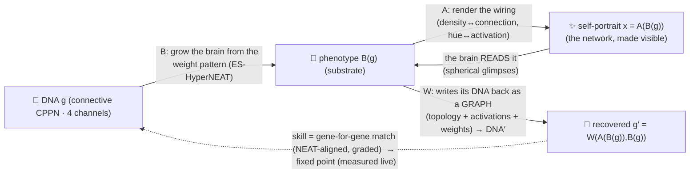

# Autograph: Crowd-Evolved Self-Referential Networks as Generative Art

**A working paper.** *Version 0.1.*
**Author:** Aqeel Akber.
**Design notes (further reading):** [architecture & the swarm](./notes/architecture.md) · [runtime & GPU](./notes/runtime-and-gpu.md) · [cryptography](./notes/cryptography.md) · [quantum](./notes/quantum.md) · [prior art & novelty](./notes/prior-art.md).

---

## Abstract

We describe **Autograph**, a browser-native instrument for a live evolutionary experiment in which small neural networks evolve toward **self-reference**. Each individual is a single **connective [CPPN](#references)** (the genotype, or "DNA") read two ways. Given a pair of 3-D coordinates it emits **four channels** — **structure** (`weight`, `bias`) and **faculties** (`α` plasticity, `modGate` neuromodulation). From the **weight** pattern a genuine **[ES-HyperNEAT](#references)** quadtree (Risi & Stanley 2012) — variance-based division/initialization and band-pruning extraction — *grows* the phenotype "brain", deciding the **placement, density and connectivity** of its hidden neurons (not a fixed grid). That built network, **rendered across space** in four channels (density ↔ connection-strength magnitude, hue ↔ activation type, and the **signed** weight + **signed** bias — sign preserved, bias disentangled), IS the creature's volumetric **self-portrait** — *render = network = code*, made literal; the picture genuinely depicts the wiring, not a correlated aesthetic. The loop closes **through that portrait**: the brain **reads** it — attention-chosen foveated **glimpses** in **spherical $(r,\theta,\varphi)$** volumetric attention ([RAM](#references)-style evolved hard attention), a variable **ponder** with CPPN-painted Hebbian + [Backpropamine](#references)-style neuromodulated plasticity, a learned **halt** ([ACT](#references)) — and then **writes its DNA back as a GRAPH** from its *own output neurons* (von Neumann self-reproduction): node genes (a **categorical activation type** + a bias) then connection genes (a **topology** of from/to slots + a weight + an enabled bit), feeding back its previous output ([seq2seq](#references)) and **deciding its own structure size**. Behaviours are real substrate output neurons, computed by running — never CPPN channels: the genotype↔phenotype boundary, kept clean. DNA′ is scored against DNA **gene-for-gene** ([NEAT](#references)-innovation-aligned, **graded** partial credit, **coupled** so half-solutions can't win): a blank creature scores **~0**; a single garden reconstructs **topology ≈ 0.78**, **activation-type accuracy ≈ 0.60** (vs 0.083 chance), **weight-R² ≈ 0.34**, and **size ≈ 0.8–0.95** (often the *exact* counts) — the coupled selection skill (**≈ 9%**) is the product of that whole-graph reconstruction, a far harder, richer measure than a value-only one (node biases, R² ≈ 0, are the honest hold-out). Reconstructing one's whole graph from scratch *measured a limit on self-knowledge*: the creature recovers *most* of its DNA but never *all* — self-knowledge is real but partial (§3.1). We frame self-reference, self-replication and (prospectively) cryptographic self-commitment as instances of a single fixed-point construction, the same diagonal trick underlying Gödel's incompleteness and Kleene's recursion theorem. The population is illuminated by **MAP-Elites** quality-diversity (a grid keyed by structural complexity × mirror symmetry); because the trivial near-empty creature is a degenerate fixed point (zero variance to reconstruct, zero vitality), a **vitality gate** keeps self-reference load-bearing. The instrument renders on-device (Three.js with a Canvas 2D fallback) and **joins a live shared swarm by default**: a PartyServer-on-Cloudflare coordinator holds one shared archive, with a live peer count, a collective generation rate, and best-per-niche migration between machines (an offline mode is one click away). We are explicit about the one honest approximation in the ES-HyperNEAT — a browser-bounded quadtree depth and a 2-D placement sheet with a 3-D swept render (heterogeneous activations + CPPN-painted biases are named extensions) — and about where exactness is impossible (cross-device floating-point non-determinism). We are scrupulous about the maturity of the two technical pillars: a signed, content-addressed Merkle-DAG lineage that is **built and real today** (and persisted across sessions in IndexedDB), a zkML "proof of becoming" named honestly as a **research north star**, and a quantum framing kept strictly as **metaphor and lineage, never mechanism**.

---

## Key findings (what the live instrument actually shows)

1. **The loop reconstructs the EXACT DNA — von Neumann self-reproduction.** A brain grows from the DNA; its wiring, rendered, **is** the self-portrait (density ↔ connection strength, hue ↔ activation type); the brain **reads** that portrait (spherical foveated glimpses → a variable ponder with Hebbian + neuromodulated plasticity → a learned halt) and **writes its DNA back as a GRAPH** from its own output neurons — node genes (a categorical activation type + a bias) then connection genes (a topology of from/to + a weight + an enabled bit), **deciding its own structure size**. DNA′ is scored against DNA **gene-for-gene** (NEAT-aligned, graded, coupled), *measured live, never faked*: a blank creature scores **0.000**; a single garden reconstructs **topology ≈ 0.6–0.78**, **activation-type accuracy ≈ 0.6–0.75** (vs 0.083 chance), **weight-$R^2$ ≈ 0.3–0.5** (lifted by the signed read channel), **size near-exact** — the coupled selection skill ≈ few % (§3.1). The portrait now carries the SIGN of every gene (was abs-destroyed — an incidental cap, now lifted; perfect reconstruction of the readable genes reachable in principle), leaving the residual genome←phenotype non-identifiability as the honest limit.
2. **Honesty by construction, not by audit — and a measured limit on self-knowledge.** The decode reads the creature's *own wiring-portrait* through its *own brain* and writes its DNA graph from its *own output neurons* (nothing external to fit), so the only way to score is genuine self-consistency; a blank creature → a constant graph → 0. Two ways a creature cannot fully know itself, both *measured*: (a) *fully iterating* the loop drives it toward the only effortless fixed point — a flat creature whose genes lose all variance (vitality → 0); (b) even reaching for its *whole* self — reconstructing its exact graph from scratch — it recovers *most* (topology, activations, size, much of the weights now the sign is readable) but never *all*: the residual is the **fundamental non-identifiability** of an expansive development (many genomes grow one creature), distinct from the *incidental* sign cap we removed. So **life is imperfect self-knowledge**: we reach for our true selves and hold only a part (§3.1).
3. **The search is open-ended — it does not plateau.** With Novelty Search + MAP-Elites quality-diversity + NEAT complexification, behavioural **novelty** and **QD-score** keep climbing long after fidelity saturates (headless: novelty ~6×, fidelity flat) — it keeps discovering new *kinds*, never converged-and-static (§3.3).
4. **Real NEAT, made visible.** The DNA starts minimal and **augments its own topology** (add-node / add-connection with innovation numbers; optional recurrent + gated links), with compatibility-distance **speciation** protecting new structure; node/connection counts grow on screen (§3.2).
5. **An honest, signed tree of life + an archipelago swarm.** Champions are content-addressed and ECDSA-signed into a *branching* Merkle-DAG phylogeny (crossover → two parents); the swarm is **live** — an asynchronous **island model** (best-per-niche migration, a live peer count and collective gen/s) behind a swap-able archive seam, one shared garden today; planetary-scale GPU evaluation and full untrusted-machine verification remain roadmap (§3.4, §3.6, §3.8).

The framing throughout is **Hofstadter's strange loop of consciousness** [10] — a process that models itself until an "I" precipitates — held honestly as structure made visible, never a claim of consciousness.

---

## 1. Introduction

Most contemporary machine learning optimises a fixed objective on a fixed architecture with gradient descent at industrial scale. An older, stranger tradition asks a different question: *can a process be open-ended* — endlessly generating novel, interesting, learnable artefacts — and *what do the artefacts so produced look like on the inside?* Recent position work argues open-endedness is essential to the next era of capable AI [9], and recent empirical work suggests that artefacts produced by open-ended evolutionary search can possess markedly cleaner internal structure than their gradient-trained counterparts [11].

Autograph takes the most self-contained possible target for such a search — **a network that refers to itself** — and makes the search a public, browser-based **instrument** one joins on load. The contribution is not a new algorithm; it is a *synthesis*: Picbreeder-style crowd-evolved CPPNs [6], indirect HyperNEAT/ES-HyperNEAT encoding (the CPPN paints and places a larger substrate) [1,6], the neural-network quine [12], MAP-Elites illumination [5], and — as a documented direction — a one-runtime volunteer-compute substrate, arranged so that the scientific object (an approximate fixed point of self-encoding) and the aesthetic object (Escher's *Drawing Hands*, alive) are literally the same thing. The instrument **joins a live shared swarm by default** (with a one-click offline mode); what remains roadmap is its planetary *scale* — GPU-tier evaluation and full verification of untrusted machines.

The framing we reach for is **Hofstadter's strange loop of consciousness** [10]: a self is a process that models itself modelling itself until an "I" precipitates — consciousness as a loop that closes on itself. Autograph makes **no claim that its creatures are conscious**; it makes the *structure* of self-reference literal, evolvable and measurable, so the idea can be *seen* rather than asserted — and it is honest that perfect closure is the empty fixed point, so what evolution actually finds are lively, *imperfect* self-loops.

We emphasise honesty throughout. The strange loop is real and computable; several adjacent ideas we find beautiful (notably the quantum angle, §3.7) are **speculative and labelled as such**.

---

## 2. Background and related work

**Self-reference and fixed points.** Gödel's incompleteness theorems [13] construct a sentence asserting its own unprovability via a diagonal/fixed-point lemma. The computational counterpart is Kleene's recursion theorem [14], which guarantees the existence of programs with access to their own description; a [*quine*](#references) is the minimal instance — a fixed point of the execution map, `run(p) = p`. Hofstadter's *Gödel, Escher, Bach* [15] popularised the thesis that such "strange loops" are a deep structural motif across logic, visual art (Escher's *Drawing Hands* [16]) and music (Bach's endlessly rising canon [17]); his later *I Am a Strange Loop* [10] argues the self itself is such a loop.

**Self-replication.** Von Neumann's universal constructor [18] established that machines can build copies of themselves given a description they both *interpret* and *copy*; Langton's loops [19] are a minimal cellular-automaton realisation. Chang & Lipson [12] brought this into deep learning with the **neural network quine** — a network trained (by gradient descent and/or a "regeneration" fixed-point iteration) to output its own weights via coordinate indexing — and observed a trade-off between auxiliary-task performance and replication fidelity, echoing the biological tension between reproduction and other functions.

**Neuroevolution and indirect encodings.** NEAT [1] evolves both weights and topology, complexifying from minimal structure. CPPNs [6,25] are compositional networks queried over coordinates to produce regular, symmetric patterns. In their *connective* form a CPPN maps a pair of node coordinates to a connection weight, and **HyperNEAT** uses this to paint the weights of a much larger substrate from geometry — an *indirect encoding* in which a small genome grows a large phenotype. **ES-HyperNEAT** extends this by also *deciding where the hidden neurons go*, placing them where the connectivity pattern carries the most information (the original method uses an adaptive quadtree to find regions of high variance / "information"); evaluating the CPPN over all `(source, target)` substrate-coordinate pairs is an embarrassingly-parallel `map`, shipped, e.g., as TensorNEAT's `FullSubstrate` [3]. Picbreeder [6] demonstrated crowd-powered, branch-from-each-other CPPN evolution in the browser; Galactic Arms Race used implicit player behaviour as the fitness signal [26].

**Open-endedness and quality-diversity.** Novelty search [2] abandons the objective in favour of behavioural novelty and frequently outperforms objective-based search on deceptive tasks. MAP-Elites [5] keeps the best solution per cell of a behaviour-descriptor grid, yielding a *map* of diverse high performers ("illumination"). POET [7] co-evolves problems and solutions; ELM [8] uses learned operators inside MAP-Elites. The position paper of Hughes et al. [9] argues open-endedness is essential for superhuman AI; Kumar, Clune, Lehman & Stanley [11] report that open-endedly evolved CPPNs approach a "unified factored representation" (UFR), whereas conventional SGD tends toward a "fractured entangled representation" (FER) — directly relevant to *why* an evolved image might be legible.

**Volunteer compute and its perils.** BOINC [20] established the playbook for untrusted distributed computation (replication, quorum, homogeneous redundancy, adaptive replication); JSDoop [21] showed browser-based volunteer neural-network training is feasible. WebGPU reaching Baseline in 2026 [22] makes a single GPU-compute runtime spanning phones to servers practical for the first time.

---

## 3. The system

### 3.1 Task: self-reference as an (approximate) fixed point

Let $g \in \mathcal{G}$ be a genome — a small *connective* CPPN (the DNA): heterogeneous activations, evolvable weights and biases, with inputs $(x_1,y_1,z_1,x_2,y_2,z_2,\text{bias})$ and **four outputs** $(\text{weight},\,\text{bias},\,\alpha,\,\text{modGate})$ — **structure** (`weight` is the connection between two coordinates; `bias`, read at $(p,p)$, is a neuron's bias) and **faculties** (`α` Hebbian plasticity, `modGate` neuromodulation gate). There is **no appearance channel**: the self-portrait is not a correlated aesthetic but a true DEPICTION OF THE BUILT NETWORK (below). Three maps define the loop:

- a **development** map $B:\mathcal{G}\to\mathcal{P}$ that grows the phenotype (the substrate "brain") from the DNA's **weight pattern** by genuine ES-HyperNEAT — §3.2 — *discovering* the hidden neurons' placement, density and connectivity;
- a **portrait** map $A:\mathcal{P}\to\mathcal{X}$ that renders the BUILT SUBSTRATE as a volumetric image $x=A(B(g))$ in FOUR channels — **density ↔ connection-strength magnitude** ($\sum|\text{incident weight}| + |\text{bias}|$), **hue ↔ activation type**, a **signed weight** field (excitatory/inhibitory — the sign $\text{abs}$ used to destroy) and a **signed bias** field (position-weighted, disentangled from strength). The picture genuinely IS the wiring (*render = network = code*); it is not a CPPN channel and never a brain output. The signed channels make the portrait a sign-faithful sufficient statistic for the readable genes (oracle: 95.8% / 98.2%);
- a **read-then-write** map $W:\mathcal{X}\times\mathcal{P}\to\mathcal{G}$ — the brain reads the portrait then **autoregressively writes its DNA as a GRAPH** (a seq2seq self-writer; von Neumann self-reproduction). **Read:** up to $T$ attention-chosen **foveated glimpses** in **spherical $(r,\theta,\varphi)$** volumetric attention — a default informative scan plus a per-step **deviation** the brain emits from its own attention output neurons (evolved hard attention, [RAM](#references)-style) — running recurrently with CPPN-painted **Hebbian plasticity** under **[Backpropamine](#references)-style neuromodulation**, accumulating a **halt** signal ([ACT](#references)). **Write:** from the recurrent state, it emits the genome graph — a NODE phase (each step a **categorical activation type**, argmax of a logit bank, + a bias) then a CONN phase (each step a **topology** of from/to node-slot pointers + a weight + an enabled bit), feeding back its own previous output (autoregressive, [seq2seq](#references)) and **deciding its own structure size** via node-end / conn-end signals ([ACT](#references)). All behaviours are real **substrate output neurons** (fan-in-mean readouts), *computed by running the brain*, never CPPN channels. There is **no CPPN re-projection**: DNA′ is the brain's own recurrent generation of the exact graph.

The target is a genome $g^\star$ that is a **fixed point of $W(A(B(\cdot)),B(\cdot))$**:

$$ W\big(A(B(g^\star)),\,B(g^\star)\big) \approx g^\star . $$

The image $A(g)$ is genuinely the medium of the loop: DNA′ is computed *from the image the creature is born in*, processed by the creature's own brain — the continuous, rendered cousin of Chang & Lipson's neural-network quine [12] (a network whose output encodes its own parameters), Escher's *Drawing Hands* made literal. We do **not** assume exact fixed points are reachable (and §3.5 explains why bitwise exactness is impossible across heterogeneous hardware anyway), so the operational quantity is baseline-corrected **skill** $\in[0,1]$:

$$ \text{skill} = \max\!\Big(0,\; 1 - \tfrac{\text{MSE}(W(A(g),B(g)),\,g)}{\operatorname{Var}(g)}\Big), $$

a **graded, gene-for-gene** match of the written graph against the creature's own DNA (NEAT-innovation-aligned; topology, activation types, weights and size, coupled multiplicatively but floored; see §3.1's formula below). It is **measured and displayed live, never faked**, and honest *by construction*: a blank creature emits a near-constant graph ≈ the per-creature mean → skill 0 (not the ~0.97 an earlier $1-\text{RMSE}$ free-regressor metric printed for flat creatures); only an image that genuinely carries its DNA, written back by its own brain, scores above 0.

**The degenerate fixed point, and the vitality gate.** A blank, near-flat creature paints a near-constant image → the read-back has *nothing to reconstruct* (DNA′ collapses to the mean → skill ~0) — and it is also volumetrically empty. We therefore never reward closure alone: a **vitality** term (volumetric contrast, ≈0 for empty creatures) gates fitness, and the **quality-diversity** pressure (§3.3) preserves the *space* of lively self-encoders. Self-reference is only interesting when it is load-bearing against a world [12].

**Honest skill, and what it depends on.** An earlier design carried a separate per-creature read-back MLP that regressed each DNA value from the rendered image's fingerprint; it *collapsed to predicting the mean* (a flat-grey output scored ~0.97 under $1-\text{RMSE}$ while reconstructing nothing — a measurement artefact). A second had the CPPN echo its genes at abstract coordinates — honest as an $R^2$, but it *bypassed the image*. A third (v6) re-projected the read glimpses through the *same* CPPN to read one value per existing gene at its coordinate — honest, but a **quine entanglement** with the **length handed to it**. The structural architecture: the brain **reads** its self-portrait (a depiction of its own wiring), then **writes its DNA back as a GRAPH** from its own **output neurons** — node genes (a categorical activation type + a bias), then connection genes (from/to slot pointers + a weight + an enabled bit), **deciding its own structure size**. DNA′ is aligned to DNA gene-for-gene (NEAT-innovation order) and scored with **graded partial credit**, **coupled** (multiplicative) but **floored** so partial structure earns a climbable gradient: $\text{skill} = \text{cw}\cdot R^2_{\text{weight}}\cdot(0.5{+}0.5R^2_{\text{bias}})\cdot(\text{AF}{+}(1{-}\text{AF})\,a_{\text{act}})\cdot(\text{TF}{+}(1{-}\text{TF})\,m_{\text{topo}})\cdot\Lambda_{\text{size}}$, with floors $\text{AF},\text{TF}$ keeping it bootstrappable. **The hard part is evolvability, and we measured both edges of it.** A random creature writes wrong-length constant garbage → ≈0 reward, so a *minimal* competence-scheduled **curriculum** scaffolds the bootstrap (a dense teacher-length value signal — the first $G$ emitted values, *free-run* input so the true genes never leak — annealing **fast** to the creature's *own* self-length write, [scheduled sampling](#references)). We then probed the cold extreme: a **fully** teacher-free fitness is **gamed** by a degenerate one-gene write that nails the single highest-variance gene ($\Lambda \approx 0.04$, measured) — so the teacher is *not* a crutch to be ashamed of, it is the **anti-gaming signal that forces whole-genome reconstruction**. The fast-anneal cold setting is the sweet spot: the displayed champion is the genuine self-length reconstructor (it **writes its own gene count** — length-match $\Lambda \approx 0.9$, observed live), not an early-halting teacher-gamer. **Ablation confirms the faculties are load-bearing, not decorative** (measured on the v10 structural architecture, on the best creature that evolved each; a blended reconstruction score): turning **plasticity** off collapses it from $\approx 0.27$ to **$\approx 0.03$** — the brain genuinely *learns to reconstruct within its lifetime*, and plasticity does most of the work; **neuromodulation** off, $\approx 0.27 \to 0.23$; **attention** off, $\approx 0.27 \to 0.24$ — all load-bearing. **Signed read channels (the incidental cap, lifted).** An earlier render built density from $\sum|\text{weight}| + |\text{bias}|$ — the `abs` **destroyed the sign** of every gene and entangled bias with connection strength, so exact reconstruction of the readable genes was information-theoretically *impossible* (bias-$R^2$ pinned at 0). The portrait now exposes two extra channels the glimpse reads: a **signed** connection-weight field and a **signed**, position-weighted (disentangled) bias field. An oracle reader recovers the substrate's weight sign at **95.8%** (corr 0.935) and bias sign at **98.2%** (corr 0.995) — vs structurally 0 before — so the portrait is now sign-faithful and perfect reconstruction of the readable genes is **reachable in principle**. **The honest numbers (single garden, ~1–2k gens).** The brain reconstructs its DNA graph: **topology-match ≈ 0.6–0.78**, **activation-type accuracy ≈ 0.6–0.75** (vs 0.083 chance), **weight-$R^2$ ≈ 0.3–0.5** (lifted now the sign is readable), **size $\Lambda \approx 0.8$–$1.0$** (often the *exact* node/connection counts), **enabled ≈ 0.4–0.9**; the node **bias-$R^2$** is the honest frontier — the information is now present (oracle 98.2%), but evolution has not yet routed it, so champions still read ≈ 0. The **coupled selection skill ≈ few %** is the product of all of the above — low precisely because it demands the whole graph at once; the components are the real story. The honesty floor is **0.000** (a blank creature; the bounded rollout can never print a NaN). *Collectively*, the swarm climbs higher. **The deeper truth, measured — two limits told apart.** (a) *Fully iterating* the loop drives any creature toward the *only* effortless fixed point — a flat creature whose genes lose all variance (vitality → 0); perfect, effortless self-encoding is emptiness. (b) The residual gap is **fundamental non-identifiability**: development $B$ is deterministic but *expansive* (a small genome grows a large substrate), and many genomes grow the same creature, so reading even a perfect self-portrait cannot pin down the one exact recipe. This is distinct from the now-removed *incidental* sign cap: the information that *can* be read is now present; the part that cannot be is the genuine poem. A living creature only ever *approaches* closure. **Life is imperfect self-knowledge — we reach for our true selves and hold only a part.**

### 3.2 Representation and development

**The DNA (genotype).** A *connective* CPPN [6,25] evolved by genuine **NEAT — augmenting topologies** [1], with a genome shape faithful to neataptic's clean encoding: node genes (`id`, type, a heterogeneous activation/`squash` drawn from `sin`, `gauss`, `tanh`, `sigmoid`, `abs`, `cos`, `relu`, `triangle`, `identity`, `softsign`, `step`, `bent`, and a `bias`) and connection genes (`from`, `to`, `weight`, `enabled`, optional `gater`) carrying **innovation numbers** (historical markings). It **starts minimal** — every input wired straight to every output — and *complexifies* over generations through **add-connection** and **add-node** (which splits an existing connection), with **recurrent links permitted** (a compiled, recurrence-aware evaluator runs a few propagation passes). **Crossover is textbook NEAT**: genes aligned by innovation number, matching genes inherited at random from either parent, disjoint/excess genes from the *fitter* parent, and the 75% disable rule. The CPPN maps a pair of 3-D coordinates to **four channels** — structure (`weight`, `bias`) + faculties (`α`, `modGate`). There is **no separate read-back network in the genome** — the genome is just the graph; the loop's decode half is the brain itself reading its self-portrait and writing the DNA (§3.1). Because the DNA grows, so does the loop: the writer must reconstruct **the whole graph** (every node's activation + bias, every connection's topology + weight) from the *same* finite self-portrait, so a more complex creature faces a strictly harder self-encoding problem — complexity is not free.

**The brain (phenotype).** An ES-HyperNEAT substrate whose **six input neurons** receive the foveated glimpse of the self-portrait — fovea `density` (connection strength), fovea `hue` (activation type), periphery `density`, the brain's own previous emitted value (autoregressive feedback), a read/write **mode** flag, and a bias — and whose **$13+|\text{activations}|$ output neurons** are the **structural writer**: a READ head (spherical fixation $r,\theta,\varphi$ + scale, halt, $m$), a NODE head (node-end, bias, a **categorical activation-type logit bank**), and a CONN head (from, to, weight, enabled, conn-end). These behaviours are produced by *running the substrate* and reading the output neurons (fan-in-mean readouts); they are **not** CPPN channels — the clean genotype↔phenotype boundary. The substrate is not stored in the genome; it is *developed* from the DNA's weight pattern by the map $B$ via genuine **ES-HyperNEAT** (Risi & Stanley 2012 [27]) — `eshyperneat.ts`. Its wiring (weights + activation types), rendered, IS the self-portrait $A$ reads back (`substrateFieldAt`):

1. **Placement — division & initialization.** A quadtree over the substrate sheet is recursively subdivided, querying the CPPN at each quad's centre; a quad keeps dividing while the **variance** of its children's weights exceeds a division threshold (more neurons where the pattern carries more information), bounded by an initial and a maximum depth.
2. **Connectivity — pruning & extraction with band-pruning.** Traversing the tree, a connection is expressed only where the point sits in a *band* — its weight differs from its neighbours on at least one axis, $\max(\min(d_{\text{top}},d_{\text{bottom}}),\min(d_{\text{left}},d_{\text{right}})) > \text{band threshold}$ — so density follows the CPPN's banding. The discovery is iterated from inputs → hidden → outputs, and neurons not on a path from an input to an output are pruned (`cleanNet`).

So placement, density and connectivity are all **discovered from the CPPN pattern**, not fixed. **Honest approximations, flagged in code and UI:** the quadtree's max depth is *bounded* for browser real time (the paper sets a maximum resolution $r_m$ too; ours is lower); placement runs on the algorithm's native 2-D sheet while the image is the network's response swept over 3-D space; and per-neuron heterogeneous activations + CPPN-painted biases are Autograph *extensions* beyond standard ES-HyperNEAT (which uses one activation). Connection expression is by band-pruning, not a separate gate.

CPPNs are an ideal substrate here for two reasons: they are coordinate-queried (so painting and rendering are embarrassingly parallel), and open-ended CPPN evolution is empirically prone to *factored* internal structure [11], which a self-encoding task should reward.

### 3.3 Archive: MAP-Elites illumination

The archive is a grid keyed by a **2-D behaviour descriptor** computed from the rendered image; each cell retains the best (highest loop-fidelity, vitality-gated) self-encoder found for it. **Speciation** is layered on top: creatures are grouped by NEAT compatibility distance (excess/disjoint genes + mean matching-weight difference [1]) and reproduction draws a *species* before a member, so each species — including a lone, newly-complexified one — gets an equal share and novel structure is not out-competed before it matures. The instrument also offers an optional **Novelty Search** mode [2]: reproduction is biased toward the *frontier* of behaviour space (elites bordering unfilled cells), rewarding behavioural novelty over fidelity to push coverage into unexplored forms. The shipped descriptor is:

| Axis | Meaning (from the rendered volume) |
|---|---|
| **structural complexity** | spatial detail of the image (mean local gradient of the volume's projection) |
| **mirror symmetry** | left↔right regularity of the projection |

These two axes give a legible 2-D wall the visitor watches fill, with each cell's **fitness shown as a greyscale border value (no colour)** — colour is reserved for the living images inside the cells (the aesthetic doctrine: a greyscale instrument framing sunrise-coloured life — see [VISION.md](../VISION.md)). Further axes (e.g. loop directness, genome compression) are candidates for future tuning. The illuminated archive *is* the exhibited artwork: a wall of diverse images, each the champion of its kind.

### 3.4 Rendering the image, and the one-runtime direction

**Shipping (real, on-device).** The portrait map $A$ renders the **built substrate's wiring** (`substrateFieldAt`) over a 3-D grid — density ↔ connection strength, hue ↔ activation type — density becomes alpha, hue is mapped through the **sunrise** palette (HSLuv; colour for life only — see [VISION.md](../VISION.md)), and the surviving voxels are drawn as a volumetric **point cloud** via [Three.js](https://threejs.org/). A **Canvas 2D** path renders a projection of the same field as a graceful fallback and as the population-grid thumbnails — the same network, only the device changes. All of this runs locally; nothing leaves the tab.

**Direction (for the swarm).** Swarm-scale *evaluation* kernels (substrate painting; loop-fidelity scoring; mutation/crossover; atomic MAP-Elites insert) can be authored **once in WGSL** and run via WebGPU in browsers and, unchanged, headless via Deno/Dawn on server GPUs, with a layered fallback `WebGPU → WebGL2 → WASM SIMD+threads → scalar JS` and tensorisation (fixed max-topology + masks, or padded population tensors) following TensorNEAT [3] and QDax [4]. The protocol is invariant across tiers; only batch size, precision and replication policy vary. This is the roadmap, not the shipping instrument.

### 3.5 Trust, and the determinism caveat

The coordinator verifies signatures and keeps best-per-niche, but it does **not** re-run evaluation — loop skill is computed canonically on each device and the signed value is trusted — so the cross-device concerns below sharpen as evaluation moves to shared GPU tiers (§3.4). WGSL provides **no bit-exactness guarantee** across GPUs/drivers/WASM (FMA contraction, reassociation, per-built-in accuracy bounds; no `fast-math` flag) [23]. Two consequences:

1. **Self-encoding must be defined up to tolerance $\varepsilon$**, not bitwise — the loop "closes" within a stated metric (loop skill, §3.1), and the metric must be numerically stable (prefer fixed-point read-outs and order-independent reductions). This holds even on a single device, because the brain cannot exactly reconstruct its DNA from its own finite, lossy image.
2. **No single self-reported score is trusted (swarm).** We adopt BOINC's mechanisms [20]: replication + quorum (default 2×, escalate on disagreement), tolerance comparison, homogeneous redundancy, and authoritative server-side recomputation of archive *elites*. Quality-diversity is noise-tolerant by construction [4], which materially helps a churny volunteer swarm.

### 3.6 Pillar 1: cryptographic self-proof

Self-reference (§3.1) and swarm trust (§3.5) are, at the limit, the *same* mechanism: a genome that can prove itself is its own validator. We separate this pillar into three honest maturity tiers.

**Built and real today.** Each creature carries a signed commitment to itself and sits in a tamper-evident phylogeny. A genome's id is a content hash `SHA-256(genome ‖ parent-ids ‖ seed ‖ fidelity)`; because each child commits to its parents' ids, the archive becomes a **signed, content-addressed Merkle DAG** — a verifiable tree of life with tamper-evident ancestry, attribution and anti-fraud, rendered in the instrument as a navigable greyscale tree. Everything descends from the canonical **Genesis** seed. Signatures (ECDSA P-256 via the Web Crypto API) bind each entry to an author key, so a creature cannot be grafted onto a lineage without the right key. This is *Git for genomes* — content-addressing as in [Git](https://git-scm.com/book/en/v2/Git-Internals-Git-Objects); append-only transparency as in [Certificate Transparency (RFC 6962)](https://datatracker.ietf.org/doc/html/rfc6962) — a few hundred lines, no chain, no token. The lineage **persists across sessions in IndexedDB**, so it grows over time, and is round-trip-verifiable: export it, re-import it, and every hash and signature is re-checked (tampered content and forged signatures are both rejected). The swarm is live, so this **is** one shared genealogy across all participants: the coordinator re-verifies every pushed elite's signature server-side before a keep-best merge. (Verifying the *computation* behind a claimed fidelity — not just its signature — is the zkML north star below.)

**Research north star.** Replace replication + quorum (§3.5) with succinct verifiable computation: each elite emits a [zero-knowledge proof](https://en.wikipedia.org/wiki/Zero-knowledge_proof) that it evaluated genome $g$ on seeded task $s$ and obtained fitness $\varphi$ and descriptor $bd$ — the coordinator *verifies* rather than re-runs. The prover/verifier asymmetry that makes [zkML](https://github.com/zkonduit/ezkl) punishing for large models is a *gift* for our tiny nets: [Kang et al. (2022)](https://arxiv.org/abs/2210.08674) verify ImageNet-scale inference with a ~5 KB proof in ~1 s. A zk circuit also pins a canonical fixed-point arithmetic, dissolving §3.5's cross-device non-determinism. The horizon is recursive proof composition ([Nova](https://eprint.iacr.org/2021/370); IVC/PCD; [Mina](https://minaprotocol.com/blog/22kb-sized-blockchain-a-technical-reference) folds an entire chain into ~22 KB), so the archive root could one day be a single recursive proof of the population's whole becoming. **The gate is proving cost:** we would prove *selectively* (elites, on opt-in / beast nodes) and verify everywhere. We therefore name this a telescope, not a feature.

**Deliberately off the critical path.** An *exact* crypto-hash quine — a network whose output literally equals `H(W)` — is a partial-preimage search, essentially proof-of-work mining. Beautiful to state; we ship the carried/soft commitment instead.

> 🚩 **Anti-grift red line.** Cryptography-as-mathematics, never coins: hashes, commitments, signatures, and eventually zk — no token, no manufactured scarcity. If a feature only makes sense with a coin attached, it is not in Autograph.

### 3.7 Pillar 2: the quantum angle — the soul's physics, not the runtime

We assessed the quantum connection sceptically and reached a clear verdict: it adds real *conceptual* depth and **zero** engineering value to a browser piece. We lean in conceptually and build nothing quantum.

The genuinely deep resonance is not invented for this project — it is a 60-year-old tension in physics. The [no-cloning theorem](https://en.wikipedia.org/wiki/No-cloning_theorem) ([Wootters & Zurek 1982](https://www.nature.com/articles/299802a0)) forbids copying an arbitrary unknown quantum state, which would *kill* self-replication — except that replication was never about cloning the live thing. Von Neumann's universal constructor passes on a **description** (copied) and regrows the **body** (built); [Marletto (2015)](https://pmc.ncbi.nlm.nih.gov/articles/PMC4345487/) shows description-based self-reproduction is fully compatible with quantum theory and categorically distinct from cloning. *The prohibition is the gift:* it is exactly what forces reproduction to work the way life does — and the way a CPPN genome (§3.1) already does. Two supporting beauties, both peer-reviewed: a system cannot accurately measure its own state from the inside ([Breuer 1995](https://www.cambridge.org/core/journals/philosophy-of-science/article/impossibility-of-accurate-state-selfmeasurements/80B368D210379DA587D41603B551B95D)) — the measurement-theoretic twin of Gödel; and Gödel/Turing undecidability surfaces in real physics — the [spectral gap is undecidable](https://www.nature.com/articles/nature16059) (Cubitt, Pérez-García & Wolf 2015 [24]).

> ⚛️ **Honest quantum note.** There are no qubits here. Quantum mechanics is our metaphor and our lineage, *not* our runtime. We claim no quantum speedup — [none exists](https://scottaaronson.blog/?p=198) for this embarrassingly-parallel, classical workload; quantum neural nets suffer barren plateaus; browser state-vector simulators cap at ~16–20 qubits. The single honest hook — *"a creature that cannot be cloned, only re-grown"* — is enough, and it is literally true.

---

### 3.8 Hyperparameters

Every tunable lives in **one config** (`web/src/engine/hyperparams.ts`) — the single source of truth that the engine imports, the UI renders read-only in a **TUNING** panel, and this table documents. Defaults:

| Group | Parameter | Value | Meaning |
|---|---|---|---|
| Population | grid columns × rows | 14 × 14 | MAP-Elites behaviour grid (complexity × symmetry) — 196 niches |
| Population | random founders | 24 | minimal genomes seeded at world start |
| Population | vitality gate | 0.05 | reject the trivial empty fixed point |
| Population | novelty bias | 0.4 | with Novelty Search on, fraction of selections from the frontier — novelty informs, never dominates |
| Mutation | weight-mutate rate / σ | 0.7 / 0.4 | fraction of weights perturbed, and step size |
| Mutation | weight-reset rate | 0.06 | chance a weight is re-drawn |
| Mutation | bias-mutate rate / σ | 0.3 / 0.3 | as above, for node biases |
| Mutation | activation-swap rate | 0.08 | chance a node changes its squash function |
| Mutation | add-connection rate | 0.14 | NEAT structural: new edge |
| Mutation | add-node rate | 0.08 | NEAT structural: split an edge |
| Mutation | enable-toggle rate | 0.02 | flip a connection on/off |
| Mutation | add-gate rate | 0.05 | neataptic-style gating — **ON by default** |
| Mutation | recurrent / self-conn chance | 0.3 / 0.2 | back-edges (**recurrent ON by default**) / self-loops |
| Speciation | compatibility threshold | 0.7 | distance above which creatures split species |
| Speciation | crossover rate | 0.3 | offspring from innovation-aligned crossover (disjoint/excess from the fitter parent), balanced against novelty |
| Speciation | respeciate interval | 20 gen | how often species membership is recomputed |
| Substrate (ES-HyperNEAT) | initial / max quad depth | 1 / 3 | minimum sampling resolution / **browser-bounded max resolution** ($r_m$) |
| Substrate (ES-HyperNEAT) | division / variance thresholds | 0.03 / 0.03 | subdivide / recurse-prune while a quad's weight variance exceeds these |
| Substrate (ES-HyperNEAT) | band threshold | 0.05 | express a connection only if it sits in a band (band-pruning) |
| Substrate (ES-HyperNEAT) | iteration level / max hidden | 1 / 48 | hidden→hidden discovery passes / defensive neuron cap |
| Substrate (ES-HyperNEAT) | substrate weight scale | 3.0 | max magnitude a painted CPPN weight maps to ($\text{max\_weight}$) |
| **Faculties + read** | plasticity α scale / Hebbian η | 1.5 / 0.3 | CPPN-painted Hebbian plasticity (effective weight $w+\alpha\cdot\text{trace}$) |
| **Faculties + read** | neuromod scale | 1.0 | [Backpropamine](#references)-style gate $m(t)$ — the brain's own m output neuron — on the plastic update |
| **Faculties + read** | glimpse grid / fovea / periphery | 16 / 0.12 / 0.50 | foveated spherical attention read of the network self-portrait |
| **Faculties + read** | ponder hard cap / cost | 8 / 0.06 | the read's ACT halt step cap and the gentle dithering penalty |
| **Self-writer (write)** | write cap / length-shape floor | 96 / 0.25 | autoregressive write step cap; length-shaping factor floor (skill $\times= \text{floor}+(1-\text{floor})\Lambda$) |
| **Self-writer (write)** | curriculum lo / hi ($R^2$) | 0.1 / 0.28 | teacher-length → self-length anneal window (scheduled sampling) |
| The loop | relaxation α / tolerance | 0.55 / 0.012 | the iterate-to-fixed-point map $g \leftarrow g + \alpha(W(A(g),B(g))-g)$ (the image-reading brain writes the DNA) |
| Tempo | offspring/frame (normal / TURBO) | 20 / 60 | search throughput |
| Tempo | follow cadence | 48 frames | how often FOLLOW BEST re-selects |

**Self-tuning.** None adapt automatically today; values were hand-set for a legible, lively search on a single device. The honest candidate for self-tuning is the **speciation threshold** — NEAT's classic *dynamic compatibility threshold*, nudged each generation to hold a target species count — which we have deliberately left fixed and flagged as future work rather than implying adaptivity we do not yet have.

## 4. The central claim, and how it is falsifiable

**Claim.** *Open-ended quality-diversity search discovers a diverse population of approximate self-encoding creatures (CPPN-painted, ES-placed substrates) that (a) cannot be matched, in joint diversity-and-fidelity, by objective-only search, and (b) exhibit more factored internal representations than gradient-descent-trained self-encoders of equal output fidelity.*

This is deliberately testable, and each clause can fail:

| Prediction | How it could be falsified |
|---|---|
| **P1.** QD (MAP-Elites) yields higher **loop skill** *and* greater archive coverage than objective-only search. | If an objective-only baseline matches or beats QD on **both** skill and coverage, the open-ended premise fails for this task. |
| **P2.** Evolved self-encoders show less "fracture" than SGD-trained self-encoders, by the neuron-visualisation / factoredness metric of [11]. | If evolved and SGD solutions of equal fidelity are indistinguishable on the FER/UFR metric, the representational argument collapses. |
| **P3.** A self-certifying genome (Pillar 1) verifies more cheaply than it re-computes. | If verification cost ≥ recomputation cost at our scale, the trust rationale for Pillar 1 is void — we fall back to replication (§3.5). |

**Where it must fail (stated up front).** Exact, bitwise self-encoding is impossible — the CPPN has finite expressivity and cannot hit its own gene values at every coordinate exactly, and heterogeneous hardware compounds it (§3.5); we predict only $\varepsilon$-approximate loops, and report loop skill ($R^2$) live rather than as a fixed guarantee. Following Chang & Lipson [12], we also expect a **skill-vs-other-function trade-off**: pushing a creature to also be lively and visually striking (the art) will cost self-consistency. Reporting that trade-off curve honestly is part of the result, not a failure of it.

---

## 5. Limitations and ethics

- **It is an artwork and an experiment, not a theorem.** The contribution is a synthesis and a public instrument; the falsifiable claims (§4) are modest and bounded.
- **No over-claiming.** §3.7 (quantum) is metaphor and lineage, never mechanism — there are no qubits in Autograph. In §3.6, the signed Merkle-DAG lineage is built and real (and persisted in IndexedDB); the zkML "proof of becoming" is named as a research north star, not a result. The **swarm / shared archive is live** — a live peer count, a collective gen/s, and best-per-niche migration through the coordinator; what remains roadmap is planetary-scale GPU evaluation and **full verification of untrusted machines** (today the trust layer is signed-lineage + rate-limiting + keep-best merge; replication/quorum and zkML are to come) (§3.5, §3.6). Neuron placement is **genuine ES-HyperNEAT** (quadtree division + band-pruning, §3.2); the one honest bound is the **browser-capped quadtree depth** (deeper/unbounded resolution and a full 3-D octree are named as the direction), and the heterogeneous-activation + CPPN-bias extensions are flagged as such.
- **Energy honesty.** Per watt, datacentres win; the swarm's value is harvesting *idle, already-powered* hardware for embarrassingly-parallel QD search at ~zero marginal cost — not efficiency, and emphatically not frontier-model training [20].
- **Consent and transparency.** Donated compute requires explicit, revocable opt-in with visible resource use; never crypto-mining by stealth.
- **Accessibility.** A scalar-JS path ensures no device is excluded; colour-blind-safe palettes; no dark patterns.
- **Provenance and credit.** Outputs and lineage are open (CC BY-SA); the intellectual debts in §2 are acknowledged in full.

---

## 6. Future work

- **The structural self-writer — shipped.** What earlier drafts named as the far-future frontier — reconstructing the genome's *structure*, not just its gene values — is now the running decode (§3.1): the brain reads its self-portrait (a true depiction of its own wiring) and **writes its DNA back as a GRAPH** from its own output neurons — node activation-types + biases, connection topology + weights + enabled — **deciding its own structure size**. This is von Neumann self-reproduction, a description regrown. The read is [RAM](#references)-style evolved **spherical** $(r,\theta,\varphi)$ attention, CPPN-painted plasticity under [Backpropamine](#references) neuromodulation, an [ACT](#references) halt; the write is a genuine graph generation ([seq2seq](#references)), all *evolved* and *intrinsic* to the one network (no separate net, no transformer). Bootstrapping the brutal sparsity (a random graph is almost entirely wrong) needed **graded partial credit** (matched genes reward, never all-or-nothing), NEAT-innovation alignment, and **coupled-but-floored** scoring. Measured: topology ≈ 0.78, activation-type accuracy ≈ 0.60 (vs 0.083 chance), weight-$R^2$ ≈ 0.34, size near-exact; coupled skill ≈ 9%; node bias-$R^2 \approx 0$ the honest hold-out. Ablation: **plasticity** off collapses reconstruction ($\approx 0.27 \to 0.03$ — it does most of the work), **neuromodulation** ($\to 0.23$) and **attention** ($\to 0.24$) both load-bearing. The genome wire format changed (CPPN_OUTPUTS 6→4) → the world rotates (`ARCHIVE_EPOCH` bumps, coordinator re-sync in lock-step).
- **Smoother throughput, honestly (perf-hardening).** The eval was hardened **+26 % with byte-identical numbers** (a packed-integer coordinate key replacing string formatting, number-set graph cleanup, reused scratch buffers). Next: a single dedicated **evolution Web Worker** to move the *unchanged, sequential* search off the render thread, and **WASM/SIMD** for the dense rollout — both portable (headless/Node, GPU parked). A **multi-core eval pool is precluded by design**: the loop is strictly sequential (each selection reads the archive *after* the prior insert), so batching would change the honest numbers — speed must never alter behaviour.
- **A deeper self-write — what's left.** The structural write is *built*; the honest remaining frontier: close the **gaps it leaves** (node biases, the last of the exact topology), and add a **behavioural-equivalence** fitness — score DNA′ on whether it *grows the same brain*, not gene-for-gene (two genomes can express one phenotype, so exact-match *under*-counts genuine self-knowledge). The principled attempt to know *all* of oneself. Research-grade and uncertain; named, not promised.
- **Atlas of Self-Reference.** Publish the illuminated archive as an open, browsable dataset — every discovered *kind* of strange loop, with lineage — in the spirit of citizen-science corpora.
- **Literal-impact path.** Citizen-science games have produced real artefacts: [Foldit](https://pmc.ncbi.nlm.nih.gov/articles/PMC2956414/) players solved and then *designed* proteins, and [EteRNA](https://journals.plos.org/ploscompbiol/article?id=10.1371%2Fjournal.pcbi.1007059) designs were synthesised in a wet lab. The analogous ambition for Autograph is that crowd-discovered self-certifying / self-describing structures (Pillar 1) become genuinely useful primitives for trustworthy distributed computation — not merely a metaphor.
- **Self-reference as a benchmark for open-endedness.** Because the target is maximally self-contained, the self-encoding fixed point may be a clean, cheap testbed for comparing open-ended algorithms (POET [7], ELM [8], MAP-Elites [5]) on representation quality [11].
- **Scale the swarm.** The coordinator is live (PartyServer on Cloudflare, behind the existing `Archive` seam — see the [deploy runbook](./DEPLOY-coordinator.md)); next is many islands at GPU-tier throughput and a stronger trust layer (replication/quorum, then zkML proof-of-fitness) so untrusted machines can be *verified*, not only signature-checked.
- **Deeper / unbounded ES-HyperNEAT.** The quadtree placement is genuine (§3.2); lift the browser-imposed max-depth cap for higher neuron resolution, and generalise the 2-D placement sheet to a full 3-D octree so density adapts in the volume, not just on a sheet.
- **Advance the pillars.** §3.6's signed lineage is built and persistent; the next step is a scoped zkML proof-of-fitness for archive elites on opt-in nodes, then recursive composition. §3.7 stays narrative by design.

---

## References

1. K. O. Stanley & R. Miikkulainen. *Evolving Neural Networks through Augmenting Topologies* (NEAT). Evolutionary Computation 10(2):99–127, 2002. https://nn.cs.utexas.edu/downloads/papers/stanley.ec02.pdf
2. J. Lehman & K. O. Stanley. *Abandoning Objectives: Evolution Through the Search for Novelty Alone*. Evolutionary Computation 19(2):189–223, 2011. https://www.cs.swarthmore.edu/~meeden/DevelopmentalRobotics/lehman_ecj11.pdf
3. L. Wang et al. *Tensorized NEAT (TensorNEAT): GPU-accelerated NeuroEvolution*. arXiv:2404.01817. https://arxiv.org/abs/2404.01817
4. F. Lim et al. *Accelerated Quality-Diversity through Massive Parallelism* (QDax). arXiv:2202.01258. https://arxiv.org/abs/2202.01258
5. J.-B. Mouret & J. Clune. *Illuminating Search Spaces by Mapping Elites* (MAP-Elites). arXiv:1504.04909. https://arxiv.org/abs/1504.04909
6. J. Secretan, K. O. Stanley et al. *Picbreeder: A Case Study in Collaborative Evolutionary Exploration of Design Space* (CPPNs). Evolutionary Computation 19(3):373–403, 2011. Picbreeder (live, authoritative): https://nbenko1.github.io/
7. R. Wang, J. Lehman, J. Clune & K. O. Stanley. *Paired Open-Ended Trailblazer (POET)*. arXiv:1901.01753. https://arxiv.org/abs/1901.01753
8. J. Lehman, J. Gordon, S. Jain, K. Ndousse, C. Yeh & K. O. Stanley. *Evolution through Large Models (ELM)*. arXiv:2206.08896. https://arxiv.org/abs/2206.08896
9. E. Hughes, M. Dennis, J. Parker-Holder, F. Behbahani, A. Mavalankar, Y. Shi, T. Schaul & T. Rocktäschel. *Open-Endedness is Essential for Artificial Superhuman Intelligence*. ICML 2024. arXiv:2406.04268. https://arxiv.org/abs/2406.04268
10. D. Hofstadter. *I Am a Strange Loop*, 2007. https://en.wikipedia.org/wiki/I_Am_a_Strange_Loop
11. A. Kumar, J. Clune, J. Lehman & K. O. Stanley. *Questioning Representational Optimism in Deep Learning: The Fractured Entangled Representation Hypothesis* (FER/UFR). arXiv:2505.11581, 2025. https://arxiv.org/abs/2505.11581
12. O. Chang & H. Lipson. *Neural Network Quine*. arXiv:1803.05859, 2018. https://arxiv.org/abs/1803.05859
13. K. Gödel. *On Formally Undecidable Propositions* (incompleteness theorems), 1931. https://en.wikipedia.org/wiki/G%C3%B6del%27s_incompleteness_theorems
14. S. C. Kleene. *Recursion theorem*. https://en.wikipedia.org/wiki/Kleene%27s_recursion_theorem · *Quine (computing)*: https://en.wikipedia.org/wiki/Quine_(computing)
15. D. Hofstadter. *Gödel, Escher, Bach: An Eternal Golden Braid*, 1979. https://en.wikipedia.org/wiki/G%C3%B6del,_Escher,_Bach
16. M. C. Escher. *Drawing Hands* (lithograph), 1948. https://en.wikipedia.org/wiki/Drawing_Hands
17. J. S. Bach. *The Musical Offering* (endlessly rising canon), 1747. https://en.wikipedia.org/wiki/Musical_Offering
18. J. von Neumann. *Theory of Self-Reproducing Automata* (universal constructor). https://en.wikipedia.org/wiki/Von_Neumann_universal_constructor
19. C. Langton. *Self-reproduction in cellular automata* (Langton's loops), 1984. https://en.wikipedia.org/wiki/Langton%27s_loops
20. D. P. Anderson. *BOINC*: job replication & homogeneous redundancy. https://github.com/BOINC/boinc/wiki/Job-replication · https://github.com/BOINC/boinc/wiki/Homogeneous-Redundancy
21. J. Á. Morell et al. *JSDoop: browser-based volunteer deep-learning*. arXiv:1910.07402. https://arxiv.org/pdf/1910.07402
22. *WebGPU now in all major browsers (Baseline)*, web.dev, 2026. https://web.dev/blog/webgpu-supported-major-browsers
23. *WGSL specification — floating-point evaluation* (no bit-exactness guarantee). https://github.com/gpuweb/gpuweb/blob/main/wgsl/index.bs
24. T. Cubitt, D. Pérez-García & M. M. Wolf. *Undecidability of the Spectral Gap*. Nature 2015. arXiv:1502.04573. https://arxiv.org/abs/1502.04573 *(referenced only by the speculative §3.7)*
25. K. O. Stanley. *Compositional Pattern Producing Networks* (CPPNs); connective CPPNs and the HyperNEAT / ES-HyperNEAT substrate-encoding lineage. GPEM, 2007. https://gwern.net/doc/ai/nn/fully-connected/2007-stanley.pdf *(we ship ES-HyperNEAT's adaptive quadtree placement genuinely, §3.2; the only bound is a browser-capped max quadtree depth.)*
26. M. Hastings, R. Guha & K. O. Stanley. *Evolving Content in the Galactic Arms Race Video Game* (cgNEAT; implicit, behavioural fitness). IEEE Computational Intelligence and Games, 2009. https://en.wikipedia.org/wiki/Galactic_Arms_Race
27. S. Risi & K. O. Stanley. *An Enhanced Hypercube-Based Encoding for Evolving the Placement, Density, and Connectivity of Neurons* (ES-HyperNEAT). Artificial Life 18(4):331–363, 2012. https://doi.org/10.1162/artl_a_00071
28. **Evolved plasticity & neuromodulation (the v6 ponder).** S. Risi & K. O. Stanley. *Indirectly Encoding Neural Plasticity as a Pattern of Local Rules* (adaptive HyperNEAT). SAB 2010, LNCS 6226:533–543. https://link.springer.com/chapter/10.1007/978-3-642-15193-4_50 · review: A. Soltoggio, K. O. Stanley & S. Risi, *Born to Learn: the Inspiration, Progress, and Future of Evolved Plastic Artificial Neural Networks*, Neural Networks 108:48–67, 2018. https://arxiv.org/abs/1703.10371 · T. Miconi, K. O. Stanley & J. Clune. *Differentiable plasticity: training plastic neural networks with backpropagation*. ICML 2018. arXiv:1804.02464. https://arxiv.org/abs/1804.02464 · **[Backpropamine]** T. Miconi, A. Rawal, J. Clune & K. O. Stanley. *Backpropamine: training self-modifying neural networks with differentiable neuromodulated plasticity*. ICLR 2019. arXiv:2002.10585. https://arxiv.org/abs/2002.10585 *(we borrow the plasticity + neuromodulation **forms**; ours are EVOLVED, not back-propagated.)*
29. **Read → write (the v7 decode).** **[ACT]** A. Graves. *Adaptive Computation Time for Recurrent Neural Networks*. arXiv:1603.08983, 2016. https://arxiv.org/abs/1603.08983 · **[RAM]** V. Mnih, N. Heess, A. Graves & K. Kavukcuoglu. *Recurrent Models of Visual Attention*. NeurIPS 2014. arXiv:1406.6247. https://arxiv.org/abs/1406.6247 · Y. Tang, D. Nguyen & D. Ha. *Neuroevolution of Self-Interpretable Agents* (evolved hard attention). GECCO 2020. arXiv:2003.08165. https://arxiv.org/abs/2003.08165 · **[seq2seq]** I. Sutskever, O. Vinyals & Q. V. Le. *Sequence to Sequence Learning with Neural Networks*. NeurIPS 2014. arXiv:1409.3215. https://arxiv.org/abs/1409.3215 · **[scheduled sampling]** S. Bengio, O. Vinyals, N. Jaitly & N. Shazeer. *Scheduled Sampling for Sequence Prediction with Recurrent Neural Networks*. NeurIPS 2015. arXiv:1506.03099. https://arxiv.org/abs/1506.03099 *(refs 28–29 underpin the v7 **self-writer** — the shipping decode, §3.1 / §6 — evolved, intrinsic, no transformer; the autoregressive write generates DNA′ and the curriculum bootstraps the length-discovery.)*
