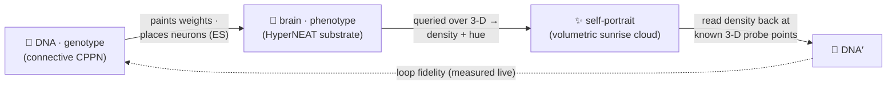
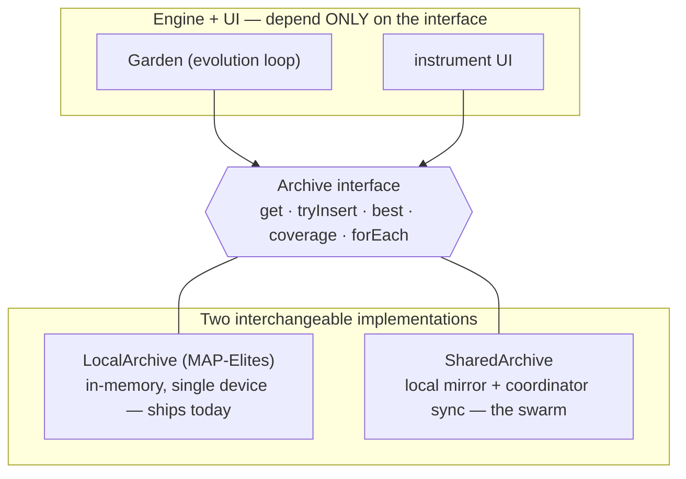
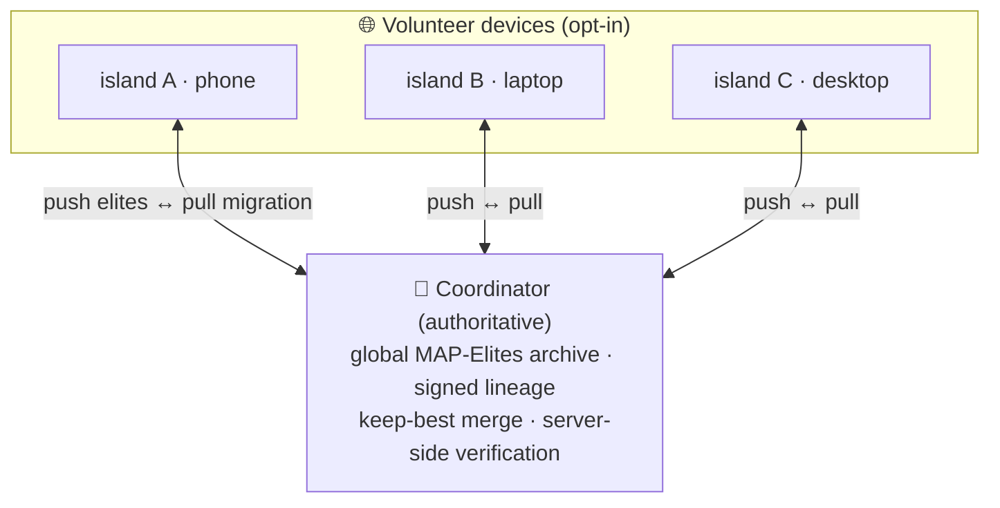

# Architecture & the swarm 🗺️

*A design note on how Autograph is built — the realised architecture, the one decision everything hangs on, and an honest map of what runs today versus what is roadmap.*

Autograph is an **instrument**, not a slideshow: a greyscale, monospace mission-control panel wrapped around one living population that evolves toward self-reference. This note is the engineering companion to the [whitepaper](../WHITEPAPER.md) and [VISION](../../VISION.md) — it describes the architecture that was chosen, and why.

---

## What's real today, and what's roadmap ✅🔭

The whole project lives or dies on not over-claiming, so here is the honest split. Three tiers, in plain terms.

| Capability | Status | Where |
|---|---|---|
| **CPPN genotype with real NEAT** — augmenting topologies (add-node / add-connection, innovation numbers, recurrent + optional gated links), heterogeneous activations, crossover, speciation | ✅ **Real, on device** | [`web/src/engine/cppn.ts`](../../web/src/engine), `evolution.ts` |
| **HyperNEAT substrate** with **simplified ES neuron placement** (variance-scored) | ✅ **Real, on device** | `substrate.ts` |
| **Self-encoding loop + live loop fidelity**, with a **vitality gate** against the trivial zero-quine | ✅ **Real, on device** | `fitness.ts` |
| **MAP-Elites** quality-diversity archive (complexity × symmetry), speciation, optional **Novelty Search** | ✅ **Real, on device** | `mapelites.ts`, `evolution.ts` |
| **3-D volumetric render** (Three.js) with a **Canvas 2D fallback**; sunrise HSLuv palette (colour for life only) | ✅ **Real, on device** | `render/` |
| **Signed, content-addressed Merkle-DAG lineage** (ECDSA P-256, Web Crypto), **persisted in IndexedDB**, round-trip verifiable | ✅ **Real, on device** | `lineage.ts` |
| **Networked swarm** — a `SharedArchive` client + a PartyServer-on-Cloudflare coordinator (push best-per-niche, pull migration, live peer count, **server-side signature verification**, keep-best merge, rate-limiting) | 🟡 **Built behind the seam** | [`web/src/net/swarm.ts`](../../web/src/net/swarm.ts), [`coordinator/`](../../coordinator), [deploy runbook](../DEPLOY-coordinator.md) |
| **Planetary scale** — many islands, GPU (WGSL) evaluation spanning phones to servers, BOINC-style replication/quorum trust | 🔭 **Roadmap** | [runtime & GPU note](./runtime-and-gpu.md) |
| **zkML "proof of becoming"** + recursive proof composition | 🔭 **Roadmap (north star)** | [cryptography note](./cryptography.md) |
| **Full quadtree band-pruning ES-HyperNEAT** | 🔭 **Roadmap** | [whitepaper §3.2](../WHITEPAPER.md) |
| **Quantum** anything | 🚫 **Metaphor & lineage only** — there are no qubits here | [quantum note](./quantum.md) |

The rule of thumb: **the single-device instrument and the signed tree of life are real and running in your browser.** The swarm's *machinery* is built behind a swap-able seam; its *planetary scale*, the GPU runtime, and the cryptographic frontier are honestly labelled as roadmap wherever they appear.

---

## The shape: local-first, one device

Today the instrument runs **entirely on your own device** — no backend, no telemetry, no account, nothing leaves the tab. You are a node — a node of one. That constraint is a feature: it keeps the piece honest, private and forkable, and it forces the evaluation core to be small and portable enough to run anywhere.

A creature is **two networks that make each other**, closed into a loop:

The maths of that loop is the subject of the [whitepaper](../WHITEPAPER.md); this note is about the *system* the loop lives inside.

---

## The one decision everything hangs on: a swap-able `Archive` seam

Every consumer in the engine (the `Garden` evolution loop) and in the UI depends only on a small **`Archive` interface** — never on a concrete class. Reads are synchronous; inserts return "did this become an elite?".

This is the load-bearing design choice. Because the network sync sits *behind* the seam, the single-device archive that ships today (`MAP-Elites`) is swap-able for a shared, networked one (`SharedArchive`) **with no rewrite of the engine or the UI**. The local mirror keeps reads synchronous and the UI unchanged; local inserts that become best-per-niche elites are signed and pushed; inbound migrations merge through the same keep-best path. The seam is the reason the swarm could be built without disturbing a working instrument.

---

## From one node to a swarm: the archipelago 🌐

The roadmap is a **swarm**: many devices growing *one shared garden*, so a creature discovered on one machine illuminates the wall for everyone, and the tree of life becomes a single shared genealogy.

The natural shape is an **archipelago**. Because devices run at wildly different speeds and sync only now and then, the swarm is an *asynchronous island model*: isolated demes form on their own — with no designed topology — simply because a fast desktop and a throttled phone drift apart between syncs. Best-per-niche elites migrate through the coordinator; isolation breeds *allopatric speciation*; speciation breeds diversity. A planetary archipelago of emergent islands, all feeding one signed genealogy, is the prize.

**Honest status:** the shipping experience is a single local population. The coordinator and client are *built* (below); the *planetary scale* — many live islands, GPU evaluation across device tiers, trust under churn — is roadmap.

---

## The coordinator

The chosen path is a [PartyServer](https://github.com/cloudflare/partykit)-on-Cloudflare coordinator that owns the global MAP-Elites archive and the signed lineage, behind the same `Archive` seam already in the code. It is small and deliberately boring:

- **Protocol (v1).** A client sends `hello`, `pull` (migration: seed my mirror from the shared archive) and `push` (best-per-niche elites). The server answers with `welcome` (peer count + room info), `peers` (live count), `elites` (a pull snapshot) and `delta` (newly accepted elites, fanned out to the *other* peers so they migrate them in).
- **Anti-forgery is server-side.** Every pushed elite carries its signed, content-addressed lineage entry; the coordinator re-derives the genome hash, re-derives the content id, binds the ranked fidelity to the signed one, and verifies the ECDSA P-256 signature before a keep-best merge. You cannot graft a creature onto a lineage you do not hold the key for. The cryptographic design is in the [cryptography note](./cryptography.md).
- **Resilience by design.** Per-connection rate-limiting, a message-size cap, and graceful client fallback to the offline garden if the coordinator is unreachable — the site must always work with the coordinator absent.

The full runbook (sandboxed config, no secrets) is the [deploy note](../DEPLOY-coordinator.md). The deeper engineering case for scaling evaluation across device tiers is the [runtime & GPU note](./runtime-and-gpu.md).

---

## Why this core, and not another

Autograph could have been many things. The chosen core — **a connective-CPPN quine, coupled to a quality-diversity world, recorded in a signed Merkle-DAG lineage** — was picked because it is at once the most *beautiful* and the most *buildable* combination:

- **It is the soul, made literal.** A CPPN that learns to draw a self-portrait that re-encodes its own DNA is a [neural quine](https://arxiv.org/abs/1803.05859) on the project's exact substrate — Escher's *Drawing Hands*, alive.
- **Quality-diversity keeps the loop honest.** Pure self-replication collapses to the trivial *zero quine* (a blank creature "encodes itself" perfectly and says nothing). Coupling self-encoding to a [MAP-Elites](https://arxiv.org/abs/1504.04909) world — plus a vitality gate — keeps the strange loop *load-bearing*, exactly as a self-replicator coupled to a task must be.
- **The crypto is real, useful and grift-free today.** A signed, content-addressed lineage is *Git for genomes*: tamper-evident provenance, attribution and anti-fraud, a few hundred lines on the Web Crypto API — **no chain, no token**. It is also the principled fix for an untrusted swarm.

Every layer is a different face of one idea: self-portrait → self-description → self-commitment → (one day) self-verifying history. The whole project is a strange loop you can watch, share and audit.

---

## A minimal stack

For anyone forking or rebuilding, the shape that ships and still scales:

- **Client.** TypeScript + Vite. The engine (CPPN, substrate, simplified ES placement, MAP-Elites, the render, the Web-Crypto lineage) is written from scratch and dependency-light. The render uses Three.js with a Canvas 2D fallback so no device is excluded.
- **The seam.** Everything talks to the `Archive` interface; `LocalArchive` ships, `SharedArchive` adds the network without touching the engine.
- **Coordinator.** A small PartyServer Durable Object: dispatch, the global archive, keep-best merge, signature verification, replication policy. WebSocket + persistence.
- **Why it scales.** The evaluation kernels and the job protocol are identical from a budget phone to a server GPU — only batch size, precision and replication policy change. That portability is the subject of the [runtime & GPU note](./runtime-and-gpu.md).

---

*Further reading: [runtime & GPU](./runtime-and-gpu.md) · [cryptography](./cryptography.md) · [quantum](./quantum.md) · [prior art & novelty](./prior-art.md) · the [whitepaper](../WHITEPAPER.md).*
