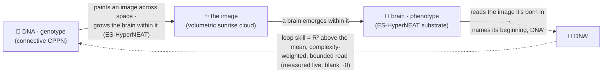
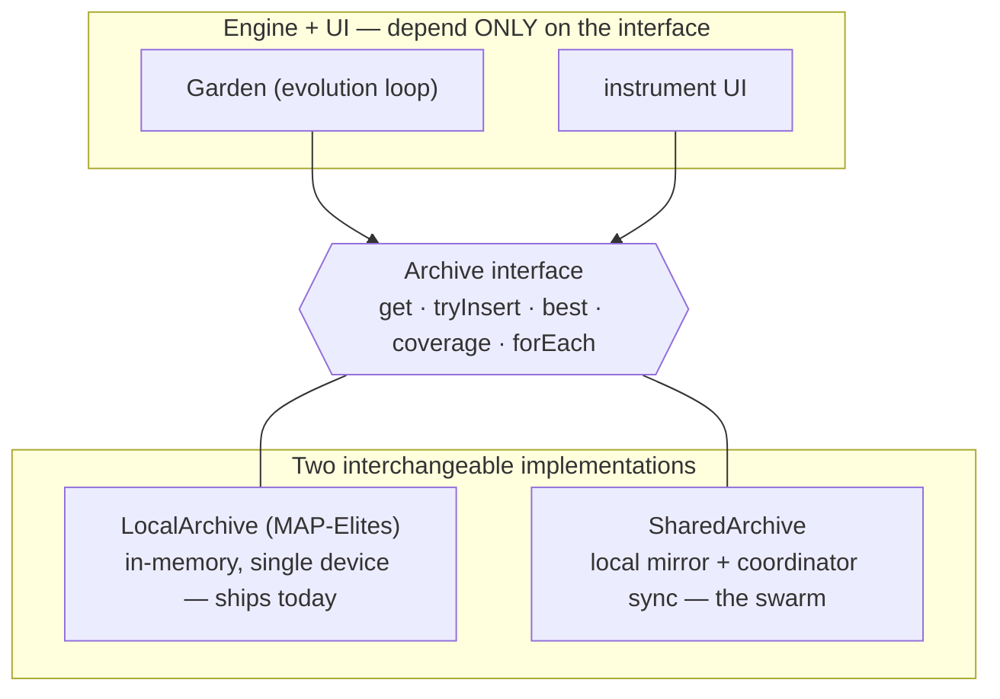
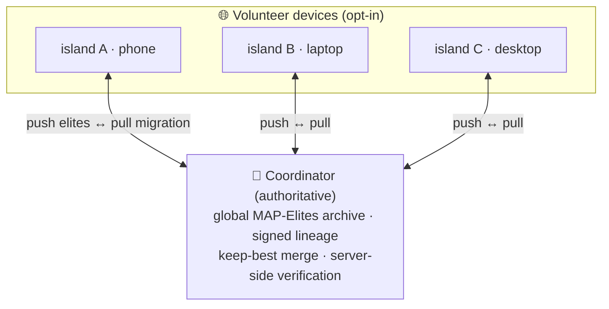

# Architecture & the swarm 🗺️

*A design note on how Autograph is built — the realised architecture, the one decision everything hangs on, and an honest map of what runs today versus what is roadmap.*

Autograph is an **instrument**, not a slideshow: a greyscale, monospace mission-control panel wrapped around one living population that evolves toward self-reference. This note is the engineering companion to the [whitepaper](../WHITEPAPER.md) and [VISION](../../VISION.md) — it describes the architecture that was chosen, and why.

---

## What's real today, and what's roadmap ✅🔭

The whole project lives or dies on not over-claiming, so here is the honest split. Three tiers, in plain terms.

| Capability | Status | Where |
|---|---|---|
| **CPPN genotype with real NEAT** — augmenting topologies (add-node / add-connection, innovation numbers, recurrent + optional gated links), heterogeneous activations, textbook innovation-aligned crossover, speciation | ✅ **Real, on device** | [`web/src/engine/cppn.ts`](../../web/src/engine), `mutate.ts`, `evolution.ts` |
| **Genuine ES-HyperNEAT substrate** — quadtree division + initialization (variance) and pruning + extraction (band-pruning), discovering hidden **placement, density and connectivity** (Risi & Stanley 2012); iterated + dead-node-pruned | ✅ **Real, on device** *(quadtree depth bounded for browser real time; 2-D placement sheet, 3-D swept render; heterogeneous activations + CPPN biases are extensions — all flagged)* | `eshyperneat.ts`, `substrate.ts` |
| **Structural self-write loop + honest skill (v11)** — the brain reads its **sign-faithful** self-portrait (a true depiction of its own wiring; four channels — density, activation-hue, **signed** weight + **signed** bias; spherical glimpses → recurrent ponder with Hebbian plasticity + neuromodulation → ACT halt), then **WRITES its DNA back as a GRAPH** from its own output neurons — node genes (categorical activation type + bias), then connection genes (from/to topology + weight + enabled), **deciding its own structure size** (von Neumann self-reproduction). Skill = a gene-for-gene, NEAT-aligned **graded, coupled** match: blank **0.000**; measured topology ≈0.6–0.78, activation-type acc ≈0.6–0.75 (vs 0.083 chance), weight-R² ≈0.3–0.5 (lifted by the signed channel), size near-exact; coupled headline a few % (node bias-R² ≈0 the honest convergence frontier — info now present). The signed channels lift the incidental sign cap (oracle: weight 95.8% / bias 98.2%) → perfect reconstruction of the readable genes reachable in principle; the residual genome←phenotype non-identifiability is the honest limit. **vitality gate** against the trivial zero-quine | ✅ **Real, on device** | `readback.ts`, `structural.ts`, `substrate.ts`, `fitness.ts` |
| **MAP-Elites** quality-diversity archive (complexity × symmetry), speciation, optional **Novelty Search** | ✅ **Real, on device** | `mapelites.ts`, `evolution.ts` |
| **3-D volumetric render** (Three.js) with a **Canvas 2D fallback**; sunrise HSLuv palette (colour for life only) | ✅ **Real, on device** | `render/` |
| **Signed, content-addressed Merkle-DAG lineage** (ECDSA P-256, Web Crypto), **persisted in IndexedDB**, round-trip verifiable | ✅ **Real, on device** | `lineage.ts` |
| **Live swarm** — a `SharedArchive` client + a PartyServer-on-Cloudflare coordinator: best-per-niche **push**, **pull** migration, a **live peer count**, a **collective gen/s**, **server-side signature verification**, keep-best merge, rate-limiting; on by default (`?swarm=off` to go solo) | ✅ **Live, behind the seam** | [`web/src/net/swarm.ts`](../../web/src/net/swarm.ts), [`coordinator/`](../../coordinator), [deploy runbook](../DEPLOY-coordinator.md) |
| **Temporal brain + structural writer (v6→v10)** — the substrate runs over *T* steps (recurrence alive), CPPN-painted Hebbian plasticity + [Backpropamine](https://arxiv.org/abs/2002.10585)-style neuromodulation, [RAM](https://arxiv.org/abs/1406.6247)-style evolved **spherical** glimpse attention, an [ACT](https://arxiv.org/abs/1603.08983) halt on the read, and a **structural graph writer** — node + connection heads (categorical activation + reals) that emit the DNA graph with learned end-signals ([seq2seq](https://arxiv.org/abs/1409.3215)) — all *evolved* and *intrinsic*, gentle on-ramps | ✅ **Real, on device** | `substrate.ts`, `structural.ts` |
| **Future** — close the *remaining self-write gaps* (node biases + the last of the exact topology; a **behavioural-equivalence** fitness — score DNA′ on whether it grows the *same brain*); a single dedicated *evolution Web Worker* + WASM/SIMD (a multi-core pool is precluded — it would change the numbers) | 🔭 **Roadmap** | [v7 notes](v7-self-writer.md) |
| **Planetary scale** — many islands, GPU (WGSL) evaluation spanning phones to servers, BOINC-style replication/quorum trust | 🔭 **Roadmap** | [runtime & GPU note](./runtime-and-gpu.md) |
| **zkML "proof of becoming"** + recursive proof composition | 🔭 **Roadmap (north star)** | [cryptography note](./cryptography.md) |
| **Deeper / unbounded ES-HyperNEAT** — higher quadtree resolution, full 3-D octree placement | 🔭 **Roadmap** *(today's depth is capped for browser real time)* | [whitepaper §3.2](../WHITEPAPER.md) |
| **Quantum** anything | 🚫 **Metaphor & lineage only** — there are no qubits here | [quantum note](./quantum.md) |

The rule of thumb: **the instrument, the signed tree of life, and the shared swarm are real and running in your browser right now.** What's roadmap is the swarm's *planetary scale* (GPU-tier evaluation across devices) and its *full trust layer* — verifying untrusted machines via replication, then zkML. Today the swarm's trust is signed-lineage + rate-limiting + keep-best merge.

---

## The shape: an on-device engine, in a shared swarm

The engine runs **on your own device** — no backend, no account, and nothing leaves the tab but the elites you share. By default the tab also **joins a live shared swarm** (next section); `?swarm=off` keeps it purely local. Keeping the evaluation core small and portable is a feature: honest, private, forkable — and it is exactly what lets the *same* core scale from a phone to a server GPU.

A creature is **two networks that make each other**, closed into a loop:

The maths of that loop is the subject of the [whitepaper](../WHITEPAPER.md); this note is about the *system* the loop lives inside.

---

## The one decision everything hangs on: a swap-able `Archive` seam

Every consumer in the engine (the `Garden` evolution loop) and in the UI depends only on a small **`Archive` interface** — never on a concrete class. Reads are synchronous; inserts return "did this become an elite?".

This is the load-bearing design choice. Because the network sync sits *behind* the seam, the single-device archive that ships today (`MAP-Elites`) is swap-able for a shared, networked one (`SharedArchive`) **with no rewrite of the engine or the UI**. The local mirror keeps reads synchronous and the UI unchanged; local inserts that become best-per-niche elites are signed and pushed; inbound migrations merge through the same keep-best path. The seam is the reason the swarm could be built without disturbing a working instrument.

---

## The shared swarm: an archipelago 🌐

Open the tab and you join a **live swarm**: many devices growing *one shared garden*, so a creature discovered on one machine migrates to illuminate the wall for everyone, and the tree of life is a single shared genealogy — with a live peer count and a collective gen/s that climbs as machines join.

The natural shape is an **archipelago**. Because devices run at wildly different speeds and sync only now and then, the swarm is an *asynchronous island model*: isolated demes form on their own — with no designed topology — simply because a fast desktop and a throttled phone drift apart between syncs. Best-per-niche elites migrate through the coordinator; isolation breeds *allopatric speciation*; speciation breeds diversity. A planetary archipelago of emergent islands, all feeding one signed genealogy, is the prize.

**Honest status:** the swarm is live and on by default — peer count, collective gen/s, and best-per-niche migration are real. What's roadmap is the *planetary scale* (GPU evaluation across device tiers) and the *full trust layer* — verifying untrusted machines under churn (replication/quorum, then zkML); today the coordinator signature-checks and keeps best-per-niche.

---

## The coordinator

The chosen path is a [PartyServer](https://github.com/cloudflare/partykit)-on-Cloudflare coordinator that owns the global MAP-Elites archive and the signed lineage, behind the same `Archive` seam already in the code. It is small and deliberately boring:

- **Protocol (v3).** A client sends `hello`, `pull` (migration: seed my mirror from the shared archive), `push` (best-per-niche elites) and `rate` (its local generations/sec). (`PROTOCOL_VERSION` is bumped with the genome wire format; v3 dropped the old read-back-network weights — the loop's decode half is now the rendered image fed back through the creature's own brain, so the genome carries no separate reader. `/health` reports it.) The server answers with `welcome` (peer count + room info), `peers` (live count), `elites` (a pull snapshot), `delta` (newly accepted elites, fanned out to the *other* peers so they migrate them in) and `swarm` (the collective: peer count + summed gen/s, broadcast as peers report or leave). The `rate`/`swarm` pair is additive — a client that never reports simply contributes 0.
- **Anti-forgery is server-side.** Every pushed elite carries its signed, content-addressed lineage entry; the coordinator re-derives the genome hash, re-derives the content id, binds the ranked fidelity to the signed one, and verifies the ECDSA P-256 signature before a keep-best merge. You cannot graft a creature onto a lineage you do not hold the key for. The cryptographic design is in the [cryptography note](./cryptography.md).
- **Resilience by design.** Per-connection rate-limiting, a message-size cap, and graceful client fallback to the offline garden if the coordinator is unreachable — the site must always work with the coordinator absent.

The full runbook (sandboxed config, no secrets) is the [deploy note](../DEPLOY-coordinator.md). The deeper engineering case for scaling evaluation across device tiers is the [runtime & GPU note](./runtime-and-gpu.md).

---

## Why this core, and not another

Autograph could have been many things. The chosen core — **a connective-CPPN quine, coupled to a quality-diversity world, recorded in a signed Merkle-DAG lineage** — was picked because it is at once the most *beautiful* and the most *buildable* combination:

- **It is the soul, made literal.** A CPPN that paints an image a brain emerges within — an image that re-encodes its own DNA when read back — is a [neural quine](https://arxiv.org/abs/1803.05859) on the project's exact substrate — Escher's *Drawing Hands*, alive.
- **Quality-diversity keeps the loop honest.** Pure self-replication collapses to the trivial *zero quine* (a blank creature "encodes itself" perfectly and says nothing). Coupling self-encoding to a [MAP-Elites](https://arxiv.org/abs/1504.04909) world — plus a vitality gate — keeps the strange loop *load-bearing*, exactly as a self-replicator coupled to a task must be.
- **The crypto is real, useful and grift-free today.** A signed, content-addressed lineage is *Git for genomes*: tamper-evident provenance, attribution and anti-fraud, a few hundred lines on the Web Crypto API — **no chain, no token**. It is also the principled fix for an untrusted swarm.

Every layer is a different face of one idea: self-image → self-description → self-commitment → (one day) self-verifying history. The whole project is a strange loop you can watch, share and audit.

---

## A minimal stack

For anyone forking or rebuilding, the shape that ships and still scales:

- **Client.** TypeScript + Vite. The engine (CPPN, genuine ES-HyperNEAT substrate, the image→brain read-back loop, MAP-Elites, the render, the Web-Crypto lineage) is written from scratch and dependency-light. The render uses Three.js with a Canvas 2D fallback so no device is excluded.
- **The seam.** Everything talks to the `Archive` interface; `LocalArchive` ships, `SharedArchive` adds the network without touching the engine.
- **Coordinator.** A small PartyServer Durable Object: dispatch, the global archive, keep-best merge, signature verification, replication policy. WebSocket + persistence.
- **Why it scales.** The evaluation kernels and the job protocol are identical from a budget phone to a server GPU — only batch size, precision and replication policy change. That portability is the subject of the [runtime & GPU note](./runtime-and-gpu.md).

---

*Further reading: [runtime & GPU](./runtime-and-gpu.md) · [cryptography](./cryptography.md) · [quantum](./quantum.md) · [prior art & novelty](./prior-art.md) · the [whitepaper](../WHITEPAPER.md).*
