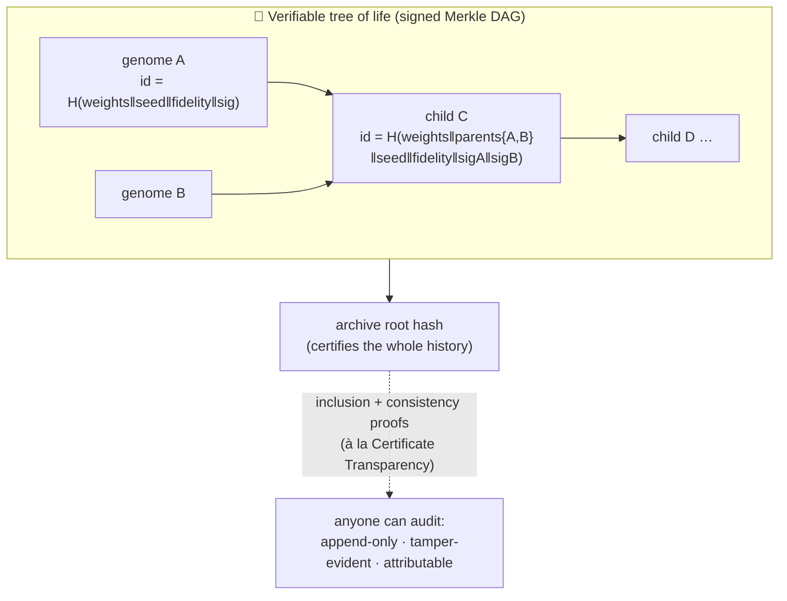
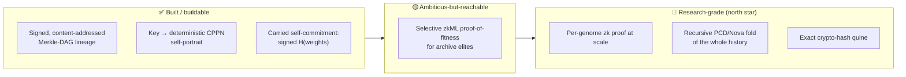

# Cryptography: a verifiable tree of life 🔐

*A design note on the most poetic — and mathematically real — intersection in Autograph: where a network that **describes itself** meets **cryptography-as-mathematics** (hashes, commitments, signatures, zero-knowledge proofs, Merkle structures). No coins. The interest here is the maths, never speculation.*

> **The anti-grift red line, up front.** Git proves tamper-evident provenance to millions of developers daily **with no blockchain**; Certificate Transparency secures the web's PKI **with no coin**. Every cryptographic idea below stands on its own without a token, an ICO, or a "buy in to participate". Where a real blockchain is the cleanest precedent for a *technique* (recursive proofs; deterministic-art-from-a-seed) it is cited as engineering precedent, never as an endorsement of speculation.

---

## In brief

- **Self-reference is not a gimmick — it is a theorem.** [Kleene's recursion theorem](https://en.wikipedia.org/wiki/Kleene%27s_recursion_theorem) proves that self-reproducing programs (*quines*) must exist in any Turing-complete system; they are **fixed points** of a computable map. A connective CPPN is the natural home for a neural quine.
- **The anchor result uses Autograph's exact substrate.** Chang & Lipson's [neural network quine](https://arxiv.org/abs/1803.05859) is built by adopting HyperNEAT's coordinate→weight trick — a network that, queried at a connection's coordinate, outputs its own weight there. They also report the key caveat: pure self-replication collapses to **trivial fixed points** unless coupled to a task/world.
- **A "verifiable tree of life" is buildable today, and built.** Content-addressing + Merkle DAGs + signatures give tamper-evident lineage — literally how Git works. This is the grift-free crypto win: provenance, attribution, anti-fraud, **no coin**. It ships in Autograph.
- **zkML is real but lopsided.** Proving correct inference of a *big* net is punishing; but **verification is cheap and tiny**, and these nets are *tiny*. That asymmetry is a gift, and it names a research north star: a creature that carries a proof it truly achieved its fitness.
- **Recursive proofs are the literal mathematics of self-reference.** Incrementally Verifiable Computation and Proof-Carrying Data let *a proof verify a proof* — folding a whole history into one succinct object. A strange loop you can check in milliseconds.

---

## The mathematics of self-reference

### Quines are inevitable, not curious

A **quine** is a program whose output is its own source. The reason quines are a *law* rather than a trick is **Kleene's Second Recursion Theorem**: for any computable `Q(x, y)` there is a program `p` with `φ_p(y) ≃ Q(p, y)` — a program can be handed *its own description* as data. Take `Q(x, y) = x` and you get a program that outputs its own code. The construction is constructive (via the s-m-n theorem + diagonalisation), so self-reproduction is not merely possible in a Turing-complete system — it is **inevitable**.

The deep word is **fixed point**. A quine is a fixed point of the "run the program" operator; the recursion theorem is a fixed-point theorem. It is the same shape as [Banach's fixed-point theorem](https://en.wikipedia.org/wiki/Banach_fixed-point_theorem) and, in modern ML, as [Deep Equilibrium Models](https://arxiv.org/abs/1909.01377), where a network *is* the solution `z* = f(z*; x)` of its own equation. Self-consistency becomes the architecture.

### Four pillars, each mapped to the substrate

| Idea | The maths | In Autograph |
|---|---|---|
| **Kleene SRT / quines** | A computable map always has a self-referential fixed point. | A CPPN whose self-portrait re-encodes its own DNA — a [neural quine](https://arxiv.org/abs/1803.05859). |
| **von Neumann's universal constructor** | Self-replication needs a description used **twice**: *decoded* (built) and *copied* (inherited). This dissolves the infinite-regress paradox. | The genotype/phenotype split: a CPPN genome is expressed *and* inherited. Indirect encoding **is** von Neumann's insight. |
| **Gödel machine** | A solver rewrites itself only once it has *proved* the rewrite helps. | Proof-gated evolution: accept a genome only if it carries a proof its claimed fitness is real — the seed of the whole crypto layer. |
| **Strange loops** | Meaning emerging from a system that refers to itself across levels (Hofstadter). | A population that watches itself evolve, signs its own ancestry, and (one day) proves its own history. |

The chain is exact: **CPPN ⊂ HyperNetwork ⊂ (set the target = self) ⇒ neural quine.** A bonus cousin is the [Neural Cellular Automaton](https://distill.pub/2020/growing-ca) — a shared local net that grows a body from one seed and re-grows it after damage: self-replication as morphogenesis, with the target shape as an attractor you can watch heal.

### The caveat that must be kept: trivial vs deep

Pure self-replication is **mathematically degenerate**. The all-zero network satisfies `f(0) = 0` — a trivial fixed point (the *zero quine*), and naïve gradient descent slides straight into it. The lesson: **self-reference is only interesting when it is load-bearing against a world.** A network that only copies itself says nothing; a network that must *both* survive a task *and* carry a faithful description of itself is doing the real, biological thing. Autograph's quality-diversity loop plus its vitality gate are exactly that world — they give the strange loop something to push against. (This is Chang & Lipson's own finding: couple replication to an auxiliary task and a trade-off appears, "analogous to the trade-off between reproduction and other tasks in nature".)

---

## The cryptographic mirror

Each thread: the maths, an honest maturity read, the framing.

### 1 · Verifiable computation / zkML — *trustless by proof* 🧾

A zk-SNARK/STARK lets a prover convince a verifier that "I ran computation `C` on input `x` and got `y`" with a **succinct** proof and **no** re-execution. **zkML** proves a *neural network's* inference; tools like [EZKL](https://github.com/zkonduit/ezkl) compile a model into a circuit you can verify in a browser. [Kang et al. (2022)](https://arxiv.org/abs/2210.08674) verified ImageNet-scale inference with a **~5 KB proof in ~1 s**.

The swarm idea: replace replication + quorum with *each work unit emits a succinct proof "I evaluated genome `g` on seeded task `s` and got fitness `φ` and descriptor `bd`."* The coordinator **verifies** instead of **re-running**. A delightful side effect: a zk circuit pins a canonical fixed-point arithmetic, dissolving the cross-device floating-point non-determinism the [runtime note](./runtime-and-gpu.md) warns about.

**Maturity — honest.** This is the expensive direction. Prover overhead for large models is large (orders of magnitude over raw inference); but **verification is succinct and cheap**, and proving cost scales with the number of operations. These nets are *tiny* (NEAT genomes; a few hundred nodes at most), so the asymmetry that makes zkML painful for LLMs makes it *plausible* here. The gate is proving cost: prove **selectively** (elites, on opt-in nodes), verify everywhere. A telescope, not a feature.

### 2 · Commitments & self-commitment — *the cryptographic quine* 🔒

A **commitment** is a sealed envelope: *hiding* (you learn nothing about the value) + *binding* (the committer cannot change it later). Combine "quine" with "commitment" and you get a **self-witnessing object**: a network that, on a designated input, outputs a commitment to its own weights — a fixed point in commitment space. Three honest tiers:

1. ✅ **Carried commitment (ships).** Store `H(genome)` in the genome's metadata and **sign** it. Standard, instant, tamper-evident.
2. 🟡 **Soft / behavioural fingerprint (feasible).** Have the net emit a short locality-sensitive fingerprint of its own behaviour; evolution can be pressured to make it self-consistent. Approximate, but reachable.
3. 🔴 **Exact crypto-hash quine (aspirational).** A net whose output *equals* `H(W)` is a partial-preimage search — astronomically hard, essentially proof-of-work mining. Beautiful to state; deliberately off the critical path.

### 3 · Signatures + Merkle-DAG lineage — *the verifiable tree of life* 🌳 (built)

**Content-addressing**: name a blob by `H(content)`, so the address *is* the data's fingerprint — same content ⇒ same name, any tamper ⇒ different name. Chain these and you get a **Merkle DAG**: each node commits to its children's hashes, so the root hash certifies the whole history. Git, IPFS, Docker and Nix all converged on this independently. Add **digital signatures** (each author signs the entry it begets) and append-only transparency (à la [Certificate Transparency](https://datatracker.ietf.org/doc/html/rfc6962)) and you can *prove* "this genome descends from those parents, in this order, and nothing was retro-edited."

A **phylogeny is a DAG** (crossover has two parents). Autograph makes it a signed, content-addressed Merkle DAG: every genome's id is `SHA-256(genome ‖ parent-ids ‖ seed ‖ fidelity)`, signed with an ECDSA P-256 key via the Web Crypto API. You instantly get tamper-evident ancestry, attribution ("this lineage began with *your* seed"), and anti-fraud ("you cannot graft your creature onto a famous lineage without the right key"). It persists across sessions in IndexedDB and is round-trip verifiable: export it, re-import it, and every hash and signature is re-checked — tampered content and forged signatures are both rejected.

**Maturity.** ✅ **Built and genuinely useful.** Hashing + signatures + a Merkle tree are a few hundred lines and run fine in-browser. This is the grift-free heart — *Git for genomes* — and it is also the principled fix for an untrusted swarm: the coordinator re-verifies every pushed elite's signature before a keep-best merge ([architecture note](./architecture.md)).

### 4 · Recursive proof composition — *a proof that verifies proofs* ♾️

**Incrementally Verifiable Computation** keeps a proof of a long-running computation that you *update* step-by-step, where the work to extend it doesn't grow with history length. **Proof-Carrying Data** generalises this to a **DAG** of mutually distrustful parties: every message carries a succinct proof that *it and its entire history* obeyed the rules. Modern engines make it efficient — [Nova](https://eprint.iacr.org/2021/370) reduces recursion to a folding scheme; [Mina](https://minaprotocol.com/blog/22kb-sized-blockchain-a-technical-reference) folds an entire blockchain into ~22 KB, verifiable on a phone in milliseconds, because each block's proof verifies the previous block's proof.

Why it is the literal mirror of the soul: PCD on a path graph is IVC; PCD on a **DAG** is a *phylogeny with crossover*. The maths of "a proof that contains a proof that contains a proof…" is the same shape as evolutionary stepping stones — and as a quine. A swarm whose archive root is a single recursive proof of its own entire history would be a *Mina-for-evolution*: the population proving its own becoming. **Maturity:** 🔴 research-grade. The north star, not the build.

### 5 · Key → generative art — *the artefact is a witness to the key* 🎨

A public key (or any seed) is a high-entropy string; feed it through a **deterministic** generator and the same key always grows the same artefact — so the artefact is a publicly checkable witness to the key. This is the on-chain generative-art pattern (Art Blocks' "the algorithm is the artwork"; fxhash even seeds evolved editions from their ancestors' hashes). For Autograph: a visitor's key → a deterministic CPPN → a creature that is a self-portrait of their identity, whose descendants are seeded by the chain of ancestor hashes. **Maturity:** ✅ trivial and beautiful — it is the existing render kernel. Borrow the *determinism*, never the order book.

---

## Feasibility: the prover/verifier asymmetry is everything

| What | Cost | Implication |
|---|---|---|
| **Verify** a small-net inference proof | ms–1 s, ~2–10 KB | The coordinator can cheaply check thousands of proofs. ✅ |
| **Prove** a *tiny* net (NEAT/CPPN) | seconds on a laptop; minutes on a phone | Plausible to prove **selectively** (archive elites). 🟡 |
| **Prove** a *big* net (ImageNet/LLM) | orders of magnitude over inference | Not this regime anyway. 🔴 |

Three honest gotchas: **quantisation** (zk circuits use fixed-point — minor for tiny nets, and it doubles as the determinism fix); **the prover is the bottleneck, not the verifier** (prove rarely and selectively); **recursion/PCD is frontier** (real and improving, but "fold the whole archive into one proof" is a research project).

---

## Principles 🛡️

- **Maths, not coins.** Hashes, signatures, Merkle DAGs and (eventually) zk — never a token or manufactured scarcity. If a feature only makes sense with a coin attached, it is not here.
- **Keep self-reference load-bearing.** Self-replication coupled to a task/world, never pure (it collapses to the zero quine).
- **Prover cost is the gate.** Verify everywhere; prove selectively (elites, opt-in nodes). Never "every genome proves everything".
- **Don't oversell the crypto-hash quine.** Exact `f_W = H(W)` ≈ proof-of-work mining; ship the carried/soft commitment instead.
- **Recursion is the north star, not the starting point.**
- **Provenance ≠ blockchain.** Content-addressed + signed + self-hosted beats "put a pointer on-chain."

---

## Sources & further reading 🔗

- **Self-reference & replication:** [Neural Network Quine (Chang & Lipson 2018)](https://arxiv.org/abs/1803.05859) · [Kleene's recursion theorem](https://en.wikipedia.org/wiki/Kleene%27s_recursion_theorem) · [von Neumann universal constructor](https://en.wikipedia.org/wiki/Von_Neumann_universal_constructor) · [Gödel machine (Schmidhuber)](https://arxiv.org/abs/cs/0309048) · [Deep Equilibrium Models](https://arxiv.org/abs/1909.01377) · [Growing Neural Cellular Automata](https://distill.pub/2020/growing-ca)
- **Verifiable computation / zkML:** [EZKL](https://github.com/zkonduit/ezkl) · [Scaling up Trustless DNN Inference (Kang et al. 2022)](https://arxiv.org/abs/2210.08674) · [halo2](https://github.com/privacy-scaling-explorations/halo2) · [RISC Zero](https://github.com/risc0/risc0)
- **Commitments, Merkle, provenance, recursion:** [Commitment schemes](https://en.wikipedia.org/wiki/Commitment_scheme) · [Git internals (content addressing)](https://git-scm.com/book/en/v2/Git-Internals-Git-Objects) · [Certificate Transparency (RFC 6962)](https://datatracker.ietf.org/doc/html/rfc6962) · [Proof-Carrying Data (Chiesa & Tromer 2010)](https://ic-people.epfl.ch/~achiesa/docs/CT10.pdf) · [Nova (folding schemes)](https://eprint.iacr.org/2021/370) · [Mina (~22 KB chain)](https://minaprotocol.com/blog/22kb-sized-blockchain-a-technical-reference)
- **Key → generative art (determinism, not speculation):** [Art Blocks](https://docs.artblocks.io/protocol/overview/) · [fxhash open-form / lineage](https://docs.fxhash.xyz/creating-on-fxhash/programming-open-form-genart)

---

*Further reading: [architecture & the swarm](./architecture.md) · [runtime & GPU](./runtime-and-gpu.md) · [quantum](./quantum.md) · [prior art & novelty](./prior-art.md) · the [whitepaper](../WHITEPAPER.md).*
