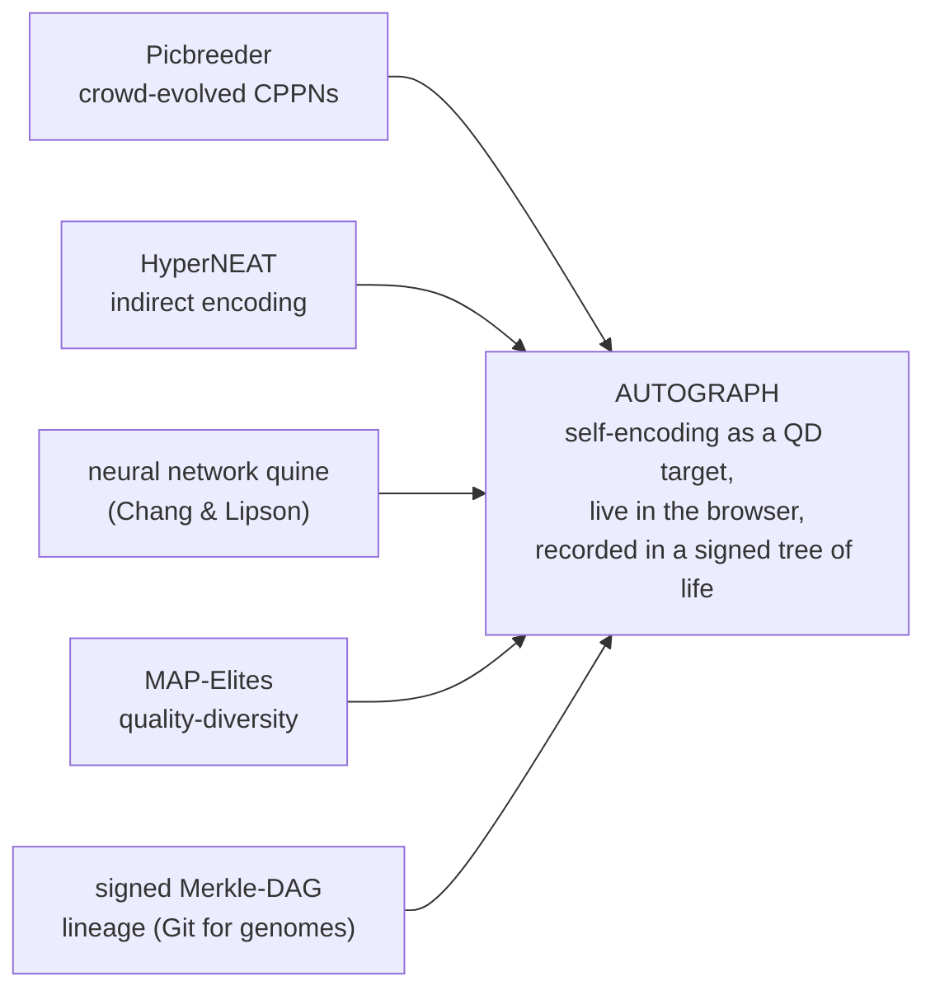

# Prior art & novelty 📚

*A design note on the shoulders Autograph stands on — the neuroevolution, self-reference and crowd-compute lineages it fuses — and an honest account of what is genuinely new here. The contribution is not a new algorithm; it is a synthesis, pointed at the most self-contained target a search can have.*

---

## The neuroevolution lineage

- **NEAT** — [Stanley & Miikkulainen, 2002](https://nn.cs.utexas.edu/downloads/papers/stanley.jair04.pdf) — evolves both *weights and topology*, starting minimal and **complexifying** through add-node / add-connection with **innovation numbers** that align genes for crossover, while **speciation** protects new structure. Autograph's DNA is genuine NEAT: it begins as a minimal graph and augments its own topology on screen.
- **CPPNs** — [Stanley, 2007](https://gwern.net/doc/ai/nn/fully-connected/2007-stanley.pdf) — compositional networks queried over coordinates to produce regular, symmetric patterns. In their *connective* form a CPPN maps a pair of node coordinates to a connection weight.
- **HyperNEAT / ES-HyperNEAT** — [overview](https://en.wikipedia.org/wiki/HyperNEAT) — use a connective CPPN to **paint** the weights of a much larger substrate from geometry (an *indirect encoding*: a small genome grows a large phenotype), and — in ES-HyperNEAT — to also **decide where the hidden neurons go**, placing them where the connectivity pattern carries the most information. Autograph ships **genuine ES-HyperNEAT** — the quadtree division/initialization + band-pruning extraction of Risi & Stanley (2012) — with one honest bound: the quadtree depth is capped for browser real time (deeper resolution + a 3-D octree are roadmap).
- **Picbreeder** — [Secretan, Stanley et al., 2011](https://nbenko1.github.io/) — internet strangers collaboratively bred CPPN images in a browser, *branching* from each other's creations to defeat single-user fatigue. The proof, fifteen years ago, that a crowd can grow beautiful, surprising things together in a browser — Autograph's crowd-evolution blueprint.
- **Galactic Arms Race** — [Hastings, Guha & Stanley, 2009](https://en.wikipedia.org/wiki/Galactic_Arms_Race) — evolved weapon-CPPNs from **implicit player behaviour**: play *is* the fitness signal. A reminder that fitness can be drawn from what people do, not only from what they say.

## Self-reference and self-replication

- **Kleene's recursion theorem** and the **quine** — self-reproduction is a *fixed point* of a computable map, and provably inevitable in any Turing-complete system. The maths is in the [cryptography note](./cryptography.md).
- **Von Neumann's universal constructor** — self-replication needs a description used twice (decoded → built; copied → inherited). The genotype/phenotype split, anticipated before Watson–Crick.
- **The neural network quine** — [Chang & Lipson, 2018](https://arxiv.org/abs/1803.05859) — the anchor result: a network trained to output its own weights via coordinate indexing, which *adopts the HyperNEAT coordinate→weight encoding*. It also reports the load-bearing caveat — couple replication to a task and a trade-off appears — that justifies Autograph's quality-diversity world and vitality gate.
- **HyperNetworks** — [Ha, Dai & Le, 2016](https://arxiv.org/abs/1609.09106) — "one network generating the weights for another", explicitly genotype → phenotype, and noted as reminiscent of HyperNEAT. The chain is exact: CPPN ⊂ HyperNetwork ⊂ (set the target = self) ⇒ neural quine.
- **Growing Neural Cellular Automata** — [Mordvintsev et al., 2020](https://distill.pub/2020/growing-ca) — a shared local net that grows a body from one seed and re-grows it after damage; self-replication as morphogenesis, the target shape an attractor you can watch heal.

## Open-endedness and quality-diversity

- **Novelty search** — [Lehman & Stanley, 2011](https://www.cs.swarthmore.edu/~meeden/DevelopmentalRobotics/lehman_ecj11.pdf) — abandon the objective in favour of behavioural novelty, and frequently *outperform* objective-based search on deceptive tasks. Autograph offers it as a live toggle.
- **MAP-Elites** — [Mouret & Clune, 2015](https://arxiv.org/abs/1504.04909) — keep the best solution per cell of a behaviour-descriptor grid, yielding a *map* of diverse high performers ("illumination"). The illuminated archive *is* Autograph's exhibited artwork.
- **POET** — [Wang et al., 2019](https://arxiv.org/abs/1901.01753) — co-evolves problems and their solutions. **ELM** — [Lehman et al., 2022](https://arxiv.org/abs/2206.08896) — uses learned operators inside MAP-Elites.
- **Open-endedness as essential** — [Hughes et al., 2024](https://arxiv.org/abs/2406.04268) — argues open-endedness is essential for the next era of capable AI.
- **FER/UFR** — [Kumar, Clune, Lehman & Stanley, 2025](https://arxiv.org/abs/2505.11581) — open-endedly evolved CPPNs approach a *unified factored representation*, whereas conventional gradient descent tends toward a *fractured entangled representation*. This is directly *why* an evolved self-portrait might be legible — and it is one of Autograph's falsifiable predictions.

## Crowd and volunteer compute

- **BOINC** — the playbook for untrusted distributed computation (replication, quorum, homogeneous redundancy, adaptive replication). The basis of the swarm's trust model; see the [runtime & GPU note](./runtime-and-gpu.md).
- **JSDoop** — [Morell et al.](https://arxiv.org/pdf/1910.07402) — showed browser-based volunteer neural-network training is feasible.
- **Literal real-world output is possible** — [Foldit](https://pmc.ncbi.nlm.nih.gov/articles/PMC2956414/) players solved and then *designed* proteins; browser-based [EteRNA](https://journals.plos.org/ploscompbiol/article?id=10.1371%2Fjournal.pcbi.1007059) designs were synthesised in a wet lab. Citizen play can become real science — the spirit behind Autograph's "Atlas of Self-Reference" ambition.

---

## What's actually new here

None of the ingredients is new. The synthesis — and its target — are.

- **Self-encoding *as the quality-diversity target*.** Prior neural quines are trained, single objects. Autograph makes the approximate fixed point of self-encoding the thing an *open-ended, illuminating* search discovers a whole diverse population of — a *map* of ways to be self-aware-ish, not one trained net.
- **The loop is rendered, three-dimensional and watchable.** Not "a network that prints its weights as numbers", but a creature that **draws** itself in 3-D colour while the *same* CPPN, read at its genome coordinates, reports its DNA back — with **loop skill (R² above the mean) measured live, never faked**.
- **Intrinsic, not a free regressor.** The decode half is the creature's own CPPN read at its genome coordinates — a genuine [neural-network quine](https://arxiv.org/abs/1803.05859) — so there is nothing external to over-fit. (An earlier bolt-on per-creature regressor collapsed to "predict the mean" and scored ~0.97 while reconstructing nothing; the honest negative result drove the redesign.) Baseline-corrected skill makes the mean worth 0; a constant creature scores ~0, and fully iterating the self-map drifts to the only effortless fixed point, the empty one. *Life is imperfect self-knowledge.*
- **A signed tree of life, in the browser.** A content-addressed, ECDSA-signed Merkle-DAG phylogeny that persists across sessions — *Git for genomes*, with no chain and no token — and the principled trust layer for the swarm.
- **Delivered as a public instrument, not a paper.** The scientific object (an approximate fixed point of self-encoding) and the aesthetic object (Escher's *Drawing Hands*, alive) are literally the same thing, joinable on load.

The central claim is stated in falsifiable form in the [whitepaper §4](../WHITEPAPER.md): open-ended quality-diversity search discovers a diverse population of approximate self-encoders that objective-only search cannot match in joint diversity-and-fidelity, and that show more factored internal representations than gradient-trained self-encoders of equal output fidelity. Each clause can fail — which is what makes it worth stating.

---

*Further reading: [architecture & the swarm](./architecture.md) · [runtime & GPU](./runtime-and-gpu.md) · [cryptography](./cryptography.md) · [quantum](./quantum.md) · the [whitepaper](../WHITEPAPER.md).*
