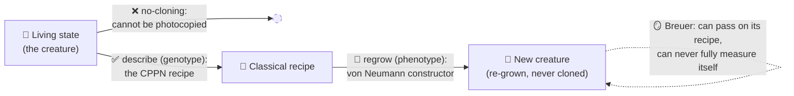

# Quantum: the soul's physics, not the runtime ⚛️🪞

*A design note, and an honest one: is there a **genuinely deep** quantum connection to a self-referential "strange loop", or would "quantum" be a shoehorned buzzword? This is a sceptical assessment with real sources. The verdict, up front: the ideas are real and in places breathtaking — and they earn their place as **lineage and metaphor**, never as a mechanism. There are no qubits here.*

---

## In brief

- **The single deepest idea is not invented for this project — it is a 60-year-old tension in physics.** Quantum **no-cloning** forbids photocopying a live state, so quantum self-replication is *forced* to route through a classical description — exactly von Neumann's genotype/phenotype trick, exactly a CPPN-as-recipe, exactly *Drawing Hands*. A true, citable, profound resonance.
- **Three more are genuinely on-theme and peer-reviewed:** you cannot exactly measure your own state from inside a system (Breuer); Gödel/Turing undecidability appears in real physics (the spectral gap is undecidable); a quine is a fixed point, and so is the steady state of a quantum channel — the same fixed-point mathematics.
- **One is a Darwinian bonus:** quantum Darwinism says reality is made of the states that get *redundantly copied* into the environment — selection for copyability, as a law of physics.
- **As a buildable mechanism, quantum is a distraction.** It gives **no speedup** to this embarrassingly-parallel classical workload; quantum neural nets suffer barren plateaus; browser state-vector simulators cap at ~16–20 qubits. Building anything quantum would *fracture* the visual identity, not enrich it.
- **The conclusion Autograph takes: lean in conceptually, build nothing quantum.** One honest "the strange loop, quantised" framing, headlined by the no-cloning ↔ self-replication beauty, with the same anti-hype discipline as the honest energy note.

---

## The genuinely real and beautiful connections 💎

### 1 · No-cloning vs von Neumann self-replication — the crown jewel ⭐

The [no-cloning theorem](https://en.wikipedia.org/wiki/No-cloning_theorem) ([Wootters & Zurek 1982](https://www.nature.com/articles/299802a0)): the linearity of quantum mechanics makes it impossible to copy an arbitrary *unknown* quantum state. Naïvely this *kills* self-replication — until you notice replication was never about cloning the live thing. [Von Neumann's universal constructor](https://en.wikipedia.org/wiki/Von_Neumann_universal_constructor) passes on a **description** (copied passively) and regrows the **body** (built actively); life does the same with DNA; [Marletto (2015)](https://pmc.ncbi.nlm.nih.gov/articles/PMC4345487/) shows description-based self-reproduction is fully compatible with quantum theory and categorically distinct from cloning.

> **The prohibition is the gift:** the very law that forbids xeroxing a living state is what *forces* reproduction to work the way life does — copy the recipe, regrow the body. Physics independently rediscovers the genotype/phenotype split a CPPN genome already embodies.

### 2 · You cannot accurately measure your own state — Breuer's theorem 🪞

[Breuer (1995)](https://www.cambridge.org/core/journals/philosophy-of-science/article/impossibility-of-accurate-state-selfmeasurements/80B368D210379DA587D41603B551B95D): it is impossible for an observer to distinguish all states of a system *in which they are contained* — quantum or classical. Self-reference itself imposes the limit. This is the measurement-theoretic twin of Gödel — *a system cannot fully know itself from the inside* — almost a one-line gloss of "a network that tries to understand its own beginning." (Honest note: it holds classically too, so it is the epistemic heart of the strange loop, not a uniquely-quantum claim.)

### 3 · A quine is a fixed point — and so is a quantum steady state ♾️

The unifying mathematics of *every* strange loop is the fixed-point theorem: [Lawvere's theorem](https://en.wikipedia.org/wiki/Lawvere%27s_fixed-point_theorem) shows Cantor, Russell, Gödel, Turing and Tarski are one theorem — a diagonal argument in a cartesian-closed category. A quine is a fixed point of "describe-then-execute"; on the quantum side, every quantum channel (CPTP map) on a finite system has a fixed point — a density matrix with `Φ(ρ) = ρ`. "A quine is a fixed point of self-description" and "a quantum system's resting state is a fixed point of its own evolution" are the same sentence in two languages. (Close in spirit; the fixed-point poetry is already ours via Kleene/Lawvere.)

### 4 · Gödel/Turing undecidability is real *in physics* — the spectral gap 🧩

[Cubitt, Pérez-García & Wolf (2015)](https://www.nature.com/articles/nature16059): whether a quantum many-body Hamiltonian is gapped or gapless is **algorithmically undecidable** — they encode a Turing machine's halting problem into the ground state. There exist concrete models where the answer is independent of the axioms of mathematics — Gödelian incompleteness, in physics. The "G" of *Gödel, Escher, Bach* literally surfaces in a real Hamiltonian. (A thematic cousin; about spin lattices, not neural nets.)

### 5 · Quantum Darwinism — selection *for being copyable* 🧬

[Zurek's quantum Darwinism](https://arxiv.org/abs/0903.5082): classicality emerges because the environment redundantly imprints a system's *pointer states* into many fragments, so many observers read the same value without disturbing it. Only einselected pointer states "produce multiple informational offspring" — Zurek's own Darwinian language. The irony is delicious: no-cloning forbids copying *arbitrary* states, yet the world we see exists *because* a special, "fit" subset of states gets copied prolifically. Reality is the fixed point of a copying-and-selection process — which is exactly what an evolution engine simulates.

### 6 · Wheeler's self-excited circuit — beautiful, but wear gloves 🌀

Wheeler's "it from bit" and participatory universe is, explicitly, a strange loop at cosmic scale — Escher's *Drawing Hands* as cosmology. But the strong "observation creates reality" reading is fringe and contested; cite it as acknowledged poetry, never as load-bearing physics.

### Scorecard 📊

| Connection | Real & cited? | About self-reference? | Uniquely quantum? | A mechanism here? | Hype risk |
|---|---|---|---|---|---|
| No-cloning ↔ self-replication | ✅ | ✅✅ | ✅ | ❌ (narrative) | 🟢 low |
| Breuer self-measurement | ✅ | ✅✅ | 🟡 (holds classically) | ❌ | 🟢 low |
| Quine = channel fixed point | ✅ | ✅ | 🟡 | 🟡 (toy only) | 🟢 low |
| Spectral-gap undecidability | ✅ | ✅ | ✅ | ❌ | 🟢 low |
| Quantum Darwinism | ✅ | 🟡 | ✅ | ❌ | 🟡 medium |
| Wheeler it-from-bit | 🟡 (philosophy) | ✅ | ✅ | ❌ | 🔴 high |

Rows 1–4 are real, on-theme and low-hype — the spine of an honest quantum narrative. Row 5 is a bonus; row 6 is for flavour only. **None is a mechanism.**

---

## The honest verdict ⚖️

**Quantum adds real *conceptual* depth to the strange-loop soul, and zero *engineering* value to a browser piece. It is lineage and metaphor, not a feature.** The anti-hype reality checks, all load-bearing:

- **No speedup for this workload.** Quantum computers do not "try all solutions in parallel"; advantage comes from interference choreographed for *specific* structured problems (factoring, simulating physics). Unstructured search gets only a quadratic edge. CPPN/MAP-Elites evaluation is embarrassingly-parallel classical arithmetic — precisely the regime quantum does **not** accelerate ([Aaronson's anti-hype FAQ](https://scottaaronson.blog/?p=198)).
- **Quantum neural nets are real but fragile.** Variational quantum circuits exist — and you can even *evolve* their architectures — but they suffer [barren plateaus](https://www.nature.com/articles/s41467-018-07090-4): gradients vanish exponentially with qubit count.
- **"Quantum quine" is not an established result.** Quantum recursion is a real research area, but there is no canonical self-printing quantum program — and there can't be a naïve one, because the quantum part hits no-cloning. The honest resolution loops back to connection 1: copy the *classical* description, regrow the quantum state.
- **Simulators are visual but small.** Browser quantum simulators are lovely, but the state vector is `2ⁿ` amplitudes — ~16–20 qubits is the practical ceiling, and a circuit diagram is a *different artwork* from an evolving MAP-Elites wall.

A "quantum-powered" badge with no quantum hardware would be the exact crime Autograph's honesty ethic polices. The narrative is an asset **only if it is scrupulously labelled as narrative.**

---

## The single most beautiful hook 🪞

> ### *"A creature that cannot be cloned — only re-grown."*

The wonderful part is that it is **physically accurate**, not a flourish:

It is *Drawing Hands* with a conservation law: a hand can sketch the recipe for a hand, but no hand may be photocopied whole. A strange loop the laws of physics actually enforce.

---

## Principles 🛡️

- Say "metaphor / lineage", never "mechanism". No "quantum-powered", "quantum compute", "quantum speedup".
- No "quantum quine" without the word "coinage" — it isn't an established result.
- Keep Wheeler as acknowledged poetry, flagged as philosophically contested.
- Don't claim quantum RNG/mutation value — a classical PRNG is not the bottleneck.
- Cite primary sources, not vibes.

---

## Sources & further reading 🔗

- **No-cloning, self-replication, constructors:** [Wootters & Zurek 1982](https://www.nature.com/articles/299802a0) · [no-cloning overview](https://en.wikipedia.org/wiki/No-cloning_theorem) · [von Neumann universal constructor](https://en.wikipedia.org/wiki/Von_Neumann_universal_constructor) · [Marletto, *Constructor theory of life* (2015)](https://pmc.ncbi.nlm.nih.gov/articles/PMC4345487/) · [Neural Network Quine (Chang & Lipson 2018)](https://arxiv.org/abs/1803.05859)
- **Self-reference, undecidability, fixed points:** [Breuer 1995](https://www.cambridge.org/core/journals/philosophy-of-science/article/impossibility-of-accurate-state-selfmeasurements/80B368D210379DA587D41603B551B95D) · [Spectral-gap undecidability (Cubitt et al. 2015)](https://www.nature.com/articles/nature16059) · [Lawvere's fixed-point theorem](https://en.wikipedia.org/wiki/Lawvere%27s_fixed-point_theorem)
- **Measurement, observer, Darwinism:** [Quantum Darwinism (Zurek 2009)](https://arxiv.org/abs/0903.5082) · [Wheeler's it-from-bit](https://www.themarginalian.org/2016/09/02/it-from-bit-wheeler/)
- **Mechanism reality-check:** [Barren plateaus (McClean et al. 2018)](https://www.nature.com/articles/s41467-018-07090-4) · [Aaronson, anti-hype FAQ](https://scottaaronson.blog/?p=198)

---

*Further reading: [architecture & the swarm](./architecture.md) · [cryptography](./cryptography.md) · [prior art & novelty](./prior-art.md) · the [whitepaper](../WHITEPAPER.md).*
