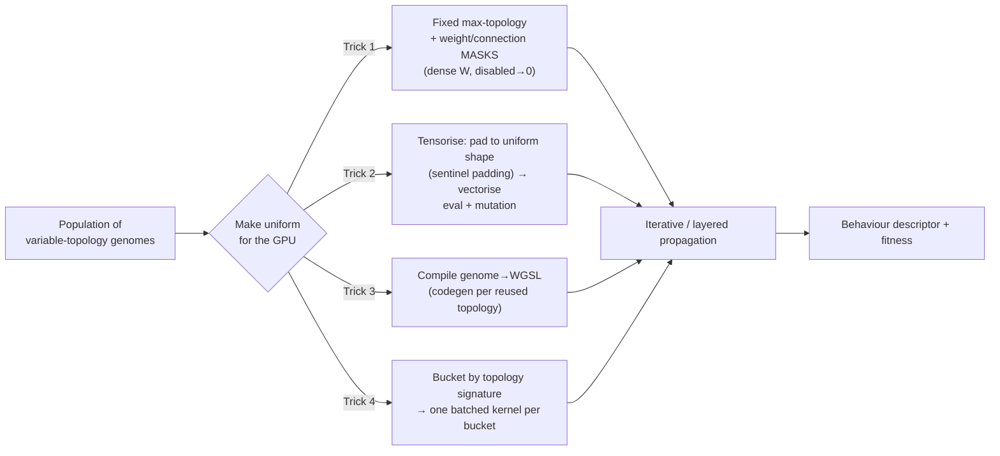
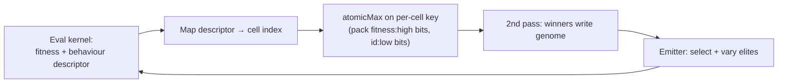

# Runtime & GPU: one core, phone to H100 🧬

*A design note on the runtime that would let Autograph's evaluation scale across the whole device spectrum — a budget Android phone and a headless H100 running the **same** code. This is the engineering behind the swarm roadmap; the shipping instrument is single-device and local-first.*

The ambition is **one runtime to rule them all**: write the genome-evaluation and variation kernels **once**, and run that same logic in a browser via WebGPU, headless on a server GPU via Deno/Dawn, and — degraded but correct — on anything older. The *kernels* and the *job protocol* (genomes in → behaviour-descriptor + fitness out) stay identical across the fleet; only batch size, precision and replication policy vary by device tier.

---

## In brief

- **Primary runtime: WebGPU compute (WGSL).** As of 2026 it is **Baseline** across major browsers. Real gaps remain (notably Linux Firefox and pre-A12 iPhones / older OSes), so graceful degradation is non-negotiable.
- **Fallbacks:** WebGL2 transform-feedback / float-texture GPGPU → WASM SIMD+threads → scalar JS. The scalar path doubles as a correctness oracle.
- **The portable trick:** author the eval + variation kernels once in WGSL, then run them (a) in browsers via WebGPU and (b) headless on any server GPU (incl. H100) via Deno's built-in WebGPU (`wgpu`) or Node/Bun + Dawn — no browser required.
- **Variable-topology NEAT on the GPU is the hard part.** The proven approach is **tensorisation**: pad every genome to a uniform shape with sentinel masks, then vectorise eval/mutation across the whole population (see TensorNEAT and QDax).
- **Never trust a single GPU's fitness across devices** — floating-point is not bit-exact across GPUs/drivers/WASM. Borrow BOINC's playbook: a seeded reference impl, tolerance comparison, replication + quorum, homogeneous redundancy. Quality-diversity is inherently noise-tolerant, which helps.
- **Energy, honestly:** consumer-GPU-in-browser is less FLOPS/watt than a datacentre, but it harvests *idle, already-powered* hardware at ~zero marginal cost. Great for embarrassingly-parallel QD evaluation; not for training frontier models.

---

## The layered runtime

`WebGPU compute (WGSL)` → `WebGL2 GPGPU (transform feedback / ping-pong float textures)` → `WASM (SIMD128 + threads)` → `scalar JS`. Feature-detect, pick the best available tier, degrade gracefully.

### WebGPU support reality (2026)

WebGPU reached **Baseline** in early 2026 after Safari 26 and Firefox shipped.

| Engine | Desktop | Mobile | Notes / caveats |
|---|---|---|---|
| **Chrome / Edge** | ✅ Win/Mac/ChromeOS (113+); Linux maturing (Intel/NVIDIA on recent builds) | ✅ Android 121+ (Android 12+) | Most mature; `subgroups` (SIMD reductions) and `shader-f16` available. Some hardened Android profiles may disable WebGPU. |
| **Safari / WebKit** | ✅ macOS 26+ | ✅ iOS/iPadOS 26+ | OS-gated: every iOS browser is WebKit, so the **OS version controls access**. Pre-A12 iPhones / OS < 26 have none; stricter mobile memory limits. |
| **Firefox** | ✅ Windows 141+; Apple-Silicon Mac 145+ | ⚠️ Android behind a flag | ❌ Linux not default (Nightly only). |

> **Two real holes to keep a fallback for:** Linux Firefox, and iPhones older than A12 / OSes below 26. Roughly ~85% desktop and ~60% mobile coverage — enough for progressive enhancement, not enough to drop the fallbacks.

### The fallback layers

- **WebGL2 GPGPU** (no compute shaders): two patterns — *transform feedback* (vertex outputs → buffer with `RASTERIZER_DISCARD`) and *ping-pong float textures* (fragment shader reads neighbours, writes next state). The same approach behind Lenia / Neural-CA demos. WebGL2 is near-universal.
- **WASM SIMD128 + threads:** threads need `SharedArrayBuffer`, which requires cross-origin isolation (`COOP: same-origin` + `COEP: require-corp`). Feature-detect and load the right build.
- **Scalar JS:** a tiny, correct reference path so *everyone* contributes — and it doubles as the verification oracle (below).

### Libraries, honestly

The mature GPU neuroevolution / QD stack is JAX/Python (ideal for headless beast nodes); the browser side is best served by hand-written WGSL plus a thin helper.

| Library | Backend | Headless | Fit |
|---|---|---|---|
| **Hand-written WGSL** | WebGPU compute | ✅ via Deno/Dawn | ⭐ Best. Full control of genome layout, masks, atomics — the portable core. |
| **regl** | WebGL/WebGL2 | ✅ (headless-gl) | ⭐ Best WebGL2-fallback engine — clean ping-pong / transform-feedback GPGPU. |
| **ONNX Runtime Web** | WebGPU EP + WASM | ✅ (node) | Great for running an *evolved fixed graph* fast; not for evolving topology. |
| **TensorFlow.js** | WebGPU + WebGL + WASM | ✅ (`tfjs-node`) | OK for fixed-topology MLP eval; weak for custom variation ops. |
| **JAX: QDax / TensorNEAT / evosax / EvoJAX** | CUDA/ROCm/TPU (XLA) | ✅ native | ⭐ Beast-node turbo + the algorithm reference for a WGSL port. Not browser. |

---

## The crux: making NEAT/CPPN/HyperNEAT fast and parallel

### CPPNs are made for the GPU

A CPPN is a tiny heterogeneous network (`sin`, `gauss`, `tanh`, `sigmoid`, `abs`, …) **queried over a coordinate grid** — exactly the Neural-CA / Lenia / texture-synthesis workload: one shader invocation per `(genome, grid-point)`. Embarrassingly parallel, cache-friendly, no host round-trips. Prefer **masks + arithmetic over branches** (divergence is the killer), and use **subgroups** for in-workgroup reductions (fitness sums, descriptor stats).

### NEAT's variable topology — four tricks

1. **Fixed max-topology + masks (good default).** A dense weight matrix per genome plus a boolean mask; disabled genes → 0. Evaluate by iterative propagation (recurrent-safe) or topologically-sorted layers. Keep max-N modest.
2. **Tensorisation (proven at scale).** Pad each genome's node/connection lists to a uniform shape with sentinel padding and vectorise mutation, crossover and inference across the whole population — TensorNEAT's method (JAX `vmap`/`pmap`, up to ~500× vs NEAT-Python). Port the idea to WGSL storage buffers.
3. **Compile genomes → shaders.** Codegen a specialised kernel per distinct topology — fastest per-eval, pays a compile cost; worth it for reused substrates.
4. **Bucket by topology signature.** Group similar topologies, one batched kernel per bucket, to minimise divergence and padding waste.

### HyperNEAT / ES-HyperNEAT substrate eval

Two GPU stages: **(1) CPPN → substrate weights** — evaluate the CPPN over all `(source, target)` substrate-coordinate pairs, a giant embarrassingly-parallel `map` (TensorNEAT ships this as `FullSubstrate`); **(2) substrate forward pass** over task inputs (reuse the masked-MLP kernel). Full quadtree ES-HyperNEAT is awkward to vectorise — do the point-selection on CPU, then GPU-batch the chosen query points.

### MAP-Elites on/near the GPU

Pack `fitness` (high bits, fixed-point) + `genomeId` (low bits) into one integer and do a single `atomicMax` per cell, then a second pass writes the winners — the GPU-native version of QDax's batched insertion. Evaluate thousands of genomes per generation, then one atomic archive-merge pass. QDax shows quality-diversity **scales to massive batch sizes with little performance loss**, and tolerates **much shorter lineages** — gold for a noisy, churny volunteer swarm.

---

## The headless H100 path 🔥

Run *the same WGSL* much faster on a beast GPU, even with no browser:

| Host | How | Notes |
|---|---|---|
| **Deno** | Built-in `navigator.gpu` on `wgpu` (`DENO_WEBGPU_BACKEND=vulkan`) | Easiest — single binary, zero extra deps. |
| **Node.js** | `webgpu` (Dawn bindings) | Google Dawn under the hood. |
| **Bun** | `bun-webgpu` (Dawn FFI) | Community. |

These talk Vulkan on Linux → NVIDIA, no DOM. **Honest ceiling:** WGSL reaches FP32 SIMT throughput and FP16 + subgroup reductions, but it does **not** expose tensor cores (no WMMA/TF32/FP8) or FP64. You capture a healthy slice of an H100's CUDA-core FLOPS for CPPN/MLP eval — not its tensor-core peak. To truly saturate a beast, add an *optional* native worker (CUDA, or JAX/QDax/TensorNEAT) that speaks the same job protocol; it won't be bit-identical, which the verification design tolerates.

---

## Determinism & trust in a volunteer swarm 🔐

**The cold truth:** WGSL gives **no bit-exactness guarantee** across GPUs/drivers (FMA contraction, reassociation, per-built-in accuracy bounds; no fast-math flag). WASM/CPU diverges too. So a single self-reported fitness can never be trusted across devices. The remedy is BOINC's playbook:

| Mechanism | What it does |
|---|---|
| **Seeded RNG + reference impl** | A canonical (scalar/fixed-point) eval defines "truth"; seed every stochastic op. |
| **Fuzzy / tolerance comparison** | Accept replicas agreeing within ε on (descriptor, fitness); ties escalate. |
| **Replication + quorum** | Each unit on ≥2 unrelated hosts; accept on consensus; a third on a tie; mark canonical. |
| **Homogeneous redundancy** | Route replicas to the same numerical-equivalence class so strict equality works. |
| **Adaptive replication** | Trusted hosts spot-checked less; recompute archive *elites* authoritatively. |

Engineering for agreement: prefer **fixed-point fitness** (exact integer comparison), make reductions **order-independent** (deterministic tree-reduce or sort-then-sum — parallel float accumulation is the #1 nondeterminism source), and **hash `(descriptor, fitness)`** so divergence is cheap to detect. **Silver lining:** quality-diversity self-corrects — noisy or disagreeing evals get out-competed as the archive fills, so a volunteer swarm's inherent noise is far less fatal here than in supervised training.

---

## Energy: what "donating idle compute" actually buys 🔋

- **Per watt, datacentres win.** Datacentre nodes have higher FLOPS/watt; browser compute carries abstraction overhead. (The BOINC team even rejected a browser/WASM client as too slow for heavy work.) So a browser swarm is for **embarrassingly-parallel, loss-tolerant** evaluation, not training.
- **But idle harvesting changes the maths.** You use hardware that's already powered on; in cool climates the heat offsets domestic heating, so net marginal energy can approach zero — and the volunteer pays it, not a datacentre.
- **Budget realistically:** replication ≈ 2× overhead, plus comms and tab-visibility throttling. The win is **throughput at ~zero marginal cost**, not efficiency — and emphatically **not** frontier-model training. If donated compute ever ships, it will be explicit, visible and revocable; never crypto-mining by stealth.

---

## A build order, for anyone rebuilding this

1. Pick a cheap, visual fitness first (evolve CPPNs → images / Lenia patterns) for instant feedback before wiring anything heavier.
2. A 2-D behaviour descriptor; a MAP-Elites grid.
3. **Fixed max-topology + masks** (Trick 1) before attempting full tensorised topology evolution.
4. Add replication (2×) + fuzzy verification from day one — retrofitting trust is painful.
5. Ship the cross-origin isolation headers + HTTPS (WebGPU and threads need a secure context).

---

## Sources & further reading 🔗

- **WebGPU / WGSL:** [Implementation status](https://github.com/gpuweb/gpuweb/wiki/Implementation-Status) · [WebGPU in major browsers](https://web.dev/blog/webgpu-supported-major-browsers) · [WGSL FP evaluation](https://github.com/gpuweb/gpuweb/blob/main/wgsl/index.bs) · [WASM threads + cross-origin isolation](https://web.dev/articles/webassembly-threads)
- **Headless WebGPU:** [Deno WebGPU](https://deepwiki.com/denoland/deno/6.5-webgpu) · [Node `webgpu` (Dawn)](https://github.com/dawn-gpu/node-webgpu) · [WebGPU in headless Chrome](https://developer.chrome.com/blog/supercharge-web-ai-testing)
- **GPU QD / NEAT:** [TensorNEAT](https://arxiv.org/abs/2404.01817) ([repo](https://github.com/EMI-Group/tensorneat)) · [QDax](https://arxiv.org/abs/2202.01258) ([repo](https://github.com/adaptive-intelligent-robotics/qdax)) · [MAP-Elites (Mouret & Clune 2015)](https://arxiv.org/abs/1504.04909) · [evosax](https://github.com/RobertTLange/evosax) · [EvoJAX](https://github.com/google/evojax)
- **Verification & volunteer compute:** [BOINC job replication](https://github.com/BOINC/boinc/wiki/Job-replication) · [BOINC homogeneous redundancy](https://github.com/BOINC/boinc/wiki/Homogeneous-Redundancy) · [JSDoop (browser volunteer NN training)](https://arxiv.org/pdf/1910.07402)

---

*Further reading: [architecture & the swarm](./architecture.md) · [cryptography](./cryptography.md) · [prior art & novelty](./prior-art.md) · the [whitepaper](../WHITEPAPER.md).*
